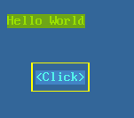
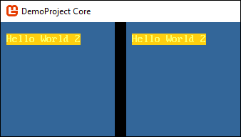
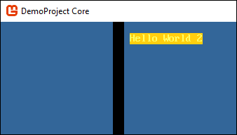
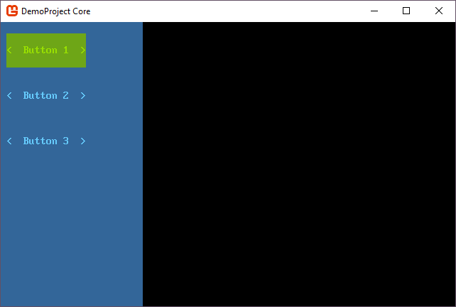
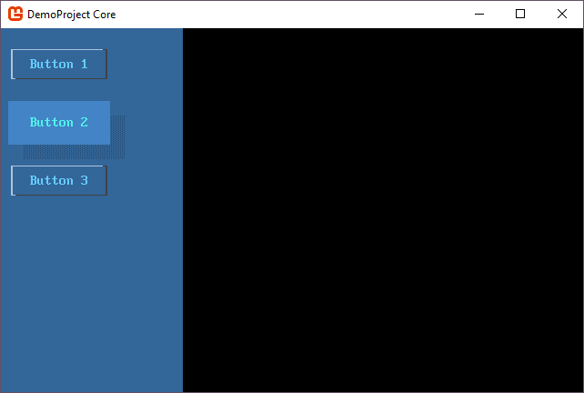

# Overview - Control Themes

SadConsole provides a theme system for all controls used by SadConsole. Every control, even your own custom controls, require a theme to function. A control is split into two parts, the control behavior, and the control theme. The theme is responsible for determining the physical layout of the control and how each cell of the control looks.

## Global library

SadConsole provides a global library that provides the themes and colors used by all controls. This single colors scheme ensures all controls look similar. If these colors are adjusted before any controls are created, they will all share the new color scheme.

In the library is a theme registration system that associates a theme type with a control type. Each time a control is created, the control asks the library registration for a copy of the associated theme.

The library is accessed through the through the static <xref:SadConsole.Themes.Library.Default?displayProperty=fullName> property.

Themes are split into two types: themes for a control and themes for control hosts. Control hosts are types like the <xref:SadConsole.ControlsConsole> or <xref:SadConsole.Window>.

To summarize, the theme library contains three main parts:

- A definition of <xref:SadConsole.Themes.Colors>.
- A theme for `ControlsConsole` and `Window`.
- A theme registration system containing a theme for every type of control.

## Control hosts

The global library defines the two control host themes directly on the library:

- A theme for <xref:SadConsole.ControlsConsole> is available at <xref:SadConsole.Themes.Library.ControlsConsoleTheme?displayProperty=fullName>.
- A theme for <xref:SadConsole.Window> is available at <xref:SadConsole.Themes.Library.WindowTheme?displayProperty=fullName>.

> [!NOTE]
> While the `ControlsConsole` is mostly talked about, everything applies to the `Window` type since it is derived from `ControlsConsole`.

The control host draws itself with the following three steps:

01. Theme
01. `Invalidate` method
01. `Invalidated` event

## Customizing hosts

A normal `Console` retains whatever you print or draw on it. Unless you erase or change the `Console`, it's contents remain forever. The <xref:SadConsole.ControlsConsole> behaves differently because it has a theme. The theme generally erases the entire console when it is redrawn.

The logic used to draw the `ControlsConsole` starts in the <xref:SadConsole.ControlsConsole.Invalidate> method. This method draws the theme on the console and is called whenever the console becomes dirty or when the theme is changed. Next, the method calls the custom drawing code in <xref:SadConsole.ControlsConsole.OnInvalidate>, and then raises the <xref:SadConsole.ControlsConsole.Invalidated> event.

Therefore, you have three ways of drawing content onto a `ControlsConsole`:

01. Subscribe the <xref:SadConsole.ControlsConsole.Invalidated> event.

    The `OnInvalidate` event is raised after all drawing has been completed on the console. It's an easy way to customize any `ControlsConsole` without having to create a new theme or a derived class.

01. Override the <xref:SadConsole.ControlsConsole.OnInvalidate> method.

    When you have your own console class, you can override the <xref:SadConsole.ControlsConsole.OnInvalidate> method and provide your own drawing code. This method is called after the theme has been drawn.

01. Create a new theme.

    If you create a new <xref:SadConsole.Themes.ControlsConsoleTheme> or new <xref:SadConsole.Themes.WindowTheme> class, you can customize the drawing of the console however you want. The theme can be applied to all consoles by setting the library <xref:SadConsole.Themes.Library.ControlsConsoleTheme?displayProperty=fullName> and <xref:SadConsole.Themes.Library.WindowTheme?displayProperty=fullName> properties.

    To apply the new theme to a single console instance, set the <xref:SadConsole.ControlsConsole.Theme> property.

## Host Invalidated event

Subscribing to the <xref:SadConsole.ControlsConsole.Invalidated> event is an easy way to customize a <xref:SadConsole.ControlsConsole> or <xref:SadConsole.Window> without having to create a whole new derived class and without having to customize the theme. The following example demonstrates a console with a single button that listens to the `Invalidated` event and draws a string and box.

```csharp
var console = new SadConsole.ControlsConsole(50, 30)
{
    new SadConsole.Controls.Button(7, 1)
    {
        Text = "Click",
        Position = new Point(5, 5)
    }
};

console.Invalidated += (s, e) =>
{
    var host = (ControlsConsole)s;
    Rectangle boxArea = host.Controls[0].Bounds;
    boxArea.Inflate(1, 1);
    host.DrawBox(boxArea, new Cell(Color.Yellow, Color.Transparent), null, CellSurface.ConnectedLineThin);

    var themeColors = host.ThemeColors ?? SadConsole.Themes.Library.Default.Colors;
    host.Print(1, 1, "Hello World", themeColors.Green, themeColors.GreenDark);
};

// code to show the console
Global.CurrentScreen = console;
```



## Host Invalidate override

If you create a new class that inherits from <xref:SadConsole.ControlsConsole> or <xref:SadConsole.Window>, override the <xref:SadConsole.ControlsConsole.Invalidate> method to draw on the console. With your own class, you wouldn't use subscribe to the event as described in the previous section. Subscribing to the event is what you would do to alter the console from the outside.

Here are some examples.

```csharp
class MyConsole : SadConsole.ControlsConsole
{
    public MyConsole(int width, int height) : base(width, height) { }

    public override void Invalidate()
    {
        base.Invalidate();

        Print(1, 1, "Hello World", Theme.Colors.Green, Theme.Colors.GreenDark);
    }
}


// code to show the console
Global.CurrentScreen = new MyConsole(20, 10);
```


Note that the blue background of the console displayed above was taken from the theme colors, and automatically applied by the theme.

## Host theme

You can create a new theme and apply it to a console. The theme is the first thing that the console draws. Let's create a new <xref:SadConsole.Themes.ControlsConsoleTheme?displayProperty=fullName> object.

```csharp
class MyTheme: SadConsole.Themes.ControlsConsoleTheme
{
    public override void Draw(ControlsConsole console, CellSurface hostSurface)
    {
        var themeColors = host.ThemeColors ?? SadConsole.Themes.Library.Default.Colors;

        var customPrintStyle = new Cell(themeColors.Yellow, themeColors.YellowDark);

        // Use the existing theme's drawing which clears the console with the FillStyle property
        base.Draw(console, hostSurface);

        hostSurface.Print(1, 1, "Hello World 2", customPrintStyle);
    }
}
```

Because colors are defined by the console, you can access the palette of colors it defines. If no colors are defined, default to the library. The `ControlsConsoleTheme` base class has a `FillStyle` property that `base.Draw` uses to fill with the control's colors.

Next, we need to set this theme on a console. We can globally set the theme at the start of SadConsole, which means every `ControlsConsole` created will use this new theme:

```csharp
// Init code
SadConsole.Themes.Library.Default.ControlsConsoleTheme = new MyTheme();

Global.CurrentScreen = new ContainerConsole();

Global.CurrentScreen.Children.Add(new ControlsConsole(20, 10) { Position = new Point(0, 0) });
Global.CurrentScreen.Children.Add(new ControlsConsole(20, 10) { Position = new Point(22, 0) });
```

The above code created two new `ControlsConsole` objects, but didn't touch any theme related properties or settings on those consoles. Each console still used the new theme that was created because it was applied globally through the `Library.Default` property.



But instead of changing all consoles, you may just want to change a single console. Set the <xref:SadConsole.ControlsConsole.Theme?displayProperty=fullName> property to a new instance of the theme.

```csharp
Global.CurrentScreen = new ContainerConsole();

Global.CurrentScreen.Children.Add(new ControlsConsole(20, 10) { Position = new Point(0, 0) });
Global.CurrentScreen.Children.Add(new ControlsConsole(20, 10) { Position = new Point(22, 0), Theme = new MyTheme() });
```



## Control themes

Control themes operate very similarly to the host console themes. The difference, though, is that when a control is created, it runs the <xref:SadConsole.Themes.Library.GetControlTheme(System.Type)?displayProperty=fullName> method to assign a theme to the control.

The <xref:SadConsole.Themes> namespace contains a theme object for each control defined by SadConsole. And each theme type uses a common base class, <xref:SadConsole.Themes.ThemeBase?displayProperty=fullName> which inherits from <xref:SadConsole.Themes.ThemeStates?displayProperty=fullName>. The `ThemeStates` class provides a cell template for each state a control can be put into. Usually the state of the control is set by interacting with it, like focusing, moving the mouse over it, and clicking.

The `ThemeBase` class provides logic for theme and control:

01. When the theme is assigned to a control, call the <xref:SadConsole.Themes.ThemeBase.Attached(SadConsole.Controls.ControlBase)> method which generally creates the <xref:SadConsole.Controls.ControlBase.Surface> of the control.

01. When the control redraws itself, the <xref:SadConsole.Themes.ThemeBase.UpdateAndDraw(SadConsole.Controls.ControlBase,System.TimeSpan)> method is called which draws the theme based on the control state.

Lets use an example console that has three buttons. In this example, we'll clone the default library and assign it to the console.

```csharp
var console = new SadConsole.ControlsConsole(25, 25);

console.Add(
    new SadConsole.Controls.Button(14, 3)
    {
        Position = new Point(1, 1),
        Text = "Button 1"
    }
    );

console.Add(
    new SadConsole.Controls.Button(14, 3)
    {
        Position = new Point(1, 5),
        Text = "Button 2"
    }
    );

console.Add(
    new SadConsole.Controls.Button(14, 3)
    {
        Position = new Point(1, 9),
        Text = "Button 3"
    }
    );

Global.CurrentScreen = console;
```



Those three buttons get their theme from the global library. If you change that theme, all buttons will use the new theme. This code is the same as before except that the button theme for the new library instance has been changed. Now, all buttons on this console look different.

```csharp
var console = new SadConsole.ControlsConsole(25, 25);

SadConsole.Themes.Library.Default.SetControlTheme(typeof(Button),
                                                  new SadConsole.Themes.ButtonLinesTheme());

// code to create 3 buttons removed to save space

Global.CurrentScreen = console;
```


However, if you want to change the theme of an individual button, create a new instance of the theme and apply it to the button.

A lot of the time you want to change the theme of a single button. Alter the **Button 2** button from the previous code to change the theme.

```csharp
console.Add(
    new SadConsole.Controls.Button(14, 3)
    {
        Position = new Point(1, 5),
        Text = "Button 2",
        Theme = new SadConsole.Themes.Button3dTheme()
    }
    );
```



## Colors

Colors are used by the library, a console host, or a control. By default a console host and control (when drawing) will search for the colors they should use. The control can define it's own colors by setting the <xref:SadConsole.Controls.ControlBase.ThemeColors> property. When a control is drawn, the theme checks for any colors defined by the control. If the colors are not defined, the parent console host is checked for colors. If the colors are not defined on the control host, the <xref:SadConsole.Themes.Library.Default?displayProperty=fullName> has the <xref:SadConsole.Themes.Library.Colors> property is used.

## Colors with control themes

All control themes use some basic appearance settings by default, and these are defined on a <xref:SadConsole.Themes.Colors?displayProperty=fullName> object. Controls are always in some sort of state (such as **mouse over**) and each state has a corresponding `Appearance*` property on the colors object. The `Appearance*` property has the foreground and background colors which the theme uses to draw the control.

| Property | State        | Made from |
| -------- | ------------ | --------- |
| <xref:SadConsole.Themes.Colors.Appearance_ControlNormal>    | Normal                          | **Foreground** <xref:SadConsole.Themes.Colors.Text><br>**Background** <xref:SadConsole.Themes.Colors.ControlBack> |
| <xref:SadConsole.Themes.Colors.Appearance_ControlDisabled>  | Disabled                        | **Foreground** <xref:SadConsole.Themes.Colors.TextLight><br>**Background** <xref:SadConsole.Themes.Colors.ControlBackDark> |
| <xref:SadConsole.Themes.Colors.Appearance_ControlOver>      | Mouse Over                      | **Foreground** <xref:SadConsole.Themes.Colors.TextSelectedDark><br>**Background** <xref:SadConsole.Themes.Colors.ControlBackSelected> |
| <xref:SadConsole.Themes.Colors.Appearance_ControlSelected>  | Selected item (like in listbox) | **Foreground** <xref:SadConsole.Themes.Colors.TextSelected><br>**Background** <xref:SadConsole.Themes.Colors.ControlBackSelected> |
| <xref:SadConsole.Themes.Colors.Appearance_ControlMouseDown> | Mouse button down               | **Foreground** <xref:SadConsole.Themes.Colors.ControlBackSelected><br>**Background** <xref:SadConsole.Themes.Colors.TextSelected> |
| <xref:SadConsole.Themes.Colors.Appearance_ControlFocused>   | Normal and focused              | **Foreground** <xref:SadConsole.Themes.Colors.TextFocused><br>**Background** <xref:SadConsole.Themes.Colors.ControlBackLight> |

By changing the base color definitions (such as <xref:SadConsole.Themes.Colors.Text>) and calling <xref:SadConsole.Themes.Colors.RebuildAppearances?displayProperty=fullName>, all of the `Appearance*` properties will be rebuilt.

## How to: Set colors for a console

The following code creates new colors used by the console host and it's controls:

```csharp
var console = new SadConsole.ControlsConsole(50, 30)
{
    new SadConsole.Controls.Button(7, 1)
    {
        Text = "Click",
        Position = new Point(5, 5)
    }
};

// Create a new set of colors
var colors = SadConsole.Themes.Colors.CreateDefault();
colors.ControlBack = Color.DarkGray;
colors.ControlBackLight = (colors.ControlBack * 1.3f).FillAlpha();
colors.ControlBackSelected = Color.LightGray;
colors.ControlBackDark = (colors.ControlBack * 0.7f).FillAlpha();
colors.Text = Color.Black;

colors.RebuildAppearances();

// Apply the colors to a console
console.ThemeColors = colors;

// code to show the console
Global.CurrentScreen = console;
```

There are more properties to set on the `colors` object to fully rebuild all control states. The limited set above was provided just to demonstrate changing the colors. Refer to the table previously listed.


## How to: Set colors for a control

That same code can be used to apply colors to an individual control. Instead of applying it to the control host, apply the colors to an individual control. Here is the same code as section above, but with the colors applied to a single control.

```csharp
var console = new SadConsole.ControlsConsole(50, 30)
{
    new SadConsole.Controls.Button(7, 1)
    {
        Text = "Click",
        Position = new Point(5, 5)
    }
};

// Create a new set of colors
var colors = SadConsole.Themes.Colors.CreateDefault();
colors.ControlBack = Color.DarkGray;
colors.ControlBackLight = (colors.ControlBack * 1.3f).FillAlpha();
colors.ControlBackSelected = Color.LightGray;
colors.ControlBackDark = (colors.ControlBack * 0.7f).FillAlpha();
colors.Text = Color.Black;

colors.RebuildAppearances();

// Apply the colors to the button (first control) on the console
console.Controls[0].ThemeColors = colors;

// code to show the console
Global.CurrentScreen = console;
```

There are more properties to set on the `colors` object to fully rebuild all control states. The limited set above was provided just to demonstrate changing the colors. Refer to the table previously listed.

