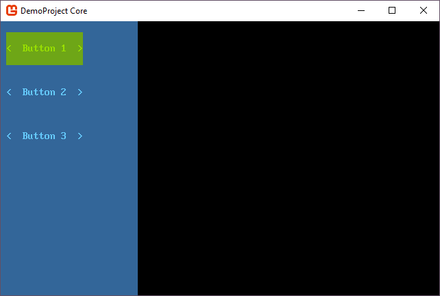
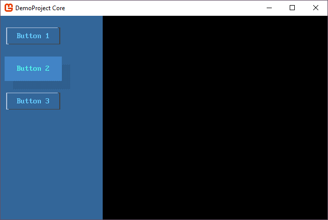

# How the control theme system works

SadConsole comes with a default theme that all controls use. This is accessed through the static <xref:SadConsole.Themes.Library.Default?displayProperty=fullname> property. When a <xref:SadConsole.ControlsConsole> or <xref:SadConsole.Window> is created, the `Library.Default` theme is automatically referenced. Therefore, all `ControlsConsole` and `Window` objects share a common theme. 

A theme library contains three main parts:

* A definition of <xref:SadConsole.Themes.Colors>.
* A theme for `ControlsConsole` and `Window`.
* A theme for every type of control.

## Host console

The <xref:SadConsole.ControlsConsole> and <xref:SadConsole.Window> type both have a `Theme` property which, unless changed, points to the shared <xref:SadConsole.Themes.Library.Default?displayProperty=fullname> library. 

>[!NOTE]
>While the `ControlsConsole` is mostly talked about, everything applies to the `Window` type since it is derived from `ControlsConsole`.

The `ControlsConsole` has an <xref:SadConsole.ControlsConsole.Invalidate> which is in charge of drawing the theme on the console. This is called in two places, when the console is first created and when the theme is set to a different theme. The invalidate method draws the theme on the console, tells each control to refresh its theme, and marks every control as dirty so they will be redrawn.

This works different from a normal `Console`. A normal `Console` always keeps whatever you draw to it. Unless you erase it, it's there forever. Printing or editing a `ControlsConsole` directly is not recommended as the theme of the `ControlsConsole` would erase whatever work you did on the console. If you want to do a custom design on a `ControlsConsole` you have two options:

01. Override the `Invalidate` method.

    If you override `Invalidate` and provide your own drawing code, you effectively disable the theme drawing on the console. You can still call `base.Invalidate()` first though to ensure that the current theme draws, and after that, draw what you want.

02. Create a new theme.

    If you create a new <xref:SadConsole.Themes.ControlsConsoleTheme> or new <xref:SadConsole.Themes.WindowTheme> class, you can customize the drawing of the console however you want. Then replace the theme's <xref:SadConsole.Themes.Library.ControlsConsoleTheme?displayProperty=fullname> or <xref:SadConsole.Themes.Library.WindowTheme?displayProperty=fullname> property. 

    Remember, if you change any theme on the <xref:SadConsole.Themes.Library.Default?displayProperty=fullname> instance (which a console points to unless you set a different library) it will apply to all controls and consoles.

Here are some examples.

### Invalidate

The <xref:SadConsole.ControlsConsole.Invalidate> method provides a quick-and-easy way for you to extend the current theme. For example, this code still calls `base.Invalidate()` to draw the current theme, but then prints on top of that using the theme's colors.

```csharp
class MyConsole : SadConsole.ControlsConsole
{
    public MyConsole(int width, int height) : base(width, height) { }

    public override void Invalidate()
    {
        base.Invalidate();

        Print(1, 1, "Hello World", Theme.Colors.Green, Theme.Colors.GreenDark);
    }
}


// code to show the console
Global.CurrentScreen = new MyConsole(20, 10);
```


Note that the blue background of the console displayed above was taken from the theme, and automatically applied by the theme.

### Theme

You can create a new theme and apply it to the library that the console uses. If the console does not use a custom library, then the theme would be applied to all consoles. For example, let's create a new <xref:SadConsole.Themes.ControlsConsoleTheme?displayProperty=fullName> object.

```csharp
class MyTheme: SadConsole.Themes.ControlsConsoleTheme
{
    Cell CustomPrintStyle;

    public override void RefreshTheme(Colors themeColors)
    {
        base.RefreshTheme(themeColors);

        CustomPrintStyle = new Cell(themeColors.Yellow, themeColors.YellowDark);
    }
    public override void Draw(ControlsConsole console, CellSurface hostSurface)
    {
        // Use the existing theme's drawing which clears the console with the FillStyle property
        base.Draw(console, hostSurface);

        hostSurface.Print(1, 1, "Hello World 2", CustomPrintStyle);
    }
}
```

The theme itself can't access the parent library and retrieve the colors. When the colors change, the `RefreshTheme` method is called on the theme. This is where you build the theme's custom settings. The `ControlsConsoleTheme` base class has a `FillStyle` property that clears and fills the console when the theme is drawn. That `base.RefreshTheme(themeColors)` call makes sure that `FillStyle` property is still built properly. And so our custom theme follows the same design, we built a new visual style `CustomPrintStyle` based on the colors provided.

Next we need to set this theme on a console. We can globally set the theme at the start of SadConsole, which means every `ControlsConsole` created will use this new theme:

```csharp
SadConsole.Themes.Library.Default.ControlsConsoleTheme = new MyTheme();
SadConsole.Themes.Library.Default.ControlsConsoleTheme.RefreshTheme(SadConsole.Themes.Library.Default.Colors);

Global.CurrentScreen = new ContainerConsole();

Global.CurrentScreen.Children.Add(new ControlsConsole(20, 10) { Position = new Point(0, 0) });
Global.CurrentScreen.Children.Add(new ControlsConsole(20, 10) { Position = new Point(22, 0) });
```

The above code created two new `ControlsConsole` objects, didn't touch any theme related properties or settings on those consoles, but the consoles still used the new theme. This is because we applied the theme at a global elvel through the `Library.Default` object.


But instead of changing all consoles, you may just want to change a single console. In this case you need to apply a whole new library instance to the console. You can easily clone the existing library and change it.

```csharp
var library = SadConsole.Themes.Library.Default.Clone();
library.ControlsConsoleTheme = new MyTheme();
library.ControlsConsoleTheme.RefreshTheme(SadConsole.Themes.Library.Default.Colors);

Global.CurrentScreen = new ContainerConsole();
Global.CurrentScreen.Children.Add(new ControlsConsole(20, 10) { Position = new Point(0, 0) });
Global.CurrentScreen.Children.Add(new ControlsConsole(20, 10) { Position = new Point(22, 0), Theme = library });
```

The above code cloned the existing default library and changed the `ControlsConsoleTheme` property to our new theme. Two consoles were created but one (by default) uses the `Library.Default` theme while the second used our custom library which has our custom theme on it.


## Controls

Control themes operate very similarly to the host console themes. The difference though is that *if* the theme is not explicitly set on the control, it asks the parent host console for the theme. If there is no parent, like when you first create a control, then the control looks at the `Library.Default` for a theme.

The <xref:SadConsole.Themes> namespace contains a theme object for each control defined by SadConsole. And each theme type uses a common base class, <xref:SadConsole.Themes.ThemeBase?displayProperty=fullName> which inherits from <xref:SadConsole.Themes.ThemeStates?displayProperty=fullName>. The `ThemeStates` class provides a cell template for each state a control can be put into. Usually the state of the control is set by interacting with it, like focusing, moving the mouse over it, and clicking. `ThemeBase`, on the other hand, provides logic that every control theme uses:

* When a control is added to a console

  * Signal the theme of the control that it has been attached to a control.
  * Refresh the theme state.

* When a custom theme is added to a control directly

  * Signal the theme of the control that it has been attached to a control.
  * Refresh the theme state.

Lets use an example console that has three buttons. In this example, we'll clone the default library and assign it to the console.

```csharp
var console = new SadConsole.ControlsConsole(25, 25);
var consoleTheme = SadConsole.Themes.Library.Default.Clone();

console.Theme = consoleTheme;

console.Add(
    new SadConsole.Controls.Button(14, 3)
    {
        Position = new Point(1, 1),
        Text = "Button 1"
    }
    );

console.Add(
    new SadConsole.Controls.Button(14, 3)
    {
        Position = new Point(1, 5),
        Text = "Button 2"
    }
    );

console.Add(
    new SadConsole.Controls.Button(14, 3)
    {
        Position = new Point(1, 9),
        Text = "Button 3"
    }
    );

Global.CurrentScreen = console;
```



Those three buttons get their theme from the parent console. If you change that theme, all buttons will use the new theme. This code is the same as before except that the button theme for the new library instance has been changed. Now, all buttons on this console look different.

```csharp
var console = new SadConsole.ControlsConsole(25, 25);
var consoleTheme = SadConsole.Themes.Library.Default.Clone();

consoleTheme.ButtonTheme = new SadConsole.Themes.ButtonLinesTheme();

console.Theme = consoleTheme;

// code to create 3 buttons removed to save space

Global.CurrentScreen = console;
```


However, if the theme you want to change (button in this case) has some settings, you can create a new version of that theme and apply it to a button.

A lot of the time you want to change the theme of a single button. Instead of using a custom library that changes the theme of all instance of the control, you can adjust a single button. Alter the "Button 2" button from the previous code to change the theme.

```csharp
console.Add(
    new SadConsole.Controls.Button(14, 3)
    {
        Position = new Point(1, 5),
        Text = "Button 2",
        Theme = new SadConsole.Themes.Button3dTheme()
    }
    );
```



## Colors

Colors are just a property of a theme library that can be altered. All controls use some basic appearance settings by default, and these are defined on a <xref:SadConsole.Themes.Colors?displayProperty=fullName> object. Controls have states which correspond to the `Appearance*` properties on the colors object.

| Property | State | Made from |
| -------- | ------------ | --------- |
| <xref:SadConsole.Themes.Colors.Appearance_ControlNormal> | Normal | **Foreground** <xref:SadConsole.Themes.Colors.Text><br>**Background** <xref:SadConsole.Themes.Colors.ControlBack>
| <xref:SadConsole.Themes.Colors.Appearance_ControlDisabled> | Disabled | **Foreground** <xref:SadConsole.Themes.Colors.TextLight><br>**Background** <xref:SadConsole.Themes.Colors.ControlBackDark>
| <xref:SadConsole.Themes.Colors.Appearance_ControlOver> | Mouse Over | **Foreground** <xref:SadConsole.Themes.Colors.TextSelectedDark><br>**Background** <xref:SadConsole.Themes.Colors.ControlBackSelected>
| <xref:SadConsole.Themes.Colors.Appearance_ControlSelected> | Selected item (like in listbox) | **Foreground** <xref:SadConsole.Themes.Colors.TextSelected><br>**Background** <xref:SadConsole.Themes.Colors.ControlBackSelected>
| <xref:SadConsole.Themes.Colors.Appearance_ControlMouseDown> | Mouse button down | **Foreground** <xref:SadConsole.Themes.Colors.ControlBackSelected><br>**Background** <xref:SadConsole.Themes.Colors.TextSelected>
| <xref:SadConsole.Themes.Colors.Appearance_ControlFocused> | Normal and focused | **Foreground** <xref:SadConsole.Themes.Colors.TextFocused><br>**Background** <xref:SadConsole.Themes.Colors.ControlBackLight>

By changing the base color definitions (such as <xref:SadConsole.Themes.Colors.Text>) and calling <xref:SadConsole.Themes.Colors.RebuildAppearances?displayProperty=fullName>, all of the `Appearance*` values will be rebuilt. Any controls that are created after this, or those that need to be redrawn, would use the new color values.