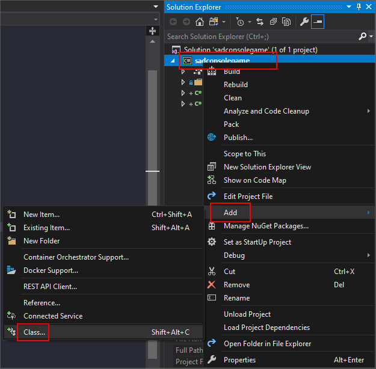

# Get Started (2) - Learning about input

In this part of the tutorial we'll explore how input works in SadConsole. Input is made up of both keyboard and mouse processing. SadConsole does not provide any input processing for gamepads and joysticks. However, MonoGame provides gamepad and joystick processing, which SadConsole is built on.

Previous articles in this tutorial:

- [Part 1: Drawing on a console](drawing-on-a-console.md)

## Prep

Reset the `Init()` method back to a clean state. Whenever the tutorial talks about resetting the `Init()` method back to a clean state, it means to replace your existing code with the following code:

```csharp
static void Init()
{
    var console = new Console(80, 25);

    SadConsole.Global.CurrentScreen = console;
}
```

## Keyboard

SadConsole includes a keyboard processing system that reacts to a console that is focused. You can have as many consoles as you want on the screen but only a single console can be set as the "focused" console. By default, no console is focused.

Once you focus a console, it will begin to react to keyboard keys being pressed. Test it out. In your `Init()` method, add the the line `console.IsFocused = true` to set the blank console as focused. When you run the program, start typing on your keyboard. You'll see the characters being printed. This is because every console has a cursor. It is visibly hidden though. Add the following code to show it: `console.Cursor.IsVisible = true`. Run your program again, you'll see a blinking cursor which you can move around with the arrow keys and it will output what you type. The <kbd>BACKSPACE</kbd> key only erases the current line.

```csharp
static void Init()
{
    var console = new Console(80, 25);

    console.IsFocused = true;
    console.Cursor.IsVisible = true;

    SadConsole.Global.CurrentScreen = console;
}
```

You can easily disable the cursor completely with `console.Cursor.IsEnabled = false`. This will make the cursor skip processing keyboard information sent to it by the console the cursor is hosted on.

## Keyboard component

There are two ways to customize keyboard processing of a console. The first way is by creating a new `KeyboardComponent` that has the logic for the keyboard and then attaching it to a console. The second way is to create a new class that inherits from `Console` and replaces the existing code with new code. We'll focus on using a component.

The component system provides an easy way to customize a `Console` without having to create a whole new console type.

01. Add a new class to your project. In Visual Studio in the Solution Explorer pane, right-click the **project** > **Add** > **Class** and name the class *MyKeyboardComponent.cs* and click **Add**.

    

01. Open up the *MyKeyboardComponent.cs* in the editor and add these three `using` statements to the top of the file:

    ```csharp
    using SadConsole.Components;
    using SadConsole.Input;
    using Microsoft.Xna.Framework;
    ```

01. Next, inherit from the `KeyboardConsoleComponent` class. This class is contained in the `SadConsole.Components` namespace which we just imported.

    ```csharp
    class MyKeyboardComponent: KeyboardConsoleComponent
    ```

01. The `KeyboardConsoleComponent` class requires that you implement some functionality before you can actually use it, the `ProcessKeyboard` method. Here is that method added to the class:

    ```csharp
    class MyKeyboardComponent : KeyboardConsoleComponent
    {
        public override void ProcessKeyboard(SadConsole.Console console, Keyboard info, out bool handled)
        {
            handled = false;
        }
    }
    ```

    The `handled` parameter is declared as an `out` parameter. This means that it must be assigned a value before the method code ends. Here we set it to `false` to signal that we're not handling the keyboard at this time.

    To test the keyboard processing, let's watch for the <kbd>SPACE</kbd> key being pressed. When it is pressed, we'll cycle the background color of the console with a random color.

01. Add this `if` statement to the `ProcessKeyboard()` method of the component. Do not set `handled = true;` just yet. Let's leave that as `false`.

    ```csharp
    if (info.IsKeyPressed(Microsoft.Xna.Framework.Input.Keys.Space))
    {
        console.DefaultBackground = Color.White.GetRandomColor(SadConsole.Global.Random);
        console.Clear();
    }
    ```

    What that code above does is detect the <kbd>SPACE</kbd> key and then change the default background of the console to a different color. The default background of a console does not instantly reset all the cells to the appropriate color or anything, so you must call the `Clear` method. The `GetRandomColor` call may look weird. This is due to the nature of extension methods in C#. `GetRandomColor` is provided by SadConsole and attached to any color *instance* variable. So in this case we get the *White* color and use that to call `GetRandomColor`. The *White* color however is not actually used.

01. Back in your `program.cs` file, change the `Init()` method to add the component to the `console` variable.

    ```csharp
    static void Init()
    {
        var console = new Console(80, 25);
        console.IsFocused = true;
        console.Cursor.IsVisible = true;
        console.Components.Add(new MyKeyboardComponent());
        
        SadConsole.Global.CurrentScreen = console;
    }
    ```

Run the program and start typing sentences. You'll see both keyboard processors working. First, each time you press the <kbd>SPACE</kbd> character, the background color of the console changes. Second, the cursor is still enabled and is also watching the keyboard and responding to key presses. Notice that when you press <kbd>SPACE</kbd>, the background changes, the cursor moves, and there is a black spot where the cursor used to be. This happens because of the order of events.

In SadConsole, when the console is processing the keyboard, it first checks for any `KeyboardComponent` that was added to the `Components` collection and calls `ProcessKeyboard` on it. If the `ProcessKeyboard` call sets `handled = true` then it will instantly stop processing any other component and will not process the cursor. Our code has `handled = false` so the cursor is processed **after** we change the background. And the cursor is set to print a black background on each character typed. Let's cause our component to halt processing the keyboard. Back in the *MyKeyboardComponent.cs* file, set `handled = true` and run your game again.

You'll notice that the cursor doesn't move and print, however, it is still visible. Your component works as intended and recolors the console every time you press the <kbd>SPACE</kbd> key. The final code for your component should look like the following:

```csharp
using SadConsole.Components;
using SadConsole.Input;
using Microsoft.Xna.Framework;

namespace SadConsoleGame
{
    class MyKeyboardComponent : KeyboardConsoleComponent
    {
        public override void ProcessKeyboard(SadConsole.Console console, Keyboard info, out bool handled)
        {
            if (info.IsKeyPressed(Microsoft.Xna.Framework.Input.Keys.Space))
            {
                console.DefaultBackground = Color.White.GetRandomColor(SadConsole.Global.Random);
                console.Clear();
            }

            handled = true;
        }
    }
}
```

You can hide the visible cursor by removing the line in *program.cs* that set the cursor to visible. Your final code for `Init()` method in the *program.cs* file should look like the following:

```csharp
static void Init()
{
    var console = new Console(80, 25);
    console.IsFocused = true;
    console.Components.Add(new MyKeyboardComponent());

    SadConsole.Global.CurrentScreen = console;
}
```

### ProcessKeyboard parameters

The `KeyboardComponent.ProcessKeyboard()` method has two important parameters passed to it. First, the `console` parameter is passed which contains a reference to the console that the component is currently attached to. Second, the `info` parameter holds information about the keyboard state.

you can use the `info` parameter to query the state of the keyboard. In our example we used it to check the `IsKeyPressed()` method which returns us `true` when the specified key is pressed, and `false` when it is not. There is also the `IsKeyUp()` and `IsKeyDown()` methods which represent the state of the key being up or down. A key "press" in SadConsole represents a single key event being triggered that game frame. If the key is held down, it will reappear as pressed over and over with a delay between when it appears. This mimics how your keyboard works with your operating system. Experiment with these other methods. For example, try changing the code to always change the background of the console while the <kbd>S</kbd> key is **not** being pressed, so that it stops changing color when the key is being held down. If you suffer from seizures, don't do this, the flashing colors may hurt you.

## Mouse

SadConsole includes a mouse processing system that is always watching the mouse. Unlike keyboard processing, the mouse is processed on a console even if that console is unfocused. Whenever you move your mouse on top of a console, the `ProcessMouse()` method of that console is run, which controls a lot of different things.

Much like the keyboard, there are actually three ways to customize the mouse on a console. You can use the same component system as the keyboard, but with a `MouseComponent` instead, create a new console class that overrides the `ProcessMouse()` method, or use the events the console provides related to the mouse.

## Mouse Events

Consoles provide three different events related to the mouse movement:

- **Console.MouseEnter**\
This event is raised whenever the mouse enters the bounds of a console.

- **Console.MouseExit**\
This event is raised whenever the mouse leaves the bounds of a console.

- **Console.MouseMove**\
After a mouse has entered a console, the `MouseMove` event is raised over-and-over while the mouse moves around the console.

As an example of using the mouse events, let's write some code that prints out the state of the mouse as it moves around the console.

01. First, in your `Init()` method, add a new line that adds a callback to the `MouseMove` event.

    ```csharp
    console.MouseMove += Console_MouseMove;
    ```

    The `+=` operator attaches the method named `Console_MouseMove` to the `MouseMove` event of the console. This method doesn't exist so it will give you an error right now. The signature of the method (the types of parameters) must match what is expected by the event.

01. Add a new method below the `Init()` method named `Console_MouseMove` with the following signature.

    ```csharp
    private static void Console_MouseMove(object sender, SadConsole.Input.MouseEventArgs e)
    {
    
    }
    ```

01. If you run your game, you won't see anything happen. So let's add some code to the method. First, the `sender` is always the console that raised the `MouseMove` event. However, because of the common event pattern, this is sent as an `object` type and we'll need to cast it to a `Console`.

    ```csharp
    var console = (Console)sender;
    ```

01. Next, the `e` parameter contains information about the mouse. Let's print the mouse location at the top-left of the console.

    ```csharp
    console.Print(1, 1, $"Mouse moving at {e.MouseState.CellPosition}          ");
    ```

    Run the game now. You'll see that as you move the mouse around the screen, the position is printed.

01. Next, let's print a message when the mouse button is down.

    ```csharp
    if (e.MouseState.Mouse.LeftButtonDown)
        console.Print(1, 2, $"Left button is down");
    else
        console.Print(1, 2, $"                   ");
    ```

Here is the final code for the method:

```csharp
private static void Console_MouseMove(object sender, SadConsole.Input.MouseEventArgs e)
{
    var console = (Console)sender;

    console.Print(1, 1, $"Mouse moving at {e.MouseState.CellPosition}          ");

    if (e.MouseState.Mouse.LeftButtonDown)
        console.Print(1, 2, $"Left button is down");
    else
        console.Print(1, 2, $"                   ");
}
```

You may have noticed that there is a print statement with a bunch of spaces. Once the text about the left mouse button being down is printed, it will remain unless we clear the console or in the case of the `else` statement, print a bunch of blank characters over it.

The `Init()` method looks like this, with the event being hooked.

```csharp
static void Init()
{
    var console = new Console(80, 25);
    console.IsFocused = true;
    console.Components.Add(new MyKeyboardComponent());

    console.MouseMove += Console_MouseMove;

    SadConsole.Global.CurrentScreen = console;
}
```

Next, let's try doing the same but with a component.

## Mouse component

Use a mouse input component to customize the mouse input of a console in a reusable way. There is one drawback to using a component though, you attach to the console in a low-level way and you have to do all the processing logic yourself. Doing so means that you don't get the individual events for mouse enter, exit, and move.

Since the component hooks into the start of the console's `ProcessMouse()` method, if you set `handled = true` on this, the events for the mouse will never trigger, you effectively provide your own mouse processing logic. If you still want all of the normal mouse processing to happen, set `handled = false` instead.

Let's try a mouse component. Reset your `Init()` code to a clean state.

01. Add a new class to your project. In Visual Studio in the Solution Explorer pane, right-click the **project** > **Add** > **Class** and name the class *MyMouseComponent.cs* and click **Add**.

01. Open up the *MyMouseComponent.cs* in the editor and add these three `using` statements to the top of the file:

    ```csharp
    using SadConsole.Components;
    using SadConsole.Input;
    using Microsoft.Xna.Framework;
    ```

01. Next, inherit from the `MouseConsoleComponent` class. This class is contained in the `SadConsole.Components` namespace which we just imported.

    ```csharp
    class MyMouseComponent: MouseConsoleComponent
    ```

01. The `MouseConsoleComponent` class requires that you implement some functionality before you can actually use it, the `ProcessMouse` method. Here is that method added to the class:

    ```csharp
    class MyMouseComponent : MouseConsoleComponent
    {
        public override void ProcessMouse(SadConsole.Console console, MouseConsoleState state, out bool handled)
        {
            handled = false;
        }
    }
    ```

As a good test of this component, let's recolor the console cells as the mouse moves around. The `state` parameter contains the state of the mouse as it's related to the `console`. So as an example, `state.IsOnConsole` is `true` or `false` as it relates to the passed in `console` parameter. Further, any other console and cell information provided by the mouse state are related to the passed in `console` parameter.

Let's modify the `ProcessMouse` code to recolor the background of a cell as the mouse moves around.

01. In your `MyMouseComponent` code, replace the `ProcessMouse()` method with the following code.

    ```csharp
    public override void ProcessMouse(SadConsole.Console console, MouseConsoleState state, out bool handled)
    {
        if (state.IsOnConsole)
            console.SetBackground(state.CellPosition.X, state.CellPosition.Y, Color.White.GetRandomColor(SadConsole.Global.Random));

        handled = false;
    }
    ```

    This code uses the `state.CellPosition` values to determine what cell the mouse is currently on, when the `state.IsOnConsole` value is `true`. Then, a random color is assigned to the background of the cell.

01. Next, add the component to your console in the `Init()` method of the *program.cs* file, like you did with the keyboard component.

    ```csharp
    static void Init()
    {
        var console = new Console(80, 25);
        console.Components.Add(new MyMouseComponent());

        SadConsole.Global.CurrentScreen = console;
    }
    ```

    Try running your game now. You'll see the background change colors as the mouse moves around.

Back in the `ProcessMouse()` method, the `handled = false` code was not changed to `true`, which means all the normal mouse events for the console will work as intended. Try adding back the event so that both the event code and the component code runs at the same time, then test your game again.

```csharp
static void Init()
{
    var console = new Console(80, 25);
    console.Components.Add(new MyMouseComponent());
    console.MouseMove += Console_MouseMove;

    SadConsole.Global.CurrentScreen = console;
}
```

Change the `handled` value to `true` and run your game again. Notice how when you run it this time, the event never fires.

As a test, try changing the component code to do different things if the left or right mouse button is pressed. Explore the mouse component!

## Conclusion

Now you understand a bit more about how input works. These are just the basics, there is a lot more you can do with input, but that will be explored when we get into the user interface controls provided by SadConsole. The next part of the series will explore creating multiple consoles and displaying them together.

- [Part 3: Learning about consoles](part-3-multiple-consoles.md)
