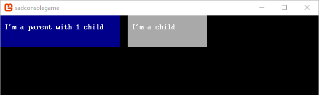
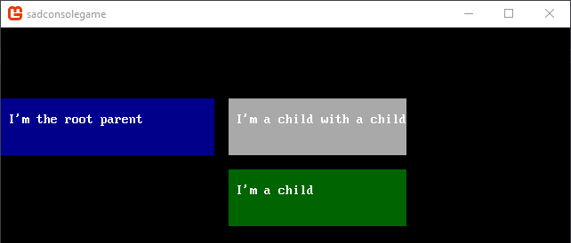
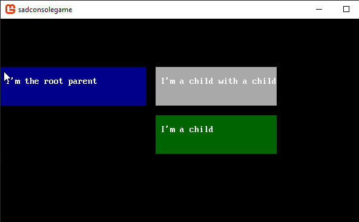
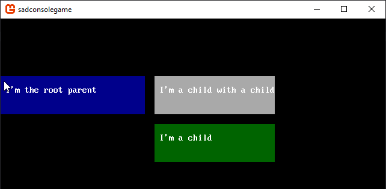

# Get Started 3 - Learning about consoles

In this part of the tutorial you'll learn how to use multiple consoles. Consoles can be attached to other consoles. Consoles can even share cell data between them.

Previous articles in this tutorial:

- [Part 1: Drawing on a console](drawing-on-a-console.md)
- [Part 2: Keyboard and Mouse](part-2-input.md)

## Prep

Reset the `Init()` method back to a clean state. Whenever the tutorial talks about resetting the `Init()` method back to a clean state, it means to replace your existing code with the following code:

```csharp
static void Init()
{
    var console = new Console(80, 25);

    SadConsole.Global.CurrentScreen = console;
}
```

## CurrentScreen

When the term **CurrentScreen** is used, it represents the variable `SadConsole.Global.CurrentScreen`. The **CurrentScreen** is the object that is drawn on the screen. Any console you create will never be shown unless you get it into the **CurrentScreen** collection. There are two ways of getting your console to draw, either set your console *as* the **CurrentScreen**, or add it as a child of the **CurrentScreen**.

When you start SadConsole, the **CurrentScreen** is initialized to an empty console that fits the window. Therefor, you can use that console just like you would any other. Try each variation of the `Init` method below:

```csharp
static void Init()
{
    SadConsole.Global.CurrentScreen.Print(1, 1, "Hello!");
    SadConsole.Global.CurrentScreen.SetGlyph(1, 6, '.');
}
```

The **CurrentScreen** can be replaced by any console:

```csharp
static void Init()
{
    SadConsole.Global.CurrentScreen = new SadConsole.Console(10, 10);
}
```

## Parents and Children

Consoles can act as a parent for other consoles. Once a console is parented to another, it appears in the parent's `Children` collection. When you set the `Parent` of one console to another or add a console directly to the `Children` collection of another, the parent-child relationship is established between the two consoles.

```csharp
static void Init()
{
    var consoleParent = new Console(30, 4);
    var consoleChild = new Console(25, 4);

    consoleParent.Position = new Point(0, 5);
    consoleParent.Fill(null, Color.DarkBlue, null);
    consoleParent.Print(1, 1, $"I'm the root parent");

    consoleChild.Position = new Point(32, 0);
    consoleChild.Fill(null, Color.DarkGray, null);
    consoleChild.Print(1, 1, "I'm a child with a child");
    consoleChild.Parent = consoleParent;

    SadConsole.Global.CurrentScreen = consoleParent;
}
```



>[!Note]
>You can use the `consoleParent.Children` collection property directly instead of `consoleChild.Parent`:
>
>```csharp
>consoleParent.Children.Add(consoleChild);
>```

## Offset positions

A console's position is always based on its parent's position. If the console has no parent, then the position is always based on the top-left coordinate (*0,0*) of the game window.

Using the code from the previous section, change the parent console's position along the Y-axis. The child console will move with the parent along the Y-axis.

```csharp
consoleParent.Position = new Point(0, 5);
```


## Add another child

Console's can have many children, but they can only have a single parent. The children of a console can also have their own children too. Replace your `Init` code with the following:

```csharp
static void Init()
{
    var consoleParent = new Console(30, 4);
    var consoleChild = new Console(25, 4);
    var consoleChild2 = new Console(25, 4);

    consoleParent.Position = new Point(0, 5);
    consoleParent.Fill(null, Color.DarkBlue, null);
    consoleParent.Print(1, 1, $"I'm the root parent");

    consoleChild.Position = new Point(32, 0);
    consoleChild.Fill(null, Color.DarkGray, null);
    consoleChild.Print(1, 1, "I'm a child with a child");
    consoleChild.Parent = consoleParent;

    consoleChild2.Position = new Point(0, 5);
    consoleChild2.Fill(null, Color.DarkGreen, null);
    consoleChild2.Print(1, 1, "I'm a child");
    consoleChild2.Parent = consoleChild;

    SadConsole.Global.CurrentScreen = consoleParent;
}
```

Here is what the console parent-child relationship looks like:

```undefined
consoleParent
└───consoleChild
    └───consoleChild2
```

There are some minor differences from the previous code. First, the `consoleChild2` variable is created and assigned as a child of `consoleChild`. Second, the `consoleChild2` is set to position *0,5*, which is relative to it's parent's calculated position of *32,0*. Once the `consoleParent` is repositioned to *0,5*, all children down the chain are also repositioned.



## Demonstration

As a way to visualize how parenting works and how it is related to positioning, let's hook the mouse up the root console. Just like in [part 2 of this series](part-2-input.md), we'll create a new mouse component to handle the code for this example.

01. Add a new class to your project. In Visual Studio in the Solution Explorer pane, right-click the **project** > **Add** > **Class** and name the class *MouseMoveComponent.cs* and click **Add**.

01. Open up the *MouseMoveComponent.cs* in the editor and add these three `using` statements to the top of the file:

    ```csharp
    using SadConsole.Components;
    using SadConsole.Input;
    using Microsoft.Xna.Framework;
    ```

01. Next, inherit from the `MouseConsoleComponent` class. This class is contained in the `SadConsole.Components` namespace which we just imported.

    ```csharp
    class MouseMoveComponent: MouseConsoleComponent
    ```

01. The `MouseConsoleComponent` class requires that you implement the `ProcessMouse` method. In this example, the code will do three things:

    01. Check that the mouse is over the game window.
    01. Move the console this component is attached to, to the same position the mouse is on the screen.
    01. Flag this component as handling the mouse so nothing else processes the mouse.

    ```csharp
    public override void ProcessMouse(SadConsole.Console console, MouseConsoleState state, out bool handled)
    {
        if (state.Mouse.IsOnScreen)
            console.Position = state.WorldCellPosition;
    
        handled = true;
    }
    ```

    The `state.WorldCellPosition` represents what cell the mouse is over according to the game world (0,0 being the top-left of the window).

01. Next, add the component to your console in the `Init()` method of the *program.cs* file, adding it to the `consoleParent`.

    ```csharp
    consoleParent.Components.Add(new MouseMoveComponent());
    ```

Try running your game now. You'll see the parent console moves to where ever the mouse is and the child consoles follow.



Next, let's change the parent of `consoleChild2` to that of the `CurrentScreen` when the mouse is clicked.

01. Create another `MouseConsoleComponent` in your project. Name the file **ChangeParentComponent.cs** and make sure the name of the class is `ChangeParentComponent`. Paste in the following code:

    ```csharp
    using SadConsole.Components;
    using SadConsole.Input;
    
    namespace SadConsoleGame
    {
        class ChangeParentComponent : MouseConsoleComponent
        {
            public override void ProcessMouse(SadConsole.Console console, MouseConsoleState state, out bool handled)
            {
                if (state.Mouse.RightClicked)
                {
                    console.Parent = SadConsole.Global.CurrentScreen;
                    console.Components.Remove(this);
                }
                
                handled = false;
            }
        }
    }
    ```

    This mouse component operates similarly to the one previously created. The differences being that it detects the right mouse being clicked and changes the parent of the console this component is running on. Then, it removes itself from the console.

01. Next, add the component to your console in the `Init()` method of the *program.cs* file, adding it to the `consoleChild2`.

    ```csharp
    consoleChild2.Components.Add(new ChangeParentComponent());
    ```

Try running your game now. You'll see the parent console moves to where ever the mouse is while the children follow. When the mouse is right-clicked, the `consoleChild2` changes its parent to the **CurrentScreen**. Even though the console is visually drawn in a new place, the position of the console is still set to (*0,5*).



After the parent changes, the console parent-child relationship looks like this:

```plaintext
consoleParent
├───consoleChild
└───consoleChild2
```

## Conclusion

Now you understand a bit more about parenting works. The next part of the series will explore creating characters on a console and moving them around with the keyboard.

- [Part 4: Movable character](part-3-multiple-consoles.md)
