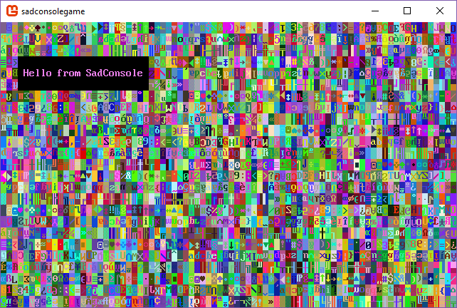

# Create a new SadConsole .NET project with the SadConsole templates

This page describes how to create a new project with the SadConsole templates hosted on [NuGet](https://www.nuget.org/packages/SadConsole.Templates/). This template creates a .NET project. The .NET SDK includes easy ways to create a project, add references, and build/compile, with or without an editor.

If you're using Visual Studio, follow these steps until told to use Visual Studio.

## Prerequisites

- [Download and install the .NET 6.0 (or later) SDK](https://dotnet.microsoft.com/download/dotnet-core/6.0).

  To see what versions you have, run `dotnet --info`. If this command fails, your install may have failed, you don't have .NET, or it's not added to your terminal path variable.

## Create your working folder

After you have a .NET SDK installed, open up a terminal. If you're unsure how to do that, search the internet for a tutorial.

Once you have a terminal open, navigate to the folder where you'll keep your code. This tutorial just assumes you're in an empty folder waiting to input commands. For example, I already have a coding folder where I store my projects. In my terminal I navigated to my _C:\Code\Fun_ folder, and I'm waiting to input the next series of commands from this article.

## Install the templates

Next, install the SadConsole templates:

```shell
dotnet new install SadConsole.Templates
```

> [!TIP]
> The `dotnet` commands used here are based on .NET 7. If you're using .NET 6 they're slightly different with `dotnet new --install SadConsole.Templates` and `dotnet new --list sadconsole`.

When this command runs, it lists every template installed. You can run a command to list the SadConsole related templates:

```shell
dotnet new list sadconsole
```

You should see output similar to the following:

```shell
These templates matched your input: 'sadconsole'

Template Name               Short Name       Language  Tags
--------------------------  ---------------  --------  -------------------------------------
SadConsole Demo             sadconsole-demo  [C#]      Console/Roguelike/SadConsole/MonoGame
SadConsole Game (MonoGame)  sadconsole-mg    [C#]      Console/Roguelike/SadConsole/MonoGame
SadConsole Game (SFML)      sadconsole-sfml  [C#]      Console/Roguelike/SadConsole/SFML
```

The `SadConsole Game (MonoGame)` template creates a SadConsle game that uses [MonoGame](https://www.monogame.net/) and the `SadConsole Game (SFML)` template creates a game that uses [SFML](https://www.sfml-dev.org/). MonoGame and SFML are the backend renderers for SadConsole. In general, the code you use for SadConsole doesn't care which rendering system you use. However, as your game progresses, which renderer you choose is very important. Currently, it's recommended that you use the MonoGame renderer as it has the following benefits:

- Easier cross-platform targeting.
- Supports 3D rendering: models, scenes, etc.
- Built for .NET coding

SFML is cross-platform, but it takes more work on your side to get that working.

## Using Visual Studio

This section is important if you're planning on using Visual Studio to create the project. Visual Studio 2022 automatically imports .NET templates you installed in the previous section. If you want to create a project using Visual Studio, see [Create a new SadConsole project with Visual Studio](getting-started-visualstudio.md).

## Create a project via CLI

Your terminal should be in the game directory you created at the start of this article. Create your project using the `dotnet new` command:

```shell
dotnet new sadconsole.mg -n SadConsoleGame
```

This command generates a small example game that you can then customize. Run the game with `dotnet run` from your terminal, and you'll see the following:



Use your favorite IDE or editor to open your newly created project, something like Visual Studio or Visual Studio Code.

## Next steps

Now that you have the project created and working, check out the [Get Started](tutorials/getting-started/part-1-drawing.md) tutorial series.
