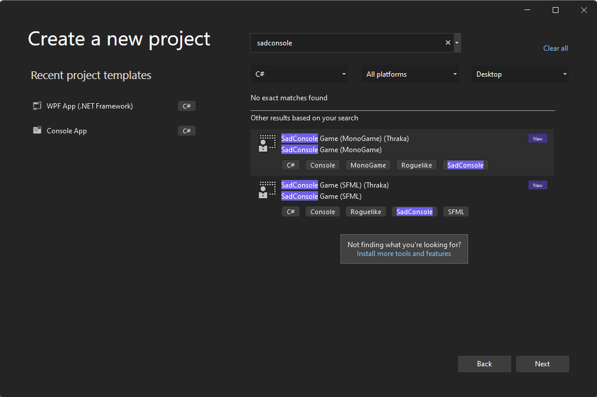

# Create a new SadConsole .NET project with Visual Studio

This page describes how to create a new project based on SadConsole Standard using .NET 6.0 and Visual Studio.

Before using Visual Studio, you'll need to install the SadConsole project templates. The first few sections of the [Create a new SadConsole .NET project with the SadConsole templates](getting-started-cli.md). article describes how to do this. Follow those instructions and then come back to this article.

## Prerequisites

01. [Download and install Visual Studio 2022](https://visualstudio.microsoft.com/vs/).
02. During install, make sure that you select the **.NET Core cross-platform development** workload.

    - If you have already installed Visual Studio, you can run the **Visual Studio Installer** that was added to your computer, and modify your installation to add the **.NET Core cross-platform development** workload.

03. Install the SadConsole templates with the dotnet command: `dotnet new --install SadConsole.Templates`. For more information, see [Create a new SadConsole .NET project with the SadConsole templates](getting-started-cli.md)

## Create a new project

Start Visual Studio.

01. In the **Create a new project** dialog, type `sadconsole`` into the search box and select the **SadConsole Game (MonoGame)** project template.

    
    
    The `SadConsole Game (MonoGame)` template creates a SadConsole game that uses [MonoGame](https://www.monogame.net/) and the `SadConsole Game (SFML)` template creates a game that uses [SFML](https://www.sfml-dev.org/). MonoGame and SFML are the backend renderers for SadConsole. In general, the code you use for SadConsole doesn't care which rendering system you use. However, as your game progresses, which renderer you choose is very important. Currently, it's recommended that you use the MonoGame renderer as it has the following benefits:
    
    - Easier cross-platform targeting.
    - Supports 3D rendering: models, scenes, etc.
    - Built for .NET coding
    
    SFML is cross-platform, but it takes more work on your side to get that working.

02. Press **Next** and then set the **Project name** to `SadConsoleGame` and choose a **location** on your computer to save the project.

Congratulations, you have a new project! Press <kbd>F5</kbd> to run the game:


## Creating a project without a template

If you want to create a project without using the SadConsole templates, it's also pretty easy to do.

01. Create a new **Console App** with either C# or VB.NET. Don't create a **Console App (.NET Framework)** project!
01. Press **Next** and follow the wizard to set the name of the project to `SadConsoleGame`.
01. Set the **Location** of your project code, and then press **Next**. and then choose where you want to save your code.
01. Set the **Framework** to **.NET 6.0** or later.
01. Make sure that **Do not use top-level statements** is unchecked unless you know what you're doing and can convert the code in the next section.
01. Press **Create**.
01. Next, add the NuGet SadConsole MonoGame renderer package to the project.

    01. In the **Solution Explorer**, right-click on the project and select **Manage NuGet Packages**. This will display the NuGet package manager.
    01. Search for **SadConsole** and install the `SadConsole.Host.MonoGame` package.
    01. Search for **MonoGame.Framework** and install the `MonoGame.Framework.DesktopGL` package.

Congratulations, you have all of the required libraries to start creating a SadConsole game!

## Configure the startup code

You need perform a minor modification to the project file, and then change the startup code that was automatically generated for your project.

### Project file

01. In the **Solution Explorer** window, double-click the project file, _SadConsoleGame_. This opens the project XML editor.
01. Change the `<OutputType>Exe</OutputType>` element to `<OutputType>WinExe</OutputType>`.

    This alteration makes it so that only the SadConsole game window pops up when you run it. Without this change, you'll have two windows appear, the SadConsole game window and a .NET console.

01. Just below the `<OutputType>` element, add `<RootNamespace>SadConsoleGame</RootNamespace>`.

01. Before the end of the file, above the `</Project>` closing element, add the following `<ItemGroup>`:

    ```xml
      <ItemGroup>
        <Using Include="SadConsole" />
        <Using Include="SadRogue.Primitives" />
        <Using Include="SadConsole.Console" Alias="Console" />
      </ItemGroup>
    ```

    This XML block adds the namespaces to every code file, automatically. This is optional, but most of the code provided in the documentation assumes these namespaces and types are imported.

01. Save the file and close the XML editor.

Your project file should look similar to this, though the `<TargetFramework>` may be different (which can be `net6.0` or above):

```xml
<Project Sdk="Microsoft.NET.Sdk">

  <PropertyGroup>
    <OutputType>WinExe</OutputType>
    <RootNamespace>SadConsoleGame</RootNamespace>
    <TargetFramework>net7.0</TargetFramework>
    <ImplicitUsings>enable</ImplicitUsings>
    <Nullable>enable</Nullable>
  </PropertyGroup>

  <ItemGroup>
    <PackageReference Include="MonoGame.Framework.DesktopGL" Version="3.8.1.303" />
    <PackageReference Include="SadConsole.Host.MonoGame" Version="10.0.0-beta2-debug" />
  </ItemGroup>

  <ItemGroup>
    <Using Include="SadConsole" />
    <Using Include="SadRogue.Primitives" />
    <Using Include="SadConsole.Console" Alias="Console" />
  </ItemGroup>

</Project>
```

### Root screen

The startup code, which you'll write in the next section, designates the startup object, known as the "root screen." That object is a `ScreenObject` type, or any type derived from `ScreenObject` such as `ScreenSurface`. Create a new root screne:

01. In the **Solution Explorer** window, right-click on the project and select **Add** > **Class**.
01. Name the class `RootScreen` and create it. The code editor for the class is opened.
01. Replace the generated code with the following:

    ```csharp
    class RootScreen : ScreenObject
    {
        private ScreenSurface _mainSurface;
    
        public RootScreen()
        {
            // Create a surface that's the same size as the screen.
            _mainSurface = new ScreenSurface(Game.Instance.ScreenCellsX, Game.Instance.ScreenCellsY);
    
            // Fill the surface with random characters and colors
            _mainSurface.FillWithRandomGarbage(_mainSurface.Font);
    
            // Create a rectangle box that has a violet foreground and black background.
            // Characters are reset to 0 and mirroring is set to none.
            _mainSurface.Fill(new Rectangle(3, 3, 23, 3), Color.Violet, Color.Black, 0, Mirror.None);
    
            // Print some text at (4, 4) using the foreground and background already there (violet and black)
            _mainSurface.Print(4, 4, "Hello from SadConsole");
    
            // Add _mainSurface as a child object of this one. This object, RootScreen, is a simple object
            // and doesn't display anything itself. Since _mainSurface is going to be a child of it, _mainSurface
            // will be displayed when RootScreen is either the starting screen or somewhere in that collection of objects.
            Children.Add(_mainSurface);
        }
    }
    ```

### Program startup code

01. In the **Solution Explorer** window, double-click the _Program.cs_. This opens the code editor.
01. Replace the code with the following:

```csharp
using SadConsole.Configuration;

Settings.WindowTitle = "My SadConsole Game";

Builder gameStartup = new Builder()
    .SetScreenSize(90, 30)
    .SetStartingScreen<RootScreen>()
    ;

Game.Create(gameStartup);
Game.Instance.Run();
Game.Instance.Dispose();
```

Press the <kbd>F5</kbd> key to run your SadConsole program. You should be presented with the following screen:


## Next steps

Now that you have the project created and working, check out the [Get Started](tutorials/getting-started/part-1-drawing.md) tutorial series.
