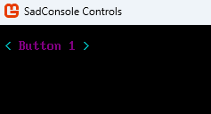
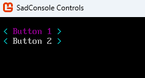

# Change the colors used by controls

Controls get their colors from a variety of places, but in order. First, the control itself is checked for colors. If control doesn't define any colors, the control's host is checked, and if those aren't defined, the default colors are used. For more information, see [Controls overview (SadConsole Systems)](systems/controls.md).

The following sections demonstrate how to change a control's colors.

UI related types are in these two namespaces:

- `SadConsole.UI` - Basic supporting objects, such as the controls host, colors, and window types.
- `SadConsole.UI.Controls` - All of the controls provided by SadConsole.

<!--
## Adjustable colors

The <xref:SadConsole.UI.Colors> type uses <xref:SadConsole.UI.AdjustableColor> for the various control color schemes, such as <xref:SadConsole.UI.Colors.ControlForegroundNormal> and <xref:SadConsole.UI.Colors.ControlBackgroundNormal>. Adjustable colors are colors that are computed with a brightness when they're actually used. They're based on an existing color or defined by the <xref:SadConsole.UI.Colors.ColorNames> enum. This enum maps to the individual color properties provided by the `Colors` type, such as `Colors.Red`.

The benefit of an adjustable color and the predefined colors, is that you can update the predefined colors object with say a new shade of red, then ask the adjustable color to refresh itself. If that adjustable color used the **red** color name, it refreshes itself with that new shade.
-->

## How to edit the default colors

All controls, unless overridden, get their colors from the <xref:SadConsole.UI.Colors.Default?displayProperty=fullName> property. You can set that property to a new <xref:SadConsole.UI.Colors> instance, or change the individual properties on the existing instance.

After changing the `Colors.Default.Control*` color properties, you must call <xref:SadConsole.UI.Colors.RebuildAppearances> to rebuild the specific `Colors.Default.Appearance_*` appearance states.

```csharp
Colors.Default.ControlForegroundNormal.SetColor(Color.Purple);
Colors.Default.RebuildAppearances();
```

## How to set the colors for a host

If the colors are set on the control host, all controls in the host use these colors instead of the default colors. The colors are set by setting the <xref:SadConsole.UI.ControlHost.ThemeColors?displayProperty=nameWithType> property to an instance of the <xref:SadConsole.UI.Colors> type. To clear those colors and use the default, set `ThemeColors` to `null`.

```csharp
// Create the new colors
Colors newColors = Colors.Default.Clone();

newColors.Red = Color.Red.GetBrightest();
newColors.ControlForegroundNormal.SetColor(Color.Purple);
newColors.RebuildAppearances();

// Create the controls console, which has a controls host
ControlsConsole console = new(GameHost.Instance.ScreenCellsX, GameHost.Instance.ScreenCellsY);

// Update the controls host
console.Controls.ThemeColors = newColors;

// Add a single control
Button button1 = new("Button 1");
button1.Position = new Point(1, 1);

console.Controls.Add(button1);

// Show the console
GameHost.Instance.Screen = console;
```



## How to set the colors for a control

If colors are set directly on a control, that control uses those colors instead of any other set of colors. Call the <xref:SadConsole.UI.Controls.ControlBase.SetThemeColors(SadConsole.UI.Colors)> on the control, passing in the colors you want to use. Pass `null` to remove the colors if they were previously set on the control.

```csharp
// Create the new colors
Colors newColors = Colors.Default.Clone();

newColors.Red = Color.Red.GetBrightest();
newColors.ControlForegroundNormal.SetColor(Color.Purple);
newColors.RebuildAppearances();

// Create the controls console, which has a controls host
ControlsConsole console = new(GameHost.Instance.ScreenCellsX, GameHost.Instance.ScreenCellsY);

// Add first button with custom colors
Button button1 = new("Button 1");
button1.SetThemeColors(newColors);
button1.Position = new Point(1, 1);
console.Controls.Add(button1);

// Add second button without custom colors
Button button2 = new("Button 2");
button2.Position = new Point(1, 2);
console.Controls.Add(button2);

// Show the console
GameHost.Instance.Screen = console;
```



## How to reset the colors to the default

If you ever change the <xref:SadConsole.UI.Colors.Default?displayProperty=fullName> colors and want to revert them back to their defaultes, set the property to the return value of the <xref:SadConsole.UI.Colors.CreateAnsi> method. This method is used to generate the colors used by SadConsole when it starts.

```csharp
Colors.Default = Colors.CreateAnsi();
```

> [!TIP]
> SadConsole also defines a set colors based on a blue tone, which you can use instead of the `CreateAnsi` colors which are based on black.
>
> ```csharp
> Colors.Default = Colors.CreateSadConsoleBlue();
> ```

## How to get the colors used by a control or host

There are times when you want to find the colors used by a control or a host, so that you can match that set of colors. This is most common when you've created your own control and you want to know what colors to use. Another common scenario for knowing the colors of a control is when you want to draw something that matches those colors. For example, the `Colors` type defines a `Lines` color, which is used to color various parts of controls, such as the `RadioButton`'s brackets or the `ListBox`'s surrounding box. You may want to know this color when drawing other lines on the surface host, so the color matches the controls.

Call the control's <xref:SadConsole.UI.Controls.ControlBase.FindThemeColors> method. This searches the control and then the host for colors. If no colors are found, the default colors are returned.

```csharp
Colors assignedColors = someControl.FindThemeColors();
```

Likewise, you can get the colors of a control host with the <xref:SadConsole.UI.ControlHost.GetThemeColors> method. This method checks to see if the host has colors value assigned to the <xref:SadConsole.UI.ControlHost.ThemeColors> property and returns them. If the property is `null`, the default colors are returned. 

```csharp
// Using a ControlsConsole which provides a ControlHost
Colors hostColors = console.Controls.GetThemeColors();
```
