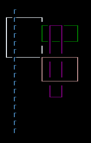
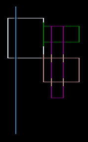

# Connect lines on a surface

When you draw lines or boxes over each other, they overlay each other, replacing the glyphs, creating gaps. Consider the following piece of code:

```csharp
Surface.DrawBox(new Rectangle(2, 2, 10, 6), ShapeParameters.CreateStyledBoxThin(Color.AliceBlue));
Surface.DrawBox(new Rectangle(11, 3, 10, 3), ShapeParameters.CreateStyledBoxThin(Color.Green));
Surface.DrawBox(new Rectangle(13, 3, 4, 10), ShapeParameters.CreateStyledBoxThin(Color.Purple));
Surface.DrawBox(new Rectangle(11, 7, 10, 4), ShapeParameters.CreateStyledBoxThin(Color.RosyBrown));
Surface.DrawLine((4, 1), (4, 16), ICellSurface.ConnectedLineThin[0], Color.SteelBlue);
```

This code creates four boxes that intersect with each other. There's a single line drawn through the first box. The glyphs used in the boxes and the line come from the same "set" of glyphs, `ICellSurface.ConnectedLineThin`. As the following image shows, the lines for each shape have erased the previous glyph where they intersect. Also, the glyph used in the single vertical line doesn't look right:



The <xref:SadConsole.CellSurfaceEditor.ConnectLines(SadConsole.ISurface,System.Int32[])> editing methods connects those characters to make intersecting lines. The method takes the array that's composed of of line character glyphs in a specific sequence and connects them together. There are at least two line sequences provided by SadConsole, <xref:SadConsole.ICellSurface.ConnectedLineThin?displayProperty=nameWithType> and <xref:SadConsole.ICellSurface.ConnectedLineThick?displayProperty=nameWithType>. Lines from one set won't intersect and auto connect to another set.

After all lines and boxes have been drawn, call the `ConnectLines` method to connect them. Be sure to use the same line style array.

```csharp
Surface.ConnectLines(ICellSurface.ConnectedLineThin);
```

Now the entire surface is connected.



Because the single vertical line used one of the characters from the line style array, it too was straightened out. You don't have to worry about drawing each character in the box or line appropriately, you just need to use one of the characters from the line style array.

## Example

The following code is a SadConsole v10 program class.

```csharp
using SadConsole.Configuration;

Settings.WindowTitle = "ConnectLines demo";

Builder config =
    new Builder()
        .SetScreenSize(80, 25)
        .IsStartingScreenFocused(true)
        .SetStartingScreen<ExampleConsole>();

Game.Create(config);
Game.Instance.Run();
Game.Instance.Dispose();

class ExampleConsole : ScreenSurface
{
    public ExampleConsole() : base(130, 50)
    {
        Surface.DrawBox(new Rectangle(2, 2, 10, 6), ShapeParameters.CreateStyledBoxThin(Color.AliceBlue));
        Surface.DrawBox(new Rectangle(11, 3, 10, 3), ShapeParameters.CreateStyledBoxThin(Color.Green));
        Surface.DrawBox(new Rectangle(13, 3, 4, 10), ShapeParameters.CreateStyledBoxThin(Color.Purple));
        Surface.DrawBox(new Rectangle(11, 7, 10, 4), ShapeParameters.CreateStyledBoxThin(Color.RosyBrown));
        Surface.DrawLine((4, 1), (4, 16), ICellSurface.ConnectedLineThin[0], Color.SteelBlue);

        Surface.ConnectLines(ICellSurface.ConnectedLineThin);
    }
}
```
