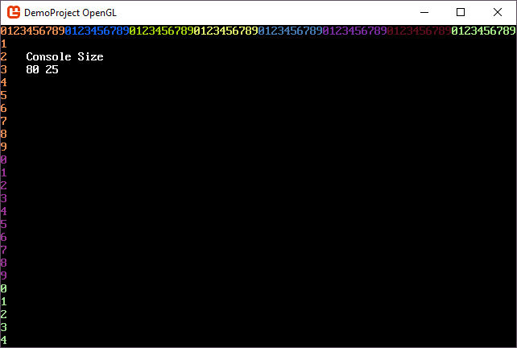
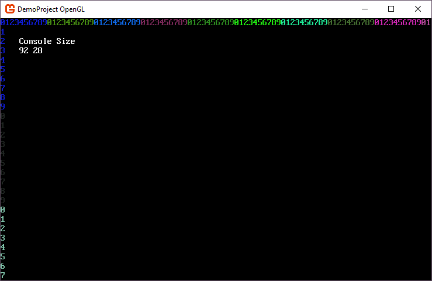

# Resize your main console with the window

A common scenario with SadConsole is resizing the window and then resizing the console with it. When you create a new SadConsole game, you specify the width and height in cells, and the game window is sized in pixels to hold that many cells. However, once you resize the window, SadConsole generally centers or stretches the rendering surface to fill the window. It does not resize the internal SadConsole objects

## Example

If you create a game with a base console size of 80x25, you'll get a window that is something like this in size:



>[!NOTE]
>The code to generate the numbers and display the console size is provided at the end of the article.

When you resize the window, say adding a few more cells each direction, SadConsole will fill the extra space with black (or the @SadConsole.Settings.ClearColor) and centers the console.


## Resizing the window

To demonstrate how to resize a console along with the window, the code uses a static console variable representing the root console. It was declared in the program file and is named `RootDynamicConsole`. If you always have the `CurrentScreen` as the root console, you could just resize that object instead.

In your initialization code, you want to hook the @SadConsole.Game.WindowResized event and set the @SadConsole.Settings.ResizeMode to `SadConsole.Settings.WindowResizeOptions.None`. You have to do some casting of the game instance to access the event SadConsole provides. This event is called **after** the window finishes resizing.

```csharp
private static void Init()
{
    // ...
    // All your setup code ...
    // ...

    Settings.ResizeMode = Settings.WindowResizeOptions.None;
    ((SadConsole.Game)SadConsole.Game.Instance).WindowResized += Program_WindowResized;
}
```

Next, add a listener for the resize event.

```csharp
private static void Program_WindowResized(object sender, EventArgs e)
{
    RootDynamicConsole.Resize(Global.WindowWidth / RootDynamicConsole.Font.Size.X, Global.WindowHeight / RootDynamicConsole.Font.Size.Y, false);
}
```

Now when you resize the window, the root console resizes to fit.




## Handling viewport consoles

If your console has a view port, like a @SadConsole.ScrollingConsole does, you generally don't want to resize the console itself, as the console is already a large size. However, you may want to resize the viewport to match the screen, which is easy to do. Since this does not resize the console itself, the viewport will always cut off at the bounds of the console. The viewport will never get larger than the console, but it can be resized as small as needed.

```csharp
RootDynamicConsole.ViewPort = new Rectangle(RootDynamicConsole.ViewPort.X, 
                                            RootDynamicConsole.ViewPort.Y, 
                                            Global.WindowWidth / RootDynamicConsole.Font.Size.X, 
                                            Global.WindowHeight / RootDynamicConsole.Font.Size.Y);
```

## Code to generate the console

In this article a sample console was used that demonstrated the size of the console. It's a normal console with a method that is called to color and write the columns and rows of the console. 

```csharp
private static void PrintHeader()
{
    int counter = 0;
    var startingColor = Color.Black.GetRandomColor(SadConsole.Global.Random);
    var color = startingColor;
    for (int x = 0; x < RootDynamicConsole.Width; x++)
    {
        RootDynamicConsole[x].Glyph = counter.ToString()[0];
        RootDynamicConsole[x].Foreground = color;
                
        counter++;

        if (counter == 10)
        {
            counter = 0;
            color = color.GetRandomColor(SadConsole.Global.Random);
        }
    }

    counter = 0;
    color = startingColor;
    for (int y = 0; y < RootDynamicConsole.Height; y++)
    {
        RootDynamicConsole[0, y].Glyph = counter.ToString()[0];
        RootDynamicConsole[0, y].Foreground = color;

        counter++;

        if (counter == 10)
        {
            counter = 0;
            color = color.GetRandomColor(SadConsole.Global.Random);
        }
    }

    // Display console size
    RootDynamicConsole.Print(4, 2, "Console Size");
    RootDynamicConsole.Print(4, 3, "                         ");
    RootDynamicConsole.Print(4, 3, $"{RootDynamicConsole.Width} {RootDynamicConsole.Height}");
}
```

Then, when the console is created, call the method to print out the columns and rows

```csharp
RootDynamicConsole = new Console(80, 25);

PrintHeader();

SadConsole.Global.CurrentScreen = RootDynamicConsole;
```

And each time the window is resized call the print method to refresh it.

```csharp
private static void Program_WindowResized(object sender, EventArgs e)
{
    RootDynamicConsole.Resize(Global.WindowWidth / RootDynamicConsole.Font.Size.X, 
                              Global.WindowHeight / RootDynamicConsole.Font.Size.Y, false);
    PrintHeader();
}
```