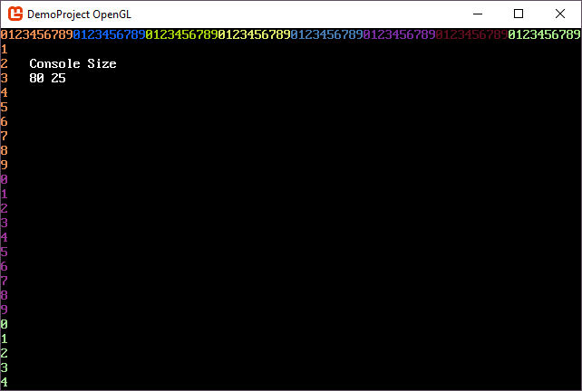
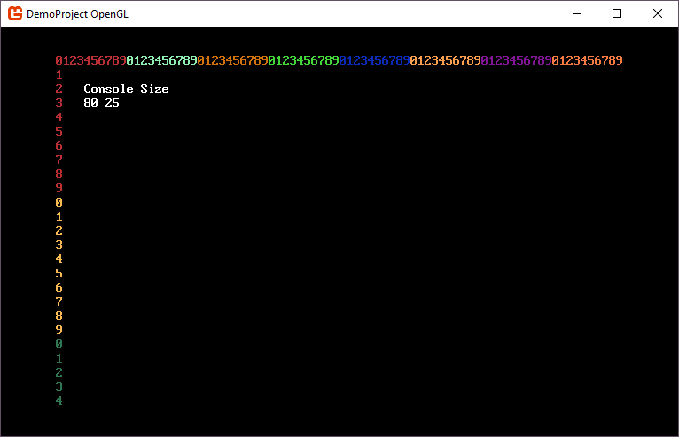

# Resize your main console with the window

A common scenario with SadConsole is resizing the window and then resizing the console with it. When you create a new SadConsole game, you specify the width and height in cells. The game window is sized in pixels to hold that many cells. However, once you resize the window, SadConsole generally centers or stretches the rendering surface to fill the window. It doesn't resize the internal rendering surface which would allow you to show a bigger console on the screen.

This article demonstrates how to resize the internal rendering surface (which is a simple configuration change) and how to resize a console to the size of the window.

## Example

If you create a game with a base console size of 80x25, you'll get a window that looks like the following image:



>[!NOTE]
>The code to generate the numbers and display the console size is provided at the end of the article.

When you resize the window, SadConsole fills the extra space with black (whatever the <xref:SadConsole.Settings.ClearColor>) property is set to> and centers the console.



To resize a console (or `ScreenSurface`) to the size of the window, you must do the following:

- Configure SadConsole's resize mode to `None`, which allows the internal rendering surface to fill the window.
- Handle the `WindowResized` event from the game host to detect the new window size.
- Use a surface object that implements `ICellSurfaceResize`, which the default objects in SadConsole use.
- Resize the surface object.

## Detect when the window is resized

You need to add an event handler to the <xref:SadConsole.Host.Game.WindowResized?displayProperty=fullName> event provided by the game host (MonoGame in this case) to detect when the window is resized.

Use the <xref:SadConsole.Configuration.Extensions.OnStart(SadConsole.Configuration.Builder,System.EventHandler{SadConsole.GameHost})> configuration object to add that event handler. This is also a good place to set the <xref:SadConsole.Settings.ResizeMode> property to <xref:SadConsole.Settings.WindowResizeOptions.None>.

The `WindowResized` event is called **after** the window finishes resizing.

```csharp
void Startup(object? sender, GameHost host)
{
    Settings.ResizeMode = Settings.WindowResizeOptions.None;

    SadConsole.Host.Game monoGameInstance = (SadConsole.Host.Game)SadConsole.Game.Instance.MonoGameInstance;
    monoGameInstance.WindowResized += MonoGameInstance_WindowResized;
}

void MonoGameInstance_WindowResized(object? sender, EventArgs e)
{
    var root = (IScreenSurface)Game.Instance.Screen!;
    var resizableSurface = (ICellSurfaceResize)root.Surface;

    resizableSurface.Resize(width: SadConsole.Settings.Rendering.RenderWidth / root.FontSize.X,
                            height: SadConsole.Settings.Rendering.RenderHeight / root.FontSize.Y,
                            clear: false);

    PrintHeader(root);
}
```

> [!NOTE]
> The `PrintHeader` method is documented at the end of this article. It provides a way to visualize the size of the surface.

Now when you resize the window, the root console resizes to fit.


## Handling viewport consoles

If you just want to resize a viewport instead of resizing the actual console, change the `Surface.View` property. Since changing the size of the view port doesn't resize the console itself, the viewport will always cut off at the bounds of the console. The viewport will never get larger than the console, but it can be resized as small as needed.

```csharp
void MonoGameInstance_WindowResized(object? sender, EventArgs e)
{
    var root = (IScreenSurface)Game.Instance.Screen!;
    var resizableSurface = (ICellSurfaceResize)root.Surface;

    rootConsole.Surface.View = rootConsole.Surface.View.WithSize(
                                  SadConsole.Settings.Rendering.RenderWidth / root.FontSize.X,
                                  SadConsole.Settings.Rendering.RenderHeight / root.FontSize.Y);

    PrintHeader(root);
}
```

## PrintHeader

The following code prints a header along the top and size of a surface, which counts the cells.

```csharp
void PrintHeader(IScreenSurface screen)
{
    // Print header along the top of the surface
    int counter = 0;
    Color startingColor = Color.Black.GetRandomColor(Game.Instance.Random);
    Color color = startingColor;

    for (int x = 0; x < screen.Surface.Width; x++)
    {
        screen.Surface[x].Glyph = counter.ToString()[0];
        screen.Surface[x].Foreground = color;

        IncrementCounterColor();
    }

    // Print header along the left of the surface
    counter = 0;
    color = startingColor;
    for (int y = 0; y < screen.Surface.Height; y++)
    {
        screen.Surface[0, y].Glyph = counter.ToString()[0];
        screen.Surface[0, y].Foreground = color;

        IncrementCounterColor();
    }

    // Quick helper method for the counter logic
    void IncrementCounterColor()
    {
        counter++;

        if (counter == 10)
        {
            counter = 0;
            color = color.GetRandomColor(Game.Instance.Random);
        }
    }

    // Display console size
    screen.Surface.Print(4, 2, "Console Size");
    screen.Surface.Print(4, 3, "                         ");
    screen.Surface.Print(4, 3, $"{screen.Surface.Width} {screen.Surface.Height}");
}
```

## Full code example

This code example is self contained to demonstrate the resizing of a console with the window. It creates a new `ScreenSurface` and resizes it when the window is resized. The header is printed to show the size of the console.

```csharp
using SadConsole.Configuration;

Settings.WindowTitle = "My SadConsole Game";

Builder
    .GetBuilder()
    .SetWindowSizeInCells(120, 38)
    .ConfigureFonts(true)
    .SetStartingScreen(GenerateStartingScreen)
    .OnStart(Startup)
    .IsStartingScreenFocused(true)
    .Run();

IScreenObject GenerateStartingScreen(GameHost host)
{
    ScreenSurface root = new(host.ScreenCellsX, host.ScreenCellsY);
    PrintHeader(root);

    return root;
}

void Startup(object? sender, GameHost host)
{
    Settings.ResizeMode = Settings.WindowResizeOptions.None;

    SadConsole.Host.Game monoGameInstance = (SadConsole.Host.Game)SadConsole.Game.Instance.MonoGameInstance;
    monoGameInstance.WindowResized += MonoGameInstance_WindowResized;
}

void MonoGameInstance_WindowResized(object? sender, EventArgs e)
{
    var root = (IScreenSurface)Game.Instance.Screen!;
    var resizableSurface = (ICellSurfaceResize)root.Surface;

    resizableSurface.Resize(width: SadConsole.Settings.Rendering.RenderWidth / root.FontSize.X,
                            height: SadConsole.Settings.Rendering.RenderHeight / root.FontSize.Y,
                            clear: false);

    PrintHeader(root);
}

void PrintHeader(IScreenSurface screen)
{
    // Print header along the top of the surface
    int counter = 0;
    Color startingColor = Color.Black.GetRandomColor(Game.Instance.Random);
    Color color = startingColor;

    for (int x = 0; x < screen.Surface.Width; x++)
    {
        screen.Surface[x].Glyph = counter.ToString()[0];
        screen.Surface[x].Foreground = color;

        IncrementCounterColor();
    }

    // Print header along the left of the surface
    counter = 0;
    color = startingColor;
    for (int y = 0; y < screen.Surface.Height; y++)
    {
        screen.Surface[0, y].Glyph = counter.ToString()[0];
        screen.Surface[0, y].Foreground = color;

        IncrementCounterColor();
    }

    // Quick helper method for the counter logic
    void IncrementCounterColor()
    {
        counter++;

        if (counter == 10)
        {
            counter = 0;
            color = color.GetRandomColor(Game.Instance.Random);
        }
    }

    // Display console size
    screen.Surface.Print(4, 2, "Console Size");
    screen.Surface.Print(4, 3, "                         ");
    screen.Surface.Print(4, 3, $"{screen.Surface.Width} {screen.Surface.Height}");
}
```
