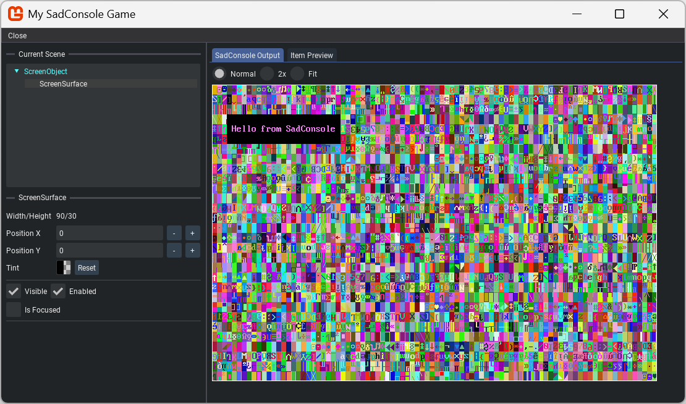

# How to enable the SadConsole debugger

The debugger is a helper library that pauses SadConsole and displays a UI over the top of the game, letting you inspect objects. You can alter object properties and provide your own debug UI that integrates with SadConsole.

## Enable the debugger

01. Add the [SadConsole.Debug.MonoGame NuGet package](https://www.nuget.org/packages/SadConsole.Debug.MonoGame/) to your project.
01. Add `EnableImGuiDebugger` to the configuration builder. Provide the key that enables the debugger.

[!code-csharp]

Once the game is running, press the referenced key, F12 in this example, and the SadConsole Debugger turns on.

## Parts of the debugger

The top-left of the debugger lists the current scene. The object that's focused is displayed in cyan. When you select an object, it's basic properties are displayed.

The center of the screen displays the render output that SadConsole draws on the screen. If the currently selected object is a `IScreenSurface`, the second tab displays the render output for that object.

## Debugger events

The debugger provides two events, `SadConsole.Debug.Debugger.Opened` and `SadConsole.Debug.Debugger.Closed`. The `Opened` event has a single parameter, a boolean that indicates whether or not this is the first time the debugger is opened.

The `Opened` event gives you an opportunity to customize the debugger once it starts. You can provide event handlers for these events on the configuration object used to control the SadConsole startup.
