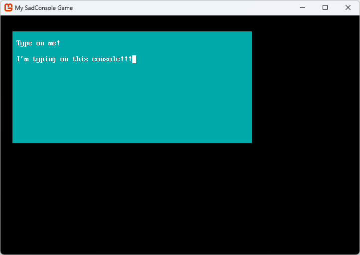
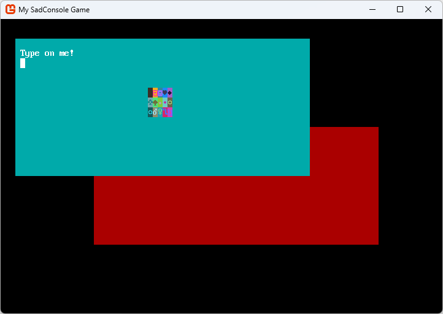

# Get Started 2 - Cursors and parenting

This article is the 2nd in the series of Getting Started tutorials for SadConsole. In this article you'll learn how to use the `Cursor` object to write on a `Console`. SadConsole can also display more than one console, you'll also learn how to have multiple consoles on the screen.

Previous articles in this tutorial:

- [Get Started 1 - Draw on a console](part-1-drawing.md)

## Prerequisites

To start this part of the tutorial you'll need to have created a SadConsole project, one that was created by following the previous tutorial in this series. However, you may have been experimenting with your code. To make sure that you start this tutorial with the same code, copy and paste the following code into your _program.cs_:

```csharp
using SadConsole.Configuration;

Settings.WindowTitle = "My SadConsole Game";

Builder configuration = new Builder()
    .SetScreenSize(90, 30)
    .UseDefaultConsole()
    .OnStart(Startup)
    ;

Game.Create(configuration);
Game.Instance.Run();
Game.Instance.Dispose();

static void Startup(object? sender, GameHost host)
{
    if (Game.Instance.StartingConsole is null)
        throw new NullReferenceException("You should never have this error if you used the UseDefaultConsole startup code.");

    Console startingConsole = Game.Instance.StartingConsole;
}
```

## Use the Cursor

The `SadConsole.Console` type is the basic type you use to get data on the screen. As you learned in the previous part of this tutorial series, you can use methods like `SetGlyph`, `SetForeground`, and even `Print`, to draw on the console. There is another way to write to the console, something you may be more used to, and that's the console cursor.

When you run a terminal program, such as _cmd.exe_ or _bash_, you're presented with a blinking cursor, letting you know it's ready for you to type something. When the programs you run communicate back to you, that cursor prints things to the screen:


SadConsole provides a cursor system as way to show users where text is about to be written, where they should use the keyboard to type, or just as a convenient way to draw to a console. You can chain cursor commands into a series of actions:

01. Match the printing style of the cursor to the host console.
01. Move the cursor to position 20,21
01. Print the text "Kato is my favorite dog"
01. Change the print color to Green
01. Move the cursor to a new line
01. Print the text "No, Birdie is my favorite dog"

Replace the `Startup` code with the following and run your program:

```csharp
static void Startup(object? sender, GameHost host)
{
    if (Game.Instance.StartingConsole is null)
        throw new NullReferenceException("You should never have this error if you used the UseDefaultConsole startup code.");

    Console startingConsole = Game.Instance.StartingConsole;

    startingConsole.Cursor.PrintAppearanceMatchesHost = false;

    startingConsole.Cursor
        .SetPrintAppearanceToHost()
        .Move(0, 21)
        .Print("Kato is my favorite dog")
        .SetPrintAppearance(Color.Green)
        .NewLine()
        .Print("No, Birdie is my favorite dog");
}
```

The first thing the code does is alter the cursor's look. By default, the cursor always prints text in the style of the console that hosts the cursor. Once `Cursor.PrintAppearanceMatchesHost` is set to `false`, the `Cursor.PrintAppearance` property is used to color the printing. This defaults to a **Black** background and **White** foreground.

The code causes the cursor to do things, but you don't _see_ a cursor on the screen. By default, the cursor is invisible and doesn't respond to the keyboard. To show the cursor, change the `IsVisible` property to `true`.

```csharp
static void Startup(object? sender, GameHost host)
{
    if (Game.Instance.StartingConsole is null)
        throw new NullReferenceException("Unsure why. If you used a game config with SetStartingScreen, it destroys the StartingConsole object.");

    Console startingConsole = Game.Instance.StartingConsole;

    startingConsole.Cursor.PrintAppearanceMatchesHost = false;

    startingConsole.Cursor
        .SetPrintAppearanceToHost()
        .Move(0, 21)
        .Print("Kato is my favorite dog")
        .SetPrintAppearance(Color.Green)
        .NewLine()
        .Print("No, Birdie is my favorite dog");

    startingConsole.Cursor.IsVisible = true;
}
```

Run your program and you'll see the cursor blinking. When you type though, nothing happens. The cursor is currently visible, but it's not been enabled yet. To make your cursor respond to keyboard events, there are two conditions that must be satisfied:

01. The console must be focused (you can use `startingConsole.IsFocused = true` to focus the console). By default, the "starting console" is already focused.
01. The cursor must be enabled.

To enable the cursor, set the `IsEnabled` property to `true`.

```csharp
static void Startup(object? sender, GameHost host)
{
    if (Game.Instance.StartingConsole is null)
        throw new NullReferenceException("Unsure why. If you used a game config with SetStartingScreen, it destroys the StartingConsole object.");

    Console startingConsole = Game.Instance.StartingConsole;

    startingConsole.Cursor.PrintAppearanceMatchesHost = false;

    startingConsole.Cursor
        .SetPrintAppearanceToHost()
        .Move(0, 21)
        .Print("Kato is my favorite dog")
        .SetPrintAppearance(Color.Green)
        .NewLine()
        .Print("No, Birdie is my favorite dog");

    startingConsole.Cursor.IsVisible = true;
    startingConsole.Cursor.IsEnabled = true;
}
```

Now when you run the game, you'll see that the cursor is blinking, and when you type on the keyboard, the cursor prints the characters to the screen!

## Containers

SadConsole has a framework in place that lets you create more than one console and display them at the same time. SadConsole provides a generic object that allows parenting but doesn't display anything itself: `ScreenObject`.

The starting screen is a `Console`, so we'll need to get rid of that and start over if we want a base container object. Let's create a new `ScreenObject` that will host a few consoles.

First, we don't need the starting console since we'll provide our own object. Remove the `.UseDefaultConsole()` line from the startup configuration:

```csharp
Builder configuration = new Builder()
    .SetScreenSize(90, 30)
    .OnStart(Startup)
    ;
```

Second, erase all the code in the `Startup` method:

```csharp
static void Startup(object? sender, GameHost host)
{

}
```

Now, do the following:

01. Create a new `ScreenObject` and assign it to a variable named `container`.
01. To make this object the main object processed by SadConsole, assign it to the `Game.Instance.Screen` property.

```csharp
static void Startup(object? sender, GameHost host)
{
    ScreenObject container = new ScreenObject();
    Game.Instance.Screen = container;
}
```

The previous code you used at the start of this article used the `Game.Instance.StartingConsole` property, and now you're using the `Game.Instance.Screen` property, conceptually known as the "current screen." When SadConsole starts up with the default console turned on, the `Game.Instance.Screen` property is assigned to the `StartingConsole` property, so they're referencing the same object. The current screen is the object that's processed by SadConsole every game frame. It represents what is on the screen visually.

If you run the game now, nothing will be displayed. A `ScreenObject` is just a container that lets you add multiple child objects to it, but it itself doesn't draw anything. `Console` also supports child objects, since it's also a `ScreenObject`, and it would draw itself. So, `ScreenObject` is the type you want to use when you have a container that doesn't need to draw anything directly.

## First child console

The first console we'll create will be displayed on the top-left part of the screen. It won't take up the whole screen, and it'll use a unique background color so that it can be distinguished from the second console we'll soon create.

```csharp
static void Startup(object? sender, GameHost host)
{
    ScreenObject container = new ScreenObject();
    Game.Instance.Screen = container;

    // First console
    Console console1 = new(60, 14);
    console1.Position = (3, 2);
    console1.Surface.DefaultBackground = Color.AnsiCyan;
    console1.Clear();
    console1.Print(1, 1, "Type on me!");
    console1.Cursor.Position = (1, 2);
    console1.Cursor.IsEnabled = true;
    console1.Cursor.IsVisible = true;
    console1.Cursor.MouseClickReposition = true;
    console1.IsFocused = true;

    container.Children.Add(console1);
}
```

The code above introduces a few new concepts you may be unfamiliar with:

01. `console1.Position = (3, 2);`

    `container` is the root object, which doesn't draw anything because it's a `ScreenObject`, however, it contains a single child: `console1`, added by the last line of the code: `container.Children.Add(console1)`. `console1` draws something on the screen because it's a console. Children are positioned relative to their parent. In this case, `console1` is positioned at _(x3,y2)_ of its parent, `container` which is at _(x0,y0)_. The final drawing position of `console1` is calculated using the formula `self.Position + parent.Position`. Because `container` is the root object and is positioned at _(x0,y0)_, which is the top-left of the game window, so `console` is drawn at _(x3, y2)_ on the window. If `container` was moved to _(x1, y1)_, `console` would be drawn at _(x4, y3)_.

    Positions are calculated differently between objects that have a surface versus those that are containers. This is explained later.
    
    > [!TIP]
    > The position is a `Point` type. Instead of using `new Point(3, 2)`, the `Point` type supports interpreting `(3, 2)` as a `Point`. You can use that syntax anywhere you need a `Point`.

01. `console1.Surface.DefaultBackground` and `console1.Clear`

    Each console (which is made up of a surface) has a `DefaultBackground` and `DefaultForeground` property. The background property is the most important of the two. This controls the "fill" color used on each cell. SadConsole has some optimization built into it based on this property. You'll always want to set the `DefaultBackground` property to match your most used background color of a console. Any cell whose background matches the `DefaultBackground`, is optimized by skipping its own background drawing.

    The `console1.Clear` method is called to reset every cell to the new default background color. In our case, this makes sure every cell is colored with a **Cyan** background.

01. `console1.Cursor.MouseClickReposition = true`

    This allows the mouse input to move the cursor for you. When you click on the console, the cursor will reposition itself to wherever the mouse was clicked.

01. `console1.IsFocused = true`

    Previously when you were using the starting console, it was automatically focused, so you didn't have to worry about that. Only the focused object receives keyboard input. If the `container` was focused, `console1` still wouldn't receive keyboard input, even though it's a child object. This is a common mistake developers make with SadConsole, they forget to **Focus** the console or object to receive keyboard input. 

When you run the code, you'll see a screen like the following, try typing with the keyboard and clicking the mouse:



## Add a child to the first console

When children are added to a parent, they draw on top of those parents. Right now, the object hierarchy of `Game.Instance.Screen` consists of two objects.

```text
- container
  - console1
```

> [!NOTE]
> `Game.Instance.Screen` is what is processed and drawn by SadConsole.

Let's add another object to the hierarchy. Instead of a `Console` though, add a `ScreenSurface`. A `ScreenSurface` is like a `Console`, with only with one minor difference, the console has a built-in `Cursor`. A `ScreenSurface` doesn't contain a cursor, though one could be added.

This surface is going to be a child of the console. It will be drawn on top of the console, however, we'll not allow it to gain focus or process any input. Add this code after the previous code.

```csharp
// Add a child surface
ScreenSurface surfaceObject = new(5, 3);
surfaceObject.Surface.FillWithRandomGarbage(surfaceObject.Font);
surfaceObject.Position = console1.Surface.Area.Center - (surfaceObject.Surface.Area.Size / 2);
surfaceObject.UseMouse = false;

console1.Children.Add(surfaceObject);
```

When you run the program and you can see the other surface displayed on top of the console.


Right now, the object hierarchy of `Game.Instance.Screen` is:

```text
- container
  - console1
    - surfaceObject
```

Try moving the cursor and typing behind `surfaceObject`.

## Second child console

The final thing we'll do is add a second console. This console will be a duplicate of the first, but with a different background color. This demonstrates changing focus between consoles and objects.

```csharp
// Second console
Console console2 = new Console(58, 12);
console2.Position = new Point(19, 11);
console2.DefaultBackground = Color.AnsiRed;
console2.Clear();
console2.Print(1, 1, "Type on me!");
console2.Cursor.Position = new Point(1, 2);
console2.Cursor.IsEnabled = true;
console2.Cursor.IsVisible = true;
console2.FocusOnMouseClick = true;
console2.MoveToFrontOnMouseClick = true;

container.Children.Add(console2);
container.Children.MoveToBottom(console2);
```

There are two new properties and a new method being called here:

01. `console2.FocusOnMouseClick = true;`

    Remember, only the **focused** object receives keyboard input. If we want the second console to receive that keyboard input, we need to remove focus from the first console and give it to the second. Normally you do this with `target.IsFocused = true`. SadConsole can detect when the mouse is clicked on a surface and automatically give it focus, which is what this code does. Set that property on `console1` also. You'll be able to click back and forth between both consoles and type on them.

01. `console2.MoveToFrontOnMouseClick = true;`

    This property responds to the mouse click and moves the object to the top, last in the collection. The draw order of the objects is based on where they are in the `Children` collection. Whichever object is added last becomes the top-most drawn object. Whichever object is first in this collection is the back-most drawn object. Changing an object's focus doesn't affect drawing order.

01. `container.Children.MoveToBottom(console2);`

    Because we added `console2` to the `container` after `console1` was added, `console2` is the top-most object drawn, being the last in the collection. However, we want the experience to be that `console1` is the first console you interact with. There are two ways of doing this. First, the code above solved this problem by forcibly moving `console2` to the bottom of the collection. The second way is just adding the consoles in the order you want them to appear, with the last item added being the top-most. For example, remove the existing `container.Children.Add` method calls for both consoles, and add this to the end of the code routine:

    ```csharp
    container.Children.Add(console2);
    container.Children.Add(console1);
    ```

    Now the consoles are inserted in the order you want them displayed, with `console1` on top.

Right now the object hierarchy of `Game.Instance.Screen` is:

```text
- container
  - console2   <-- first in the collection, drawn first, below others
  - console1   <-- last in the collection, drawn last, on top of others
    - surfaceObject  <-- as a child of console1, drawn on top of it
```

When you run the program and you can see and interact with both consoles.



When interacting with the game, try clicking on the different consoles. You'll notice a few problems:

- After you click on `console2` (Red) it's moved to the front and if you click on `console1` (Cyan) ...
  - `console1` stays in the background instead of moving to the foreground.
  - If you type, `console2` still responds to the keyboard, even though you clicked on `console1`.
- When you click on `console2` (Red), the cursor isn't moved to the position of the mouse like with `console1`.

These behavior differences are from a few properties that are set differently between `console1` and `console2`. Can you fix those bugs? Try and see if you can!

## Conclusion

Now you have both a working console and a non-console surface. You've explored how SadConsole uses the Cursor object to let you type, emulating a terminal. You also learned how to parent one object to another and move items within the parent's `Children` collection. The next part of this series will explore more about the keyboard and mouse input.

- [Next: Get Started 2 - Input](part-3-input.md)
