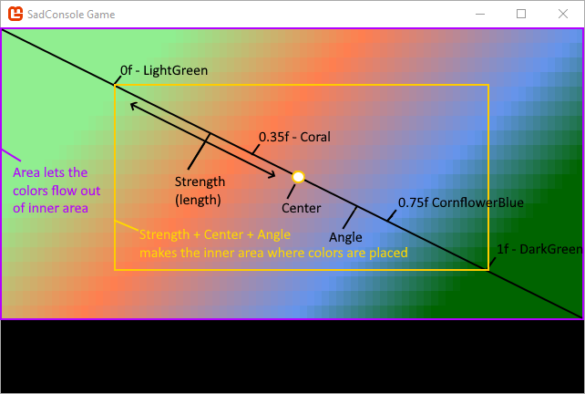
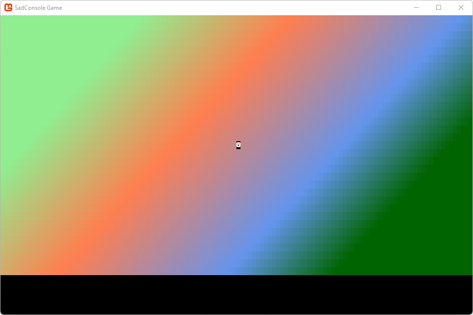

# Get Started 3 - Input

In this part of the tutorial we'll explore how input works in SadConsole. You'll learn how to create a basic map with a player that you can use the mouse and keyboard to interact with.

Input is made up of both keyboard and mouse processing. SadConsole does not provide any input processing for gamepads. However, MonoGame provides gamepad and joystick processing, which SadConsole is built on.

Previous articles in this tutorial:

- [Get Started 1 - Draw on a console](part-1-drawing.md)
- [Get Started 2 - Cursors and parenting](part-2-cursor-parents.md)

## Prerequisites

To start this part of the tutorial you'll need to have created a SadConsole project, one that was created by following the previous tutorials in this series.

## Game structure

First, let's create a new root object. This object represents a game scene which includes the map and a status pane. The player character will move around the map. Add a new class to your project (look up how to do that in your development environment tool's documentation if you don't know how) named _RootScreen.cs_. Replace the content with the following:

```csharp
namespace SadConsoleGame;

internal class RootScreen: ScreenObject
{
    public RootScreen()
    {

    }
}
```

> [!TIP]
> You may be used to older C# syntax where you need to wrap a class inside a namespace block, known as block-scoped namespaces. Modern C# lets you declare the namespace as a statement, known as a file-scoped namespace, this namespace applies to the entire code file.

Next, modify the startup code of the game to indicate that the `RootScreen` type is going to be used as the starting object. This is simple to do and removes the requirement of the `Startup` method we were using in the previous tutorial. In the _program.cs_ file, change the code to the following:

```csharp
using SadConsole.Configuration;
using SadConsoleGame;

Settings.WindowTitle = "My SadConsole Game";

Builder
    .GetBuilder()
    .SetWindowSizeInCells(120, 38)
    .ConfigureFonts(true)
    .SetStartingScreen<RootScreen>()
    .IsStartingScreenFocused(true)
    .Run();
```

Notice the differences in this code from the previous startup code:

- The project namespace was imported with `using SadConsoleGame;`.

  > [!NOTE]
  > The code in the tutorial is using the C# feature **top-level statements**. Without that feature, C# projects use a `Program.Main` method to specify the boot code. Top-level statements is cleaner, in my opinion, but requires that you import the root namespace used in your project.

- The screen size was changed to **120, 38**.
- `.OnStart(Startup)` which used the `Startup` method as the "starting" code, was replaced with `.SetStartingScreen<RootScreen>();`.
- `IsStartingScreenFocused(true)` is called, which automatically sets the starting screen to focused.
- The `Startup()` method was removed.

The `SetStartingScreen` configuration method designates an object as the starting object. It automatically assigns a new instance of that object to the `Game.Instance.Screen` property. This simplifies game setup. In this case, the newly created `RootScreen` class is our container for the current game screen. All the startup code goes into that object.

## Create a basic map

Next, lets add a basic map surface to the screen.

01. Open the _RootScreen.cs_ file.
01. Add a new `ScreenSurface` field to the class named `_map`.

    ```csharp
    internal class RootScreen: ScreenObject
    {
        private ScreenSurface _map;

        public RootScreen()
        {

        }
    }
    ```

    This surface represents the map data.

01. Modify the constructor of `RootScreen` to create an instance of the map:

    ```csharp
    internal class RootScreen: ScreenObject
    {
        private ScreenSurface _map;

        public RootScreen()
        {
            _map = new ScreenSurface(Game.Instance.ScreenCellsX, Game.Instance.ScreenCellsY - 5);
            _map.UseMouse = false;

            Children.Add(_map);
        }
    }
    ```

    Notice two things about the `_map` variable:

    - It's a `ScreenSurface` and not a `Console`.

      The map isn't going to use a cursor object to print and collect input from the user, so we don't need a full console object. Most of the time when you create objects in SadConsole that don't need a cursor you'll probably just use a `ScreenSurface`.

    - The width and height of the object is set to the `Game.Instance.ScreenCellsX` and `Game.Instance.ScreenCellsY` variables, respectively.

      `ScreenCellsX/Y` represent how many cells in the default font size the SadConsole game can fit on the screen. These are from the width and height values passed to the `Game.Create` method at the start of the game. This makes it easy to create a surface that fills the window. For the `Y` height though, we're trimming off _5_ from the bottom. This leaves some space at the bottom of the screen to add a status console later.

    Next, lets add some background to the map. Instead of using the `FillWithRandomGarbage` method that we previously used, we'll draw a gradient. The background doesn't really represent anything, but it makes it easier to see our objects and demonstrate some key concepts.

01. Add the `FillBackground` method to the class to fill the map surface with a gradient:

    ```csharp
    private void FillBackground()
    {
        Color[] colors = new[] { Color.LightGreen, Color.Coral, Color.CornflowerBlue, Color.DarkGreen };
        float[] colorStops = new[] { 0f, 0.35f, 0.75f, 1f };

        Algorithms.GradientFill(_map.FontSize, 
                                _map.Surface.Area.Center, 
                                _map.Surface.Width / 3, 
                                45, 
                                _map.Surface.Area, 
                                new Gradient(colors, colorStops), 
                                (x, y, color) => _map.Surface[x, y].Background = color);
    }
    ```

    The way the gradient algorithm works is by calculating each X,Y of an area, and providing a color that maps to it. What you do with that information is up to you. In this example we colored the background of each cell based on what the algorithm gave us. The number of colors in the gradient and the number of steps must match for the gradient to work. The following diagram may help understand how this is put together, but it's not really important at this point:

    The `FontSize` used helps stretch the gradient evenly over the surface. The default font used by SadConsole has a 2:1 ratio in width to height. The following image illustrates how the gradient is laid out, it uses a smaller window for the purpose of the illustration:

    

01. Call the `FillBackground` method from the `RootScreen` constructor:

    ```csharp
    public RootScreen()
    {
        _map = new ScreenSurface(Game.Instance.ScreenCellsX, Game.Instance.ScreenCellsY - 5);
        _map.UseMouse = false;

        FillBackground();

        Children.Add(_map);
    }
    ```

Now that there's a background that we can place objects on, let's create and place a player object.

## Game object

The game will have a player-controlled object, along with other non-player characters (NPC) on the map. Next, create an object named `GameObject` which represents these objects.

01. Add a new class to your project named _GameObject.cs_.
01. Paste the following code into the file:

    ```csharp
    namespace SadConsoleGame;

    internal class GameObject
    {
        public Point Position { get; private set; }

        public ColoredGlyph Appearance { get; set; }

        public GameObject(ColoredGlyph appearance, Point position, IScreenSurface hostingSurface)
        {
            Appearance = appearance;
            Position = position;
            DrawGameObject(hostingSurface);
        }

        private void DrawGameObject(IScreenSurface screenSurface)
        {
            Appearance.CopyAppearanceTo(screenSurface.Surface[Position]);
            screenSurface.IsDirty = true;
        }
    }
    ```

Let's dive into this code. First, the class has two properties:

- `Position`

  This is a `Point` type from the `SadRogue.Primitives` namespace. It represents a location, and in this case, the position of our game object on the map.

  > [!TIP]
  > If you have compiler errors stating that the `Point` (or other) types can't be found, you're probably not using implicit namespaces which are declared in the project file. Import the namespace into the code file by adding `using SadRogue.Primitives;` to the top of the file.

- `Appearance`

  The appearance of the game object is a `ColoredGlyph`, which represents a foreground color, background color, and glyph character combination.

The constructor of the object requires the appearance and position of the object, but also a surface. Why would you provide the surface? To draw the object! When the object is created, we're instantly drawing it to the surface by calling the `DrawGameObject` method from the constructor. `DrawGameObject` uses the `Appearance.CopyAppearanceTo` method to draw the object. This method copies all of the settings in the appearance to a specific cell on the surface. Lastly, after copying the appearance of the object, the surface is marked as dirty so that it's redrawn.

Most of the time when you draw on a surface using methods like `SetGlyph`, `SetForeground`, or `Print`, those methods mark the surface as dirty for you. In the case of the preceding code, we're editing a cell of the surface directly by using the `CopyAppearanceTo` method, which doesn't automatically mark the surface as dirty.

### Code to move the object

Add another method to the `GameObject` class named `Move`. This method handles repositioning the object and then drawing it on the surface.

```csharp
public void Move(Point newPosition, IScreenSurface screenSurface)
{ 
    Position = newPosition;
    DrawGameObject(screenSurface);
}
```

## Player game object

Now that the `GameObject` type has been created, it can be used to represent the player. Let's add a player object to the `RootScreen` class.

01. Open the _RootScreen.cs_ file.
01. Add a new field to the class to represent the controlled player object:

    ```csharp
    internal class RootScreen: ScreenObject
    {
        private ScreenSurface _map;
        private GameObject _controlledObject;

    // ... other code ...
    ```

01. In the `RootScreen` constructor, create the object to represent the player:

    ```csharp
    public RootScreen()
    {
        _map = new ScreenSurface(Game.Instance.ScreenCellsX, Game.Instance.ScreenCellsY - 5);
        _map.UseMouse = false;

        FillBackground();

        Children.Add(_map);

        _controlledObject = new GameObject(new ColoredGlyph(Color.White, Color.Black, 2), _map.Surface.Area.Center, _map);
    }
    ```

    This creates a black and white glyph "2", the smiley face glyph. It's placed at the center of the map surface. run your project and you'll see the smiley face!



Now that you have a player on the screen, you'll need to get the keyboard working.

## Keyboard

The previous tutorial article had you working with the `Cursor` object. The console was focused, and the cursor accepted input. The input was typed on the screen. While the cursor is great for getting input from the user to typing things on to the screen, it's generally not used for normal game interaction. Instead, you can interpret the keyboard as it's pressed, and move the game object.

Open the _RootScreen.cs_ file.

SadConsole sends keyboard input to the object that is focused. For our scene to process the keyboard, we'll want to do two things:

- Focus the object.

  The `RootScreen` object is already focused because it's the starting screen. If you want to change which object directly receives keyboard input, focus it. Things like popup windows will focus themselves for keyboard input, and then when hidden, restore focus to the previously focused object.

- Override the `ProcessKeyboard` method in the `RootScreen` class.

  01. First, import the `SadConsole.Input` namespace at the top of the code file:

  ```csharp
  using SadConsole.Input;
  ```

  01. Next, add the following code after the `FillBackground` method:

  ```csharp
  public override bool ProcessKeyboard(Keyboard keyboard)
  {
      return base.ProcessKeyboard(keyboard);
  }
  ```

  This method is called every game frame on the focused object. The `base.ProcessKeyboard` call allows the `RootScreen`'s base class to do its normal keyboard processing, which is processing any keyboard-based components added to the object. You'll learn more about components later.

Next, we'll update the keyboard code to move our player-controlled object around. Remember, the player object has a `Position` property. We simply have to check if a direction key is pressed, and then change the `Position` property to move the object.

The `keyboard` parameter passed to the `ProcessKeyboard` method contains the current state of the keyboard and any changes to it from the previous game frame. This parameter is used to test if a key is pressed, the state of a key (up or down), or if a key was just released.

Change the `ProcessKeyboard` method to the following code:

```csharp
public override bool ProcessKeyboard(Keyboard keyboard)
{
    bool handled = false;

    if (keyboard.IsKeyPressed(Keys.Up))
    {
        _controlledObject.Move(_controlledObject.Position + Direction.Up, _map);
        handled = true;
    }
    else if (keyboard.IsKeyPressed(Keys.Down))
    {
        _controlledObject.Move(_controlledObject.Position + Direction.Down, _map);
        handled = true;
    }

    if (keyboard.IsKeyPressed(Keys.Left))
    {
        _controlledObject.Move(_controlledObject.Position + Direction.Left, _map);
        handled = true;
    }
    else if (keyboard.IsKeyPressed(Keys.Right))
    {
        _controlledObject.Move(_controlledObject.Position + Direction.Right, _map);
        handled = true;
    }

    return handled;
}
```

Let's look at this code:

- The `handled` variable is used to indicate that we did in fact process the keyboard, and this value is returned at the end of the method. This value is important when you want to prevent other objects from processing the keyboard after you did.

- All for directional keys are checked with the [`keyboard.IsKeyPressed`](xref:SadConsole.Input.Keyboard.IsKeyPressed(SadConsole.Input.Keys)) method.

Now run the game and try moving the character around the screen:


Notice that you can move the character around the map, but the character is leaving a trail behind it. This is because when the character moves we copy the appearance of the character to the new position on the surface directly, which changes what is on the surface. We don't restore what used to be on the surface.

### Cleaner movement on the map

There are a few different ways of solving the problem of leaving a trail behind the player, but for this part of the tutorial we'll fix it in a simple way. When a game object is moved to a position on the map, store the target cell's appearance in the game object. When the game object is moved to another position, restore previous position's cell appearance.

For this code you're going to edit the _GameObject.cs_ file.

01. Open the _GameObject.cs_ file.
01. Add a private variable named `_mapAppearance` to the class, below the existing properties. This variable will store the map's cell appearance before our character moves to that cell.

    ```csharp
    internal class GameObject
    {
        private ColoredGlyph _mapAppearance = new ColoredGlyph();

        public Point Position { get; private set; }

        // ... other code ...
    ```

01. In the constructor, the game object is initially placed on the map. Copy the cell of the map before drawing the object:

    ```csharp
    public GameObject(ColoredGlyph appearance, Point position, IScreenSurface hostingSurface)
    {
        Appearance = appearance;
        Position = position;

        // Store the map cell
        hostingSurface.Surface[position].CopyAppearanceTo(_mapAppearance);

        // draw the object
        DrawGameObject(hostingSurface);
    }
    ```

01. Modify the `Move` method to restore the old cell and store the new position cell of the map:

    ```csharp
    public void Move(Point newPosition, IScreenSurface screenSurface)
    { 
        // Restore the old cell
        _mapAppearance.CopyAppearanceTo(screenSurface.Surface[Position]);

        // Store the map cell of the new position
        screenSurface.Surface[newPosition].CopyAppearanceTo(_mapAppearance);

        Position = newPosition;
        DrawGameObject(screenSurface);
    }
    ```

Run the game and now you'll see that there is no trail left behind the player:


## Conclusion

Now you understand a bit more about how input works, and you have a basic map and game object. These are just the basics, there is a lot more you can do with input, but that will be explored when we get into the user interface controls provided by SadConsole. The next part of the tutorial series will explore creating more map objects and displaying feedback to the user.

- [Next: Get Started 4 - A proper map](part-4-mapobject.md)
- [Download the code for this part of the tutorial][code_download_current]

[code_download_current]: projects/Part3.zip
