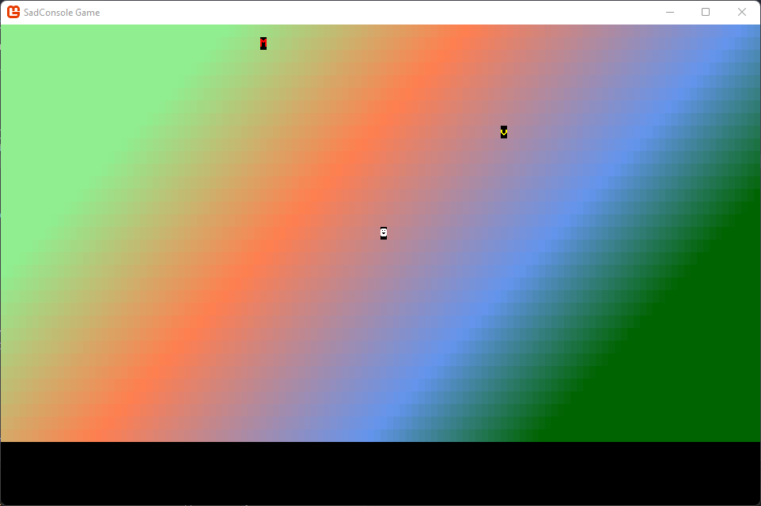

# Get Started 4 - A proper map

In this part of the tutorial, we explore improving the map and game objects. You learn how to upgrade the map from just a simple surface object to a map object that can create other game objects.

Previous articles in this tutorial:

- [Get Started 1 - Draw on a console](part-1-drawing.md)
- [Get Started 2 - Cursors and parenting](part-2-cursor-parents.md)
- [Get Started 3 - Input](part-3-input.md)

## Prerequisites

This part of the tutorial continues where the previous one left off. If you don't have your code handy, you can download it from [here][code_download_previous] and follow along.

## Bounds checking

Currently, the game crashes if you move the character off the screen. To solve this, you need to make sure that the game object checks that the object is within the bounds of the map before it moves. You can do that in two places:

- Outside of the game object.

  By checking the bounds of the map before the game object is moved, you prevent the game object from entering a non-existent map tile. However, this means that you need to make sure you always check for map bounds before you call `GameObject.Move`. You could easily forget to do this if you have multiple code paths that could move a game object.

- Inside the game object.

  You can modify the `GameObject.Move` method to check for map bounds, returning a Boolean value to indicate whether the move was successful or not. However, this means the `GameObject` needs access to the map data to understand the bounds of the map.

For now, the `GameObject.Move` method is receiving the map surface, so we can quickly check and see if the desired position is within the bounds of the surface. So it's logical that we check for the bounds of the map inside of the game object.

01. Open the _GameObject.cs_ file.
01. Find the `Move` method and change the return type from `void` to `bool`:

    ```csharp
    public bool Move(Point newPosition, IScreenSurface screenSurface)
    ```

01. Next, use the `screenSurface.Surface.IsValidCell` method to check if the `newPosition` is a valid cell position, and return `true` or `false` based on that result:

    ```csharp
    public bool Move(Point newPosition, IScreenSurface screenSurface)
    {
        // Check new position is valid
        if (!screenSurface.Surface.IsValidCell(newPosition.X, newPosition.Y)) return false;
    
        // Restore the old cell
        _mapAppearance.CopyAppearanceTo(screenSurface.Surface[Position]);
    
        // Store the map cell of the new position
        screenSurface.Surface[newPosition].CopyAppearanceTo(_mapAppearance);
    
        Position = newPosition;
        DrawGameObject(screenSurface);
    
        return true;
    }
    ```

Now, run the code and try moving the player object off the side of the screen. Notice that the player object simply stays where it was when the new position is invalid.

## A proper map

Soon we'll add more game object types such as monsters and treasure. However, adding more game objects and logic presents a problem: where to store all that information. Currently, we've been working in the `RootScreen` class, which was composing the game screen for us. But with adding more game object types, managing the life of those, handling collisions, and things like that, we need a class that better represents the game map.

01. Add a new class named _Map.cs_.
01. Paste the following code. This code is all the map related code from _RootScreen.cs_ to this new class, modified slightly.

    ```csharp
    using System.Diagnostics.CodeAnalysis;

    namespace SadConsoleGame;
    
    internal class Map
    {
        private ScreenSurface _mapSurface;
    
        public ScreenSurface SurfaceObject => _mapSurface;
        public GameObject UserControlledObject { get; set; }
    
        public Map(int mapWidth, int mapHeight)
        {
            _mapSurface = new ScreenSurface(mapWidth, mapHeight);
            _mapSurface.UseMouse = false;
    
            FillBackground();
    
            UserControlledObject = new GameObject(new ColoredGlyph(Color.White, Color.Black, 2), _mapSurface.Surface.Area.Center, _mapSurface);
        }
    
        private void FillBackground()
        {
            Color[] colors = new[] { Color.LightGreen, Color.Coral, Color.CornflowerBlue, Color.DarkGreen };
            float[] colorStops = new[] { 0f, 0.35f, 0.75f, 1f };
    
            Algorithms.GradientFill(_mapSurface.FontSize,
                                    _mapSurface.Surface.Area.Center,
                                    _mapSurface.Surface.Width / 3,
                                    45,
                                    _mapSurface.Surface.Area,
                                    new Gradient(colors, colorStops),
                                    (x, y, color) => _mapSurface.Surface[x, y].Background = color);
        }
    }
    ```

    This code is slightly different from the previous _RootScreen.cs_ code, with the following changes:
    
    - The variable that represented the game map surface was renamed from `_map` to `_mapSurface`.
    - The game map surface is exposed publicly through the get-only `SurfaceObject` property.
    - The `_controlledObject` variable held the player object, but now that's a public property named `UserControlledObject`.
    - The `System.Diagnostics.CodeAnalysis` namespace is imported at the top of the file. This is described later.

01. Next, update the code in _RootObject.cs_, removing the code ported to the new map object. This class still handles the keyboard input though. Replace the code in the class with the following:

    ```csharp
    using SadConsole.Input;
    
    namespace SadConsoleGame;
    
    internal class RootScreen: ScreenObject
    {
        private Map _map;
    
        public RootScreen()
        {
            _map = new Map(Game.Instance.ScreenCellsX, Game.Instance.ScreenCellsY - 5);
            Children.Add(_map.SurfaceObject);
        }
    
        public override bool ProcessKeyboard(Keyboard keyboard)
        {
            bool handled = false;
    
            if (keyboard.IsKeyPressed(Keys.Up))
            {
                _map.UserControlledObject.Move(_map.UserControlledObject.Position + Direction.Up, _map.SurfaceObject);
                handled = true;
            }
            else if (keyboard.IsKeyPressed(Keys.Down))
            {
                _map.UserControlledObject.Move(_map.UserControlledObject.Position + Direction.Down, _map.SurfaceObject);
                handled = true;
            }
    
            if (keyboard.IsKeyPressed(Keys.Left))
            {
                _map.UserControlledObject.Move(_map.UserControlledObject.Position + Direction.Left, _map.SurfaceObject);
                handled = true;
            }
            else if (keyboard.IsKeyPressed(Keys.Right))
            {
                _map.UserControlledObject.Move(_map.UserControlledObject.Position + Direction.Right, _map.SurfaceObject);
                handled = true;
            }
    
            return handled;
        }
    }
    ```

    The code here creates the map, adds the map surface to the SadConsole object's children, and handles the keyboard.

Run the game. Everything runs as expected, just the code has been moved around.

## More objects

Now that movement is working well, let's add a treasure and monster game object. When the player comes into contact with the treasure, the player collects it. If the player comes into contact with a monster, the player is hurt.

First, the map needs to be able to create these new objects.

01. Open the _Map.cs_ file.
01. Add a new private field named `_mapObjects` to hold the collection of game objects. The game objects should be exposed through a public property named `GameObjects`:

    ```csharp
    internal class Map
    {
        private List<GameObject> _mapObjects;
        private ScreenSurface _mapSurface;
    
        public IReadOnlyList<GameObject> GameObjects => _mapObjects.AsReadOnly();
        public ScreenSurface SurfaceObject => _mapSurface;
        public GameObject UserControlledObject { get; set; }

        // ... other code ...
    ```

    Notice that `GameObjects` is a read-only list. This lets anything outside of the map know about what objects are on the map, but we want the map itself to control adding and removing game objects.

01. Next, update the `Map` constructor to initialize the `_mapObjects` collection:

    ```csharp
    public Map(int mapWidth, int mapHeight)
    {
        _mapObjects = new List<GameObject>();

        // ... other code ...
    }
    ```

### Treasure

Now that the map can contain other objects, lets create a treasure object.

01. Open the _Map.cs_ file.
01. Add the following method to the `Map` class:

    ```csharp
    private void CreateTreasure()
    {
        // Try 1000 times to get an empty map position
        for (int i = 0; i < 1000; i++)
        {
            // Get a random position
            Point randomPosition = new Point(Game.Instance.Random.Next(0, _mapSurface.Surface.Width),
                                             Game.Instance.Random.Next(0, _mapSurface.Surface.Height));

            // Check if any object is already positioned there, repeat the loop if found
            bool foundObject = _mapObjects.Any(obj => obj.Position == randomPosition);
            if (foundObject) continue;

            // If the code reaches here, we've got a good position, create the game object.
            GameObject treasure = new GameObject(new ColoredGlyph(Color.Yellow, Color.Black, 'v'), randomPosition, _mapSurface);
            _mapObjects.Add(treasure);
            break;
        }
    }
    ```

    This code does the following:

    - Gets a random position on the map.
    - Makes sure that no other game object is located at that position.
    - Creates the **treasure** game object.

01. Next, call `CreateTreasure` from the map constructor to create one treasure:

    ```csharp
    public Map(int mapWidth, int mapHeight)
    {
        _mapObjects = new List<GameObject>();
        _mapSurface = new ScreenSurface(mapWidth, mapHeight);
        _mapSurface.UseMouse = false;
    
        FillBackground();
             
        UserControlledObject = new GameObject(new ColoredGlyph(Color.White, Color.Black, 2), _mapSurface.Surface.Area.Center, _mapSurface);
    
        CreateTreasure();
    }
    ```

If you run the game, you'll see that there's a treasure object on the map. If you walk the player character over it, nothing happens. Logic to handle collision is added later in this article.

### Monster

Similar to the treasure, let's add a method to create a monster object:

01. Open the _Map.cs_ file.
01. Add the following method to the `Map` class:

    ```csharp
    private void CreateMonster()
    {
        // Try 1000 times to get an empty map position
        for (int i = 0; i < 1000; i++)
        {
            // Get a random position
            Point randomPosition = new Point(Game.Instance.Random.Next(0, _mapSurface.Surface.Width),
                                                Game.Instance.Random.Next(0, _mapSurface.Surface.Height));

            // Check if any object is already positioned there, repeat the loop if found
            bool foundObject = _mapObjects.Any(obj => obj.Position == randomPosition);
            if (foundObject) continue;

            // If the code reaches here, we've got a good position, create the game object.
            GameObject monster = new GameObject(new ColoredGlyph(Color.Red, Color.Black, 'M'), randomPosition, _mapSurface);
            _mapObjects.Add(monster);
            break;
        }
    }
    ```

    This code is only slightly different from `CreateTreasure`, where the color of the object is **Red** and the character is **M**.

01. Next, call `CreateMonster` from the map constructor to create one monster:

    ```csharp
    public Map(int mapWidth, int mapHeight)
    {
        _mapObjects = new List<GameObject>();
        _mapSurface = new ScreenSurface(mapWidth, mapHeight);
        _mapSurface.UseMouse = false;
    
        FillBackground();
             
        UserControlledObject = new GameObject(new ColoredGlyph(Color.White, Color.Black, 2), _mapSurface.Surface.Area.Center, _mapSurface);
    
        CreateTreasure();
        CreateMonster();
    }
    ```

Now when you run the game, you'll see both the monster and the treasure on the map.



## Collision

Now that we have multiple game objects, we need to handle collision between objects. When the player moves on top of a treasure, the code needs to know about it and collect that treasure. For now, we'll just remove the treasure from the map. Let's add a few more methods to the _GameObject.cs_ class, adding these capabilities.

01. Open the _GameObject.cs_ file.
01. Add a new method named `Touched` which is called when another game object touches the current one:

    ```csharp
    public virtual bool Touched(GameObject source, Map map)
    {
        return false;
    }
    ```

    Right now this method returns false. It's also created as `virtual` method, which is described later. The return value is going to indicate whether the `source` game object can move into the position of the current object. If `false` is returned, the `source` object can't, while `true` indicates that it can.

01. Update the `Move` method to use the `Map` as a parameter instead of the `IScreenSurface`. Rename the parameter from `screenSurface` to `map`

    Change each reference of `screenSurface` (the old parameter) to `map.SurfaceObject`, which is the map's surface.

    ```csharp
    public bool Move(Point newPosition, Map map)
    {
        // Check new position is valid
        if (!map.SurfaceObject.IsValidCell(newPosition.X, newPosition.Y)) return false;
    
        // Restore the old cell
        _mapAppearance.CopyAppearanceTo(map.SurfaceObject.Surface[Position]);
    
        // Store the map cell of the new position
        map.SurfaceObject.Surface[newPosition].CopyAppearanceTo(_mapAppearance);
    
        Position = newPosition;
        DrawGameObject(map.SurfaceObject);
    
        return true;
    }
    ```

    Next, the `Move` method needs to check the map for other objects at the target position. We could code the lookup here in `Move`, or we could update the map code itself. It's better to add this into the map itself because other parts of the game are probably going to want to know if there's an object at that specific part of the map.

01. Open the _RootScreen.cs_ file.
01. In the `ProcessKeyboard` method, change the references from `_map.SurfaceObject` to `_map`.

    For example, the **Up** direction would pass `_map` as the last parameter `Move` method:

    ```csharp
    _map.UserControlledObject.Move(_map.UserControlledObject.Position + Direction.Up, _map);
    ```

    Change each `Move` method.

01. Open the _Map.cs_ file.
01. Add a new method named `TryGetMapObject`. This method is going to take a position, check if any game object is at that position, and return it if it's found. It's using the `TryGet` pattern, which returns a boolean to indicate whether it's successful, and when successful, returns the object in the `out` parameter.

    ```csharp
    public bool TryGetMapObject(Point position, [NotNullWhen(true)] out GameObject? gameObject)
    {
        // Try to find a map object at that position
        foreach (var otherGameObject in _mapObjects)
        {
            if (otherGameObject.Position == position)
            {
                gameObject = otherGameObject;
                return true;
            }
        }
    
        gameObject = null;
        return false;
    }
    ```
    
    There are two C# concepts you may not be familiar with that are introduced in this code. Modern C# projects are created [nullable aware][csharp-nullableaware]. This means that code assumes you're **not** going to use null, and that objects should always be assigned values. So, when you do use null, you mark it as such. When you declare a variable with the modification `?` you're indicating that it _could_ be null.
    
    To help developers understand when null is expected, the `System.Diagnostics.CodeAnalysis` contains many attributes that help annotate your code with how null is expected. In this case, the `gameObject` parameter was marked with the `[NotNullWhen(true)]` attribute. Attributes are like metadata assigned to any sort of code declaration. The `NotNullWhen` attribute is reserved for method parameters and indicates that when either `true` or `false` is returned, the parameter won't be null. In the case of this method, when `true` is returned, it's indicating that the `gameObject` parameter is going to contain an instance of the game object at that position. 

01. Back in _GameObject.cs_, update the `Move` method to check the map for any other object. If an object is found at that position, we want to **touch** it. If the **touch** test returns `false` it means that we can't move into that position, so the `Move` method must also return `false` to indicate that the movement failed.

    ```csharp
    public bool Move(Point newPosition, Map map)
    {
        // Check new position is valid
        if (!map.SurfaceObject.IsValidCell(newPosition.X, newPosition.Y)) return false;

        // Check if other object is there
        if (map.TryGetMapObject(newPosition, out GameObject? foundObject))
        {
            // We touched the other object, but they won't allow us to move into the space
            if (!foundObject.Touched(this, map))
                return false;
        }

        // Restore the old cell
        _mapAppearance.CopyAppearanceTo(map.SurfaceObject.Surface[Position]);

        // Store the map cell of the new position
        map.SurfaceObject.Surface[newPosition].CopyAppearanceTo(_mapAppearance);

        Position = newPosition;
        DrawGameObject(map.SurfaceObject);

        return true;
    }
    ```

Now try running the game. When you move the player character to the same position as another game object, it restricts you from moving into that position.

## Conclusion

After all these updates, your game is starting to take shape. In the next part of the tutorial, we'll explore how to create new types based on `GameObject` that know how to react to the `Touched` method.

- [Next: Get Started 5 - More objects](part-5-more-objects.md)
- [Download the code for this part of the tutorial][code_download_current]

[code_download_previous]: projects/Part3.zip
[code_download_current]: projects/Part4.zip
[csharp-nullableaware]: https://learn.microsoft.com/dotnet/csharp/language-reference/builtin-types/nullable-reference-types