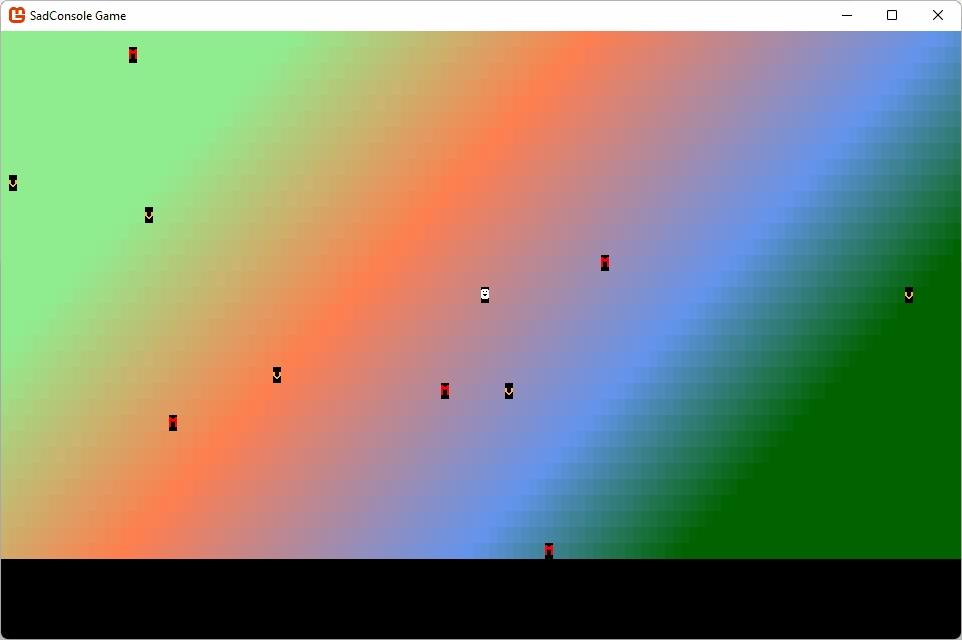

# Get Started 5 - More objects

In this part of the tutorial you learn how to add different types of map objects that can react differently to the player touching them.

Previous articles in this tutorial:

- [Get Started 2 - Cursors and parenting](part-2-cursor-parents.md)
- [Get Started 3 - Input](part-3-input.md)
- [Get Started 4 - A proper map](part-4-mapobject.md)

## Prerequisites

This part of the tutorial continues where the previous one left off. If you don't have your code handy, you can download it from [here][code_download_previous] and follow along.

## Concrete types

The `GameObject` type represents a thing that can be positioned and drawn on the map. However, it doesn't really "do" anything. Let's create two new classes, one for **monster** and one for **treasure**. Both will inherit from `GameObject` and override the `Touched` method.

### Treasure

To create the treasure class, perform the following:

01. Add a new class to the project, named _Treasure.cs_.
01. Open the code file and replace the code with the following snippet:

    ```csharp
    namespace SadConsoleGame;
    
    internal class Treasure: GameObject
    {
    
    }
    ```

01. In the class declaration, add a new constructor that calls the base class's constructor. This sets the appearance of the "monster" object.

    ```csharp
    public Treasure(Point position, IScreenSurface hostingSurface)
        : base(new ColoredGlyph(Color.Yellow, Color.Black, 'v'), position, hostingSurface)
    {

    }
    ```

    Unlike instantiating a normal `GameObject` type, where you must specify how the game object looks, `Treasure` always looks like "treasure" in the game. This is because the constructor for `Treasure` specifies the `ColoredGlyph` used by the game object. Any other defaults (though they aren't any yet) could be specified in the constructor.

01. Next, add the code for the `Touched` method. Note that the `map.RemoveMapObject` method doesn't yet exist. 

    ```csharp
    public override bool Touched(GameObject source, Map map)
    {
        // Is the player the one that touched us?
        if (source == map.UserControlledObject)
        {
            map.RemoveMapObject(this);
            return true;
        }

        return false;
    }
    ```

    The previous code checks if the player, the `UserControlledObject` is the one that touched this treasure. If it was, the object is removed from the map and `true` is returned, which lets the player move into that space.

Treasure is finished, but the `RemoveMapObject` method on the map doesn't exist, we'll create that after the `Monster` type is created.

### Monster

To create the monster class, perform the following:

01. Add a new class to the project, named _Monster.cs_.
01. Open the code file and replace the code with the following snippet:
    
    ```csharp
    namespace SadConsoleGame;
    
    internal class Monster : GameObject
    {
    
    }
    ```

01. In the class declaration, add a new constructor that calls the base class's constructor.

    ```csharp
    public Monster(Point position, IScreenSurface hostingSurface)
        : base(new ColoredGlyph(Color.Red, Color.Black, 'M'), position, hostingSurface)
    {
    
    }
    ```

    Just like `Treasure`, `Monster` specifies the `ColoredGlyph` for every `Monster` type. You can introduce variation later, but for now, they'll all be `M` on the screen.

01. Next, add the code for the `Touched` method. 

    ```csharp
    public override bool Touched(GameObject source, Map map)
    {
        return base.Touched(source, map);
    }
    ```

## Update the map with RemoveMapObject

The map needs to expose the ability to remove an object from itself. This will be the `RemoveMapObject` method.

01. Open the _Map.cs_ file.
01. Add the following code:

    ```csharp
    public void RemoveMapObject(GameObject mapObject)
    {
        if (_mapObjects.Contains(mapObject))
        {
            _mapObjects.Remove(mapObject);
            mapObject.RestoreMap(this);
        }
    }
    ```

This code checks if the game object is actually associated with the map, and if it is, removes it from the map. There is another method used here though, `mapObject.RestoreMap`. When a game object is moved, it restores the map space before drawing itself to the new map space. We need to expose that capability so that when a game object is removed from the map, it can restore the map's space.

## Update the game object with RestoreMap

Next, add the `RestoreMap` method to the `GameObject` class. This lets external objects, such as the map, tell the game object to fill back in the old map space.

01. Open the _GameObject.cs_ file.
01. Add the following code:

    ```csharp
    public void RestoreMap(Map map) =>
        _mapAppearance.CopyAppearanceTo(map.SurfaceObject.Surface[Position]);
    ```

    This code uses another modern C# technique, the `=>` expression operator. When you declare a method and only have a single code statement, you can omit the `{ }` block and use the expression operator to infer the single code statement as the body of the method.

## Use the new treasure and monster classes

The map has the `CreateTreasure` and `CreateMonster` methods, but they currently use the`GameObject` class. These two methods need to be modified to use the concrete types.

01. Open the _Map.cs_ file.
01. Change the code in the `CreateTreasure` method. Alter the type used when creating the treasure instance:

    From:
    
    ```csharp
    GameObject treasure = new GameObject(new ColoredGlyph(Color.Yellow, Color.Black, 'v'), randomPosition, _mapSurface);
    ```
    
    To:
    
    ```csharp
    Treasure treasure = new Treasure(randomPosition, _mapSurface);
    ```
    
    Note that the constructor parameters changed. The `Treaasure` type doesn't require a `ColoredGlyph` to describe how it looks.

01. Next, change the code in the `CreateMonster` method in the same way as `CreateTreasure`:

    From:
    
    ```csharp
    GameObject monster = new GameObject(new ColoredGlyph(Color.Red, Color.Black, 'M'), randomPosition, _mapSurface);
    ```
    
    To:
    
    ```csharp
    Monster monster = new Monster(randomPosition, _mapSurface);
    ```

## Run the game

Before you run the game to test out touching the treasure and monster, let's add more monsters and treasure to the map. The map has two methods, `CreateTreasure` and `CreateMonster`, which are both called once in the map's constructor. Let's call it five times instead, which makes the map a little more populated.

01. Open the _Map.cs_ file.
01. Find the `Map` constructor and add a `for` loop that runs five times.

    ```csharp
    public Map(int mapWidth, int mapHeight)
    {
        _mapObjects = new List<GameObject>();
        _mapSurface = new ScreenSurface(mapWidth, mapHeight);
        _mapSurface.UseMouse = false;

        FillBackground();

        UserControlledObject = new GameObject(new ColoredGlyph(Color.White, Color.Black, 2), _mapSurface.Surface.Area.Center, _mapSurface);

        for (int i = 0; i < 5; i++)
        {
            CreateTreasure();
            CreateMonster();
        }
    }
    ```

01. Run the game.

Now you'll see that there are multiple treasure objects. Walk the player into them and notice that they disappear. Do the same with monsters and notice that they remain.



## Conclusion

As you can see, the game is starting to come together, there are game objects and a map object that ties everything together. In the next part of the series, you'll explore how to add more consoles to the screen to present status and information to the player.

- Next: Get Started 6 - .... Not yet ready
- [Download the code for this part of the tutorial][code_download_current]

[code_download_previous]: projects/Part4.zip
[code_download_current]: projects/Part5.zip
