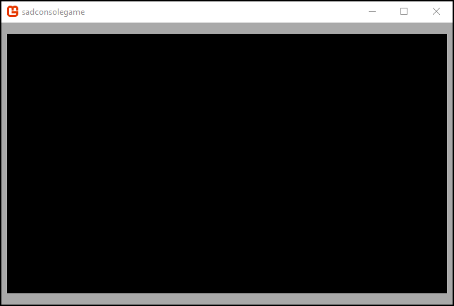
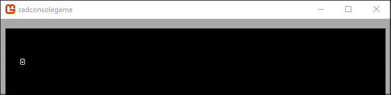
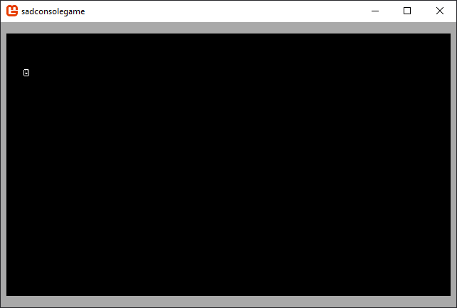

# Get Started 4 - Moving a character

In this part of the tutorial you'll learn how to use multiple consoles. Consoles can be attached to other consoles. Consoles can even share cell data between them.

Previous articles in this tutorial:

- [Part 1: Drawing on a console](drawing-on-a-console.md)
- [Part 2: Keyboard and Mouse](part-2-input.md)
- [Part 3: Learning about consoles](part-3-multiple-consoles.md)

## Prep

Reset the `Init()` method back to a clean state. Whenever the tutorial talks about resetting the `Init()` method back to a clean state, it means to replace your existing code with the following code:

```csharp
static void Init()
{
    var console = new Console(80, 25);

    SadConsole.Global.CurrentScreen = console;
}
```

## Create a "screen" for the map

When making a game, it's good to think about how you'll group up functionality together. We can call this concept a **screen**. A **screen** represents a specific aspect of your game, as it's displayed on the game window. For example, your _starting screen_ would be your game menu, with all animated objects, buttons, and things to create a new game, load a game, configure the game. The _game screen_ may represent the screen the user sees while they are playing the game, a status console, message console, and map console. Grouping the parts of your game into screens is a good way to lay out your game.

Let's create a single screen that, in this tutorial, will represent the game map and player character. Add a new class file to your project named _MapScreen.cs_ and make sure the class is named `MapScreen`. Inherit from `ContainerConsole`. Don't forget to import the `SadConsole` namespace and specify that the type `Console` is mapped to `SadConsole.Console`. Both the `System` and `SadConsole` namespaces define a type named _Console_ and this fixes the conflict.

```csharp
using System;
using System.Collections.Generic;
using SadConsole;
using Console = SadConsole.Console;

namespace SadConsoleGame
{
    class MapScreen: ContainerConsole
    {
    }
}
```

Setup the program's `Init` method to set the `MapScreen` type as the current screen.

```csharp
static void Init()
{
    Global.CurrentScreen = new MapScreen();
}
```

## Create a map console

Create a new console in the `MapScreen` type named `MapConsole`. This is a get-only property that will be set in the constructor of the container console.

```csharp
namespace SadConsoleGame
{
    class MapScreen: ContainerConsole
    {
        public Console MapConsole { get; }
    }
}
```

Add a constructor to the `MapScreen` that initializes the `MapConsole` property. This constructor will size the map console to the game window.

```csharp
class MapScreen: ContainerConsole
{
    public Console MapConsole { get; }

    public MapScreen()
    {
        var mapConsoleWidth = (int)((Global.RenderWidth / Global.FontDefault.Size.X) * 1.0);
        var mapConsoleHeight = (int)((Global.RenderHeight / Global.FontDefault.Size.Y) * 1.0);

        // Setup the map
        MapConsole = new Console(mapConsoleWidth, mapConsoleHeight);
        MapConsole.DrawBox(new Microsoft.Xna.Framework.Rectangle(0, 0, MapConsole.Width, MapConsole.Height), new Cell(Color.White, Color.DarkGray, 0));
        MapConsole.Parent = this;
    }
}
```

The code above creates two variables to help size the console. Right now this doesn't do anything except fill 100% of the console. The way this code works is the `Global.RenderWidth` (or height) is divided by the size of the default font. This gives you the amount of cells that fit on the window horizontally (`RenderWidth / Size.X`) or vertically (`RenderHeight / Size.Y`). This is then multiplied by a percentage where **1.0** represents 100% and **0.0** represents 0%. To get the console to only use 50% of the game window, you would use `* 0.50`.

The `MapConsole` is created to the size specified by the `mapConsoleWidth` and `mapConsoleHeight` variables. A box is then drawn on the console and it is assigned to as a child of the `ContainerConsole`. You can now run the game and see that you have a visible box the size of the window.



Remove the `MapConsole.DrawBox` line from your code. This was only there so you can see your console on the screen and how the sizing worked.

## Add a movable glyph

Now that we have a console to represent a map, let's look at how we can get a glyph on the screen that can move around. First though, import the `Microsoft.Xna.Framework` namespace.

```csharp
using Microsoft.Xna.Framework;
```

Next, add two properties to the `MapScreen` class. These will track the player controlled with the keyboard, and set the glyph by which the player is represented. First, add the `PlayerGlyph` property to represent the player's physical appearance. We'll configure the default appearance later.

```csharp
class MapScreen: ContainerConsole
{
    public Console MapConsole { get; }

    public Cell PlayerGlyph { get; set; }
}
```

Next, add a private field named `_playerPosition` and a public property named `PlayerPosition` to expose that field. Leave the **set** blank for now, but set it to **private** scope. The player position is represented by a `Point` type which contains the X,Y coordinates of the player.

```csharp
class MapScreen: ContainerConsole
{
    public Console MapConsole { get; }

    public int PlayerGlyph { get; set; } = 1;

    private Point _playerPosition;
    public Point PlayerPosition
    {
        get => _playerPosition;
        private set
        {

        }
    }
}
```

For **set** let's explain what we want to do when a new value comes in.

01. Erase the cell on the console where the player is located.
01. Set the position to the new value.
01. Set the glyph of the player in the new position.

The `PlayerGlyph.CopyAppearanceTo` call bellow copies the cell representing the player to the map at the position of the player, effectively drawing the player on the console.

```csharp
public Point PlayerPosition
{
    get => _playerPosition;
    private set
    {
        MapConsole.Clear(_playerPosition.X, _playerPosition.Y);
        _playerPosition = value;
        PlayerGlyph.CopyAppearanceTo(MapConsole[_playerPosition.X, _playerPosition.Y]);
    }
}
```

Update the `MapScreen` constructor to set the player's default appearance and position, then, draw the player for the first time. This is the only time you should access the `_playerPosition` field outside of the `PlayerPosition` property.

```csharp
public MapScreen()
{
    var mapConsoleWidth = (int)((Global.RenderWidth / Global.FontDefault.Size.X) * 1.0);
    var mapConsoleHeight = (int)((Global.RenderHeight / Global.FontDefault.Size.Y) * 1.0);

    // Setup map
    MapConsole = new Console(mapConsoleWidth, mapConsoleHeight);
    MapConsole.DrawBox(new Microsoft.Xna.Framework.Rectangle(0, 0, MapConsole.Width, MapConsole.Height), new Cell(Color.White, Color.DarkGray, 0));
    MapConsole.Parent = this;

    // Setup player
    PlayerGlyph = new Cell(Color.White, Color.Black, 1);
    _playerPosition = new Point(4, 4);
    PlayerGlyph.CopyAppearanceTo(MapConsole[_playerPosition.X, _playerPosition.Y]);
}
```

Run the game and you'll see that the player is printed on the console.



## Keyboard input

Now, let's hook the keyboard input of the container console. If the `MapScreen` is focused, keyboard input is sent to it. First, override the `ProcessKeyboard` method.

```csharp
public override bool ProcessKeyboard(Keyboard info)
{

}
```

The `info` parameter returns you information about the keyboard. You can use this parameter to test the keyboard for keys that are pressed and even ones that aren't. We need to detect when the keyboard arrow keys are pressed and then move the player. However, we also need to detect if the player moved as a result of the keyboard.

```csharp
public override bool ProcessKeyboard(Keyboard info)
{
    Point newPlayerPosition = PlayerPosition;

    if (info.IsKeyPressed(Microsoft.Xna.Framework.Input.Keys.Up))
        newPlayerPosition += SadConsole.Directions.North;
    else if (info.IsKeyPressed(Microsoft.Xna.Framework.Input.Keys.Down))
        newPlayerPosition += SadConsole.Directions.South;

    if (info.IsKeyPressed(Microsoft.Xna.Framework.Input.Keys.Left))
        newPlayerPosition += SadConsole.Directions.West;
    else if (info.IsKeyPressed(Microsoft.Xna.Framework.Input.Keys.Right))
        newPlayerPosition += SadConsole.Directions.East;

    if (newPlayerPosition != PlayerPosition)
    {
        PlayerPosition = newPlayerPosition;
        return true;
    }

    return false;
}
```

Explaining the code above:

- The player's position is stored in a variable named `newPlayerPosition`. We can then use this to detect if the player actually moved. At first, the positions match.
- Uses the `info.IsKeyPressed` method to detect if a key is being pressed. it's used for the **Up/Down/Left/Right** arrow keys.
- If a key was pressed, adjust the `newPlayerPosition` variable in the appropriate direction.\
Notice that the horizontal and vertical movements are grouped separately. This lets the user press both at the same time and move diagonally. For example, you can press **UP+LEFT** for example, but because of the way the `if` statements are composed, you can never push **UP+DOWN** at the same time.
- Test `newPlayerPosition` with the players current position to determine if the players new position is different.
- If the position has changed, set the `PlayerPosition` to the new position and return `true`.

The reason for returning `true` or `false` in the `ProcessKeyboard` method is to indicate to the object that called this method that we did indeed handle the keyboard and nothing else should handle the keyboard.

If you run the game now, you'll notice that the arrow keys do not move the player. This is because the screen is not yet set as the focused object. Modify the `Init` method in the *program.cs* file to focus the console.

```csharp
static void Init()
{
    Global.CurrentScreen = new MapScreen();
    Global.CurrentScreen.IsFocused = true;
}
```

Now if you run the game, you'll be able to move the player. Try two things:

01. Move the player into the border.
01. Move the player outside the bounds of the screen.



Notice that when the player moves on the border, the border is erased. Also, if you move outside of the bounds of the map, the game crashes. We'll need to protect the user from these conditions.

## Better player movement

The first thing we want to do is to store the map cell the player is about to move on top of, since this clears the map cell. Create a new private field in the `MapScreen` class named `_playerPositionMapGlyph`.

```csharp
class MapScreen: ContainerConsole
{
    private Point _playerPosition;
    private Cell _playerPositionMapGlyph;
```

Next, modify the `PlayerPosition.set` property to do the following:

01. Copy the appearance of the cell the player is about to move on.
01. Set the position to the new value.
01. Draw the player at the new position.
01. Restore the appearance of the map cell where the player moved from.

```csharp
public Point PlayerPosition
{
    get => _playerPosition;
    private set
    {
        // Restore map cell
        _playerPositionMapGlyph.CopyAppearanceTo(MapConsole[_playerPosition.X, _playerPosition.Y]);
        // Move player
        _playerPosition = value;
        // Save map cell
        _playerPositionMapGlyph.CopyAppearanceFrom(MapConsole[_playerPosition.X, _playerPosition.Y]);
        // Draw player
        PlayerGlyph.CopyAppearanceTo(MapConsole[_playerPosition.X, _playerPosition.Y]);
        // Redraw the map
        MapConsole.IsDirty = true;
    }
}
```

Notice that there is a new line, `MapConsole.IsDirty = true;`. Previously we didn't need this line because we called the method `MapConsole.Clear` when the player moved. The `Clear` method automatically set the `IsDirty` flag on the console. However, since we're using cells to directly copy to and from each other, this flag does not get set. This flag informs the console that it needs to redraw itself.

We also need to seed the `_playerPositionMapGlyph` field in the class constructor before we set the default position of the player. Notice the usage of `_playerPositionMapGlyph` in the following code.

```csharp
public MapScreen()
{
    var mapConsoleWidth = (int)((Global.RenderWidth / Global.FontDefault.Size.X) * 1.0);
    var mapConsoleHeight = (int)((Global.RenderHeight / Global.FontDefault.Size.Y) * 1.0);

    // Setup map
    MapConsole = new Console(mapConsoleWidth, mapConsoleHeight);
    MapConsole.DrawBox(new Microsoft.Xna.Framework.Rectangle(0, 0, MapConsole.Width, MapConsole.Height), new Cell(Color.White, Color.DarkGray, 0));
    MapConsole.Parent = this;

    // Setup player
    PlayerGlyph = new Cell(Color.White, Color.Black, 1);
    _playerPosition = new Point(4, 4);
    _playerPositionMapGlyph = new Cell();
    _playerPositionMapGlyph.CopyAppearanceFrom(MapConsole[_playerPosition.X, _playerPosition.Y]);
    PlayerGlyph.CopyAppearanceTo(MapConsole[_playerPosition.X, _playerPosition.Y]);
}
```

If you run the game you'll notice that the player does not erase the cells after leaving them.


## Player bounds

We don't want the player to move outside of the map bounds, so we'll need to test for that when the player tries to move, and prevent the movement.

Modify the `PlayerPosition.set` property to do the following:

01. Check if the new position of the player is outside the map bounds.
01. If so, return.

```csharp
public Point PlayerPosition
{
    get => _playerPosition;
    private set
    {
        // Test new position
        if (value.X < 0 || value.X >= MapConsole.Width ||
            value.Y < 0 || value.Y >= MapConsole.Height)
            return;

        // Restore map cell
        _playerPositionMapGlyph.CopyAppearanceTo(MapConsole[_playerPosition.X, _playerPosition.Y]);
        // Move player
        _playerPosition = value;
        // Save map cell
        _playerPositionMapGlyph.CopyAppearanceFrom(MapConsole[_playerPosition.X, _playerPosition.Y]);
        // Draw player
        PlayerGlyph.CopyAppearanceTo(MapConsole[_playerPosition.X, _playerPosition.Y]);
        // Redraw the map
        MapConsole.IsDirty = true;
    }
}
```

## Conclusion

You now have an object that can be moved around the screen. There was some extra work in it to make sure that the object didn't erase parse of the map. This is a bit how old console programs worked. However, SadConsole is a lot more robust and powerful than a standard console. The next part of the tutorial will demonstrate how to convert the player into a separate game object that is drawn on top of the console in a new layer.

>[!NOTE]
>This tutorial series is in progress. The next part of the series has not yet been published.
