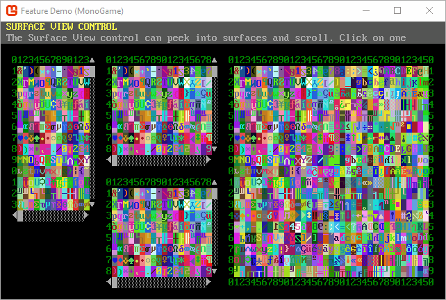

## Welcome to SadConsole

[][discord] [][nuget]

SadConsole is .NET game library that provides an engine to emulate old-school console and command prompt style graphics. SadConsole is built in a generic way and doesn't do any rendering itself. A game engine or other rendering library is required to draw SadConsole games. There are host libraries for MonoGame and SFML. The ascii character set is represented in a sprite sheet, much like other modern ascii games such as Dwarf Fortress.

SadConsole is built on cross-platform .NET, and can run anywhere the graphical host library can. It uses the **TheSadRogue.Primitives** ([NuGet](https://www.nuget.org/packages/TheSadRogue.Primitives), [GitHub](https://github.com/thesadrogue/TheSadRogue.Primitives)) library, which is a shared library with the amazing [GoRogue 3](https://github.com/Chris3606/GoRogue) utility library.

## Dependencies

SadConsole uses NuGet for its .NET dependencies.

## Demo Project

The [DemoProject](https://github.com/Thraka/SadConsole/tree/master/Samples/MainSample) shows how to use SadConsole in a multi-platform environment and demonstrates various things you can do with SadConsole.

## Features

Here are some of the features SadConsole supports.

- Show any number of consoles of any size.
- Uses PNG graphic fonts supporting more than 256 characters.
- Fonts are simply sprite sheet tilesets tied to ascii codes, you can use full graphical tiles if you want.
- Full GUI system for interactive controls such as list boxes, buttons, and text fields.
- Keyboard and mouse support.
- Read ansi files from the good old DOS days.
- Entity support for drawing thousands of movable objects on the screen
- Animated consoles and instruction system to chain commands together.
- String encoding system for colors and effects while printing.

#### GUI library

#### String display and parsing

#### Scrolling

#### Entities

#### Views

[nuget]: http://www.nuget.org/packages/SadConsole/
[discord]: https://discord.gg/pAFNKYjczM
[reddit]: http://reddit.com/r/sadconsole
