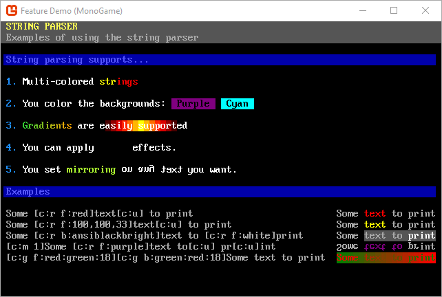
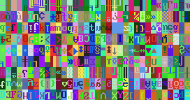

# Welcome to SadConsole

[][discord] [][nuget]

SadConsole is cross-platform .NET game library that provides an engine to emulate old-school console and command prompt style graphics. SadConsole is built in a generic way and doesn't do any rendering itself. A game engine or other rendering library is required to draw SadConsole games. There are host libraries for MonoGame and SFML, which are hardware accelerated. The ascii character set is represented in a sprite sheet, much like other modern ascii games such as Dwarf Fortress.

## Demo

The .NET templates provided by SadConsole can generate a demo application that showcases SadConsole. The follwoing commands install the SadConsole templates, generates the demo application, and then runs it.

```shell
dotnet new --install SadConsole.Templates
dotnet new sadconsole.demo
dotnet run
```

To learn how to use SadConsole, see [Get Started 1 - Draw on a console](articles/tutorials/getting-started/part-1-drawing.md).

## Features

Here are some of the features SadConsole supports.

- Show any number of consoles of any size.
- Uses PNG graphic fonts supporting more than 256 characters.
- Fonts are simply sprite sheet tilesets tied to ascii codes, you can use full graphical tiles if you want.
- Full GUI system for interactive controls such as list boxes, buttons, and text fields.
- Keyboard and mouse support.
- Read ansi files from the good old DOS days.
- Entity support for drawing thousands of movable objects on the screen
- Animated consoles and instruction system to chain commands together.
- String encoding system for colors and effects while printing.

#### GUI library


#### String display and parsing



#### Scrolling



[nuget]: http://www.nuget.org/packages/SadConsole/
[discord]: https://discord.gg/pAFNKYjczM
