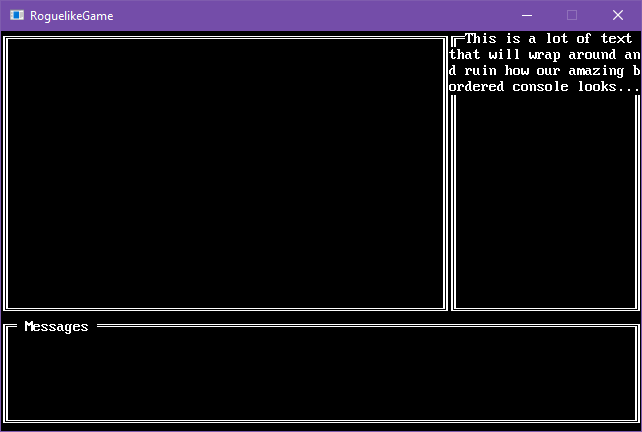
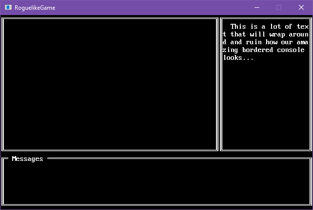

title: Create a bordered console
layout: docpage
comments: false
searcharchive: true
---

>**NOTE**  
>This article was written for version 7 of SadConsole.

A lot of the time you want a border around a console, which is pretty easy to do using the `console.DrawBox` method. However, if you want to use typing/virtual cursor or you're printing things that may wrap the next line, this becomes a problem. The text will wrap into the box border:



A border is supposed to be a decoration for the console and not get in the way of the console's normal functions. We can solve this by separating out the border from the console and treating it as its own object.

## Use a second surface

We can solve the border problem is by creating a `Basic` surface and attaching it to our console. By adding a new surface as a child of the console, it is positioned relative to the console and it is drawn whenever our console is drawn. The border will be **+2,+2** in size, compared to the console.

```csharp
using SadConsole.Consoles;

namespace RoguelikeGame
{
    class BorderedConsole : SadConsole.Console
    {
        SadConsole.Surfaces.Basic borderSurface;

        public BorderedConsole(int width, int height) : base(width, height)
        {
            Cursor.Position = new Point(0, 0);
            Cursor.Print("This console has a border around it and the text here wraps inside of it.");

            borderSurface = new SadConsole.Surfaces.Basic(width + 2, height + 2, base.Font);
            borderSurface.DrawBox(new Rectangle(0, 0, borderSurface.Width, borderSurface.Height), 
                                  new Cell(Color.White, Color.Black), null, SadConsole.Surfaces.SurfaceBase.ConnectedLineThick);
            borderSurface.Position = new Point(-1, -1);

            Children.Add(borderSurface);
        }
    }
}
```

Whenever a new `BorderedConsole` instance is created, it will display a border around the contents. The position of your console will have to take into account the fact that the border will be **-1,-1** relative to it. 

Try creating and positioning the console so that you can see the border:

```csharp
var console = new BorderedConsole(22, 10);
console.Position = new Point(3, 3);
Global.CurrentScreen = console;
```

Your result should look similar to this:

