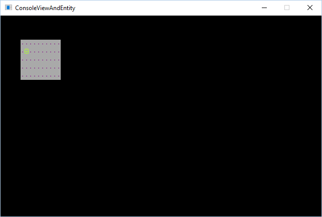
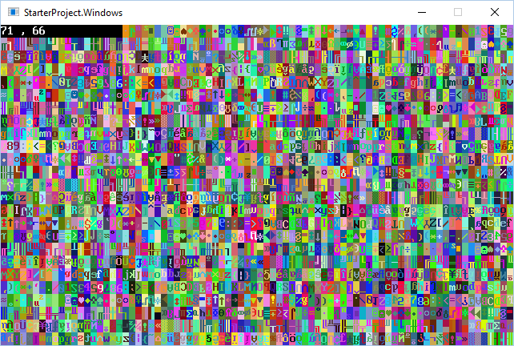

title: Display Entities on a console
layout: docpage
comments: false
searcharchive: true
---

>**NOTE**  
>This article was written for version 7 of SadConsole.

Entities are powerful because they represent independent-animated objects. Even if an entity is not animated, they make it easy to position glyphs independently of the console they are drawn on top of, for example a smiley face glyph that moves around but does not animate.

But why not just draw the glyph directly on the console? You could, but if you move glyphs around, you need to remember to erase the old glyph position and then draw it in the new position. If you also have background glyphs (like roads or scenery) you need to not only erase the old position of the glyph, but then restore that old position back to the original background glyph.

Think of it like this. If you print a glyph at `(20, 30)` to represent the player, and then the player presses the left-arrow key, you need to move the glyph left by one cell. You "move" the player by printing the player glyph at `(19, 30)`. However the old location `(20, 30)` still has a player glyph there. Now you need to **erase** the old location so it is blank. Let's say in this case your player is currently walking through a forest of green and yellow tiles, you'll need to remember what was there prior to the player entering that position, and restore it.

Entities help solve this problem because they are positioned and drawn independent other objects.

>**NOTE** You may want to review the introduction to [entities article](how-to-create-an-entity.md).

### Position problems
A problem appears when your console is not located at `(0, 0)` or you're using a custom `ViewPort`. This is because if you position the entity at `(1, 1)` on the **screen**, this may not map to where `(1, 1)` is on the console.

For example, if you position your console on the screen at `(5, 5)` this makes the top-left cell `(0, 0)` of the console draw at `(5, 5)`. If your entity is positioned at `(1, 1)` it will not appear on top of the console because the entity position represents where on the **screen** it is located, not where on a console it should be drawn.

Here is an example that demonstrates a badly positioned entity:

```csharp
var console = new Console(10, 5);
console.Position = new Point(5, 3);
console.Fill(Color.Purple, Color.DarkGray, 250, null);

var animation = new SadConsole.Surfaces.Animated("default", 1, 1);
var frame = animation.CreateFrame();
frame[0].Glyph = 1;
frame[0].Foreground = Color.GreenYellow;
frame[0].Background = Color.Transparent;

var entity = new SadConsole.Entities.Entity(animation);
entity.Position = new Point(1, 1);

Global.CurrentScreen.Children.Add(console);
Global.CurrentScreen.Children.Add(entity);
```


To fix this, you can parent the entity to the console. This ensures that the entity is always positioned relative to the console's current position:

```csharp
// ...other code from above...
Global.CurrentScreen.Children.Add(console);

// entity is now added as a child of the console instead of the Global.CurrentScreen
console.Children.Add(entity);
```



### View ports

The `ViewPort` property on a `Console` allows you to only display a small section of the surface. This way you can have a giant surface that is bigger than the game window which you can scroll around. This is very useful for when you have console that represents the map or play area.

Here is an example (click on the screenshot) of a console with a bunch of random glyphs and colors. The console is **1000 x 1000** but the `ViewPort` is positioned at `(71, 66)` and is **80 x 24** in size.

[](http://imgur.com/r7R7VA2)

By default, a console displays the entire surface area, and no optimizations are made. Once you set the `Console.ViewPort` property to something custom, optimizations take affect for rendering.

```csharp
var console = new SadConsole.Console(100,100);
console.ViewPort = new Microsoft.Xna.Framework.Rectangle(20, 25, 30, 30);
Global.CurrentScreen.Children.Add(console);
```

In the example above the console is created with a **100 x 100** surface area and will render all **100 x 100** cells. When the `ViewPort` is changed to **30 x 30**, only that specified area is rendered.

By setting the `ViewPort` to `null`, you can reset the render area to draw the entire console.

```csharp
console.ViewPort = null;
```

If you're trying to render other objects on the console, such as an enitity, this becomes problematic. Even if you parent the entity to the console, as done in the previous section, the `ViewPort` moves the backing console cells around. The top-left cell of the console may not be `(0, 0)` but could be `(20, 25)`. If you are trying to sync an entity to the console, you need to offset the entity by the `ViewPort` to keep things in sync.

The `SadConsole.Entities.EntityManager` is a class that was created to help sync the entity with a console's `ViewPort` value. Instead of adding the entity to the console, add it to the `EntityManager`. Then, add the `EntityManager` to the console:

```csharp
var console = new Console(10, 5);
console.Position = new Point(5, 3);
console.Fill(Color.Purple, Color.DarkGray, 250, null);

var animation = new SadConsole.Surfaces.Animated("default", 1, 1);
var frame = animation.CreateFrame();
frame[0].Glyph = 1;
frame[0].Foreground = Color.GreenYellow;
frame[0].Background = Color.Transparent;

var entity = new SadConsole.Entities.Entity(animation);
entity.Position = new Point(1, 1);

var manager = new SadConsole.Entities.EntityManager();
manager.Entities.Add(entity);

Global.CurrentScreen.Children.Add(console);
console.Children.Add(manager);
```

