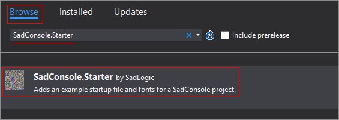

title: MonoGame Template
layout: docpage
comments: false
searcharchive: true
---

>**NOTE**  
>This article was written for version 7 of SadConsole.

This article describes how to use SadConsole from a Visual Studio MonoGame template.

- If you're using a MonoGame template to create a new project, which auto-generated your `game1` code file, follow these steps. 
- If you do not have the MonoGame SDK installed, you should create a new blank .NET project by following the directions in the [Create a new SadConsole project](create-a-new-sadconsole-project.md) article.

>**NOTE**
>SadConsole for MonoGame targets *.NET 4.6.1*. You may use a higher version if necessary.

1. After creating a new MonoGame project, open the *game1.cs* or *game1.vb* source code file
2. Right-click on the project and click Manage NuGet Packages.
5. Search for [SadConsole.Starter](https://www.nuget.org/packages/SadConsole.Starter/) and add it.

    

    >**TIP:**  
    >If you're using **Linux**, NuGet may not setup your project correctly. Look at the folder containing your project. Add any **.font** and **.png** as project references and set them to **Copy to output folder**.
5. Delete the *program-example.cs* file.
6. Open up your `game1.cs` file.
7. Change the base class from the MonoGame Game class to `SadConsole.Game`

    ```csharp
    public class Game1 : SadConsole.Game
    ```

8. Change the constructor to initialize SadConsole. Provide the font and width/height of the game window in cells.

    ```csharp
    public Game1() : base("IBM.font", 80, 25, null)
    ```

#### Initialize
Before anything can be done with SadConsole, the main engine must be initialized. The initialization routine takes a GraphicsDevice reference object. 

The following example overrides the `Initialize()` method on a Game class:

```csharp
protected override void Initialize()
{
    // Generally you don't want to hide the mouse from the user
    IsMouseVisible = true;

    // Finish the initialization of SadConsole
    base.Initialize();

    // Create your console
    var firstConsole = new SadConsole.Console(60, 30);

    firstConsole.FillWithRandomGarbage();
    firstConsole.Fill(new Rectangle(2, 2, 20, 3), Color.Aqua, Color.Black, 0);
    firstConsole.Print(3, 3, "Hello World!");

    SadConsole.Global.CurrentScreen.Children.Add(firstConsole);
}
```

### Example game1.cs class

This class shows using the SadConsole Engine Component to initialize MonoGame

```csharp
using Microsoft.Xna.Framework;
using System;
using System.Collections.Generic;
using System.Linq;
using System.Text;
using System.Threading.Tasks;

namespace SadRogueSharp
{
    public class Game1 : SadConsole.Game
    {
        public Game1() : base("IBM.font", 80, 25, null)
        {
            
        }

        protected override void Initialize()
        {
            // Generally you don't want to hide the mouse from the user
            IsMouseVisible = true;

            // Finish the initialization of SadConsole
            base.Initialize();

            // Create your console
            var firstConsole = new SadConsole.Console(60, 25);

            firstConsole.FillWithRandomGarbage();
            firstConsole.Fill(new Rectangle(2, 2, 20, 3), Color.Aqua, Color.Black, 0);
            firstConsole.Print(3, 3, "Hello World!");

            SadConsole.Global.CurrentScreen = firstConsole;
        }
    }
}
```

## Next steps

Now that you have the project created and working, check out the [existing tutorials](index.md). These will walk you through the basics.