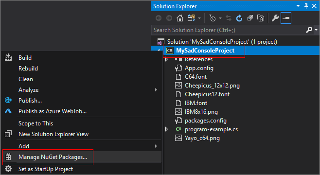
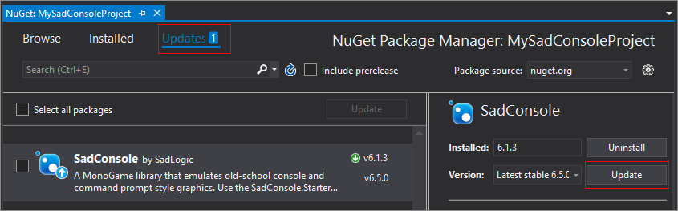
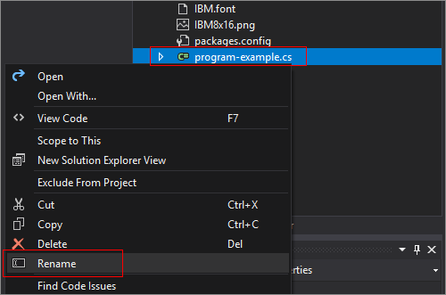
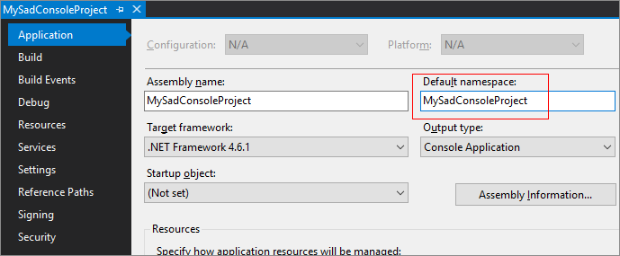
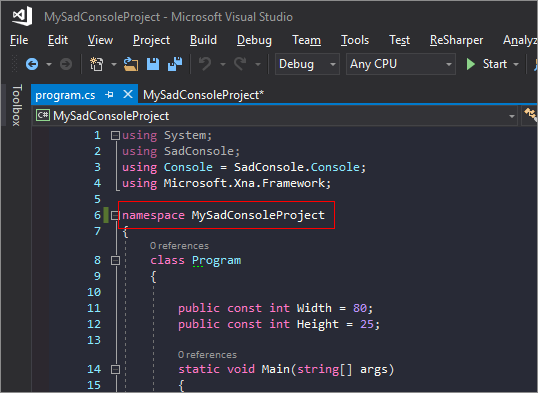

title: NuGet Starter for MonoGame
layout: docpage
comments: false
searcharchive: true
---

>**NOTE**  
>This article was written for version 7 of SadConsole.

This article describes how to setup SadConsole with your new project, after you've installed the [SadConsole NuGet](https://www.nuget.org/packages/SadConsole/) package. If you have not yet created a project, start with the [Create a new SadConsole project](create-a-new-sadconsole-project.md) article.

-----

Thank you for choosing **SadConsole**! 

If you added this NuGet package from:

1. An empty .NET project template.

    Setup is pretty easy at this point. Follow [the directions](#setup-sadconsole) below.

2. A new **MonoGame Game** project template.

    This way is only recommended when you're going to be making a MonoGame game that you would like to use parts of SadConsole with it. For more information, see the [MonoGame Template](monogame-template.md) article.

3. A **Console App** or **Windows Forms App** project template.

    First, delete the **program.cs** or **form1.cs** files from your project. Follow [the directions](#setup-sadconsole) below. There is less mess if you create an empty .NET project instead of a Console/Forms app. If you can, delete your current project and start with the [Create a new SadConsole project](create-a-new-sadconsole-project.md) article. 

>### **IMPORTANT**
>If you're using **Linux**, NuGet may not setup your project correctly. Look at the folder containing your project. Add any **.font** and **.png** as project references and set them to **Copy to output folder**.

## Setup SadConsole

With your project created in Visual Studio and the [SadConsole NuGet](https://www.nuget.org/packages/SadConsole/) package added, do the following:

1. In the **Solution Explorer**, right-click on the project, and click **Manage NuGet Packages**.

   

2. Search for and install a _MonoGame.Framework_ package. You can use the desired platform.
    * If you're making a Windows & Linux app, choose [MonoGame.Framework.DesktopGL](https://www.nuget.org/packages/MonoGame.Framework.DesktopGL/)
    * If you're making a Windows app, choose either [MonoGame.Framework.WindowsDX](https://www.nuget.org/packages/MonoGame.Framework.WindowsDX/) or [MonoGame.Framework.DesktopGL](https://www.nuget.org/packages/MonoGame.Framework.DesktopGL/)
    * If you're making a UWP app, choose [MonoGame.Framework.WindowsUniversal](https://www.nuget.org/packages/MonoGame.Framework.WindowsUniversal/)
    * If you're making an Android app, choose [MonoGame.Framework.Android](https://www.nuget.org/packages/MonoGame.Framework.Android/)

    >### **IMPORTANT**
    >If you chose the **DesktopGL** library, MonoGame does not provide you a required file, a copy of **SDL2.dll**. You need to add this to your project. I've provided a copy until MonoGame fixes this problem. There is a copy [here](https://github.com/Thraka/SadConsole/raw/master/src/DemoProject/DesktopGL/SDL2.dll).
    >
    >1. Download this file and copy it to the root of your project.
    >2. Right-click the **Project** > **Add** > **Existing item...**.
    >3. Navigate to the dll file and select it.
    >4. Select the file in the **Solution explorer** and in the **Properties** pane, set **Copy to Output Directory** to **Copy if newer**.
    >
    >   
    > If you get a **System.BadImageFormatException** error, try downloading the 32-bit version of SDL2.dll from https://www.libsdl.org/download-2.0.php 

3. If needed, use the **Manage NuGet Packages** window to update SadConsole to the latest release.

   

4. Rename *program-example.cs* to *program.cs*.

    If you have an existing *program.cs* file, delete it.

    The **SadConsole.Starter** NuGet package that was [installed previously](create-a-new-sadconsole-project.md) should have added a *program-example.cs* file to your project. Right-click the file and choose **Rename**. Set the name to *program.cs*.

    

5. Change the namespace declared in the *program.cs* file to your project namespace.

   1. In the **Solution Explorer**, right-click on the project, and choose **Properties**.

   2. Copy the text in the **Default namespace** box.

      

   3. Open the *program.cs* file and change `namespace MyProject` to `namespace the-text-you-copied-from-properties`

      

   4. Save the file.

6. Change the **Output type** and **Startup object**

   1. Back in the project properties window, set the **Output type** to **Windows Application**.

   2. Set the **Startup object** to your program class where you changed the namespace.

      

6. Press F5 to run.

## Next steps

Now that you have the project created and working, check out the [existing tutorials](index.md). These will walk you through the basics.