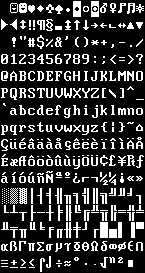

title: Basic font information
layout: docpage
---

Because of the way the system works, you use tile sets that map to character codes. Therefore, the tile set you use is a set of indexed graphics or, as is the default with SadConsole, a tile set of font characters.



>**NOTE**  
>Normally the background of the font texture is transparent, not black. It is black just for the examples here.

Each graphical font has a special config file that tells SadConsole how to read it. Regardless of how the font is configured, it is always used in the same way. The font is broken down into cells which are referenced by index. This works by starting at index 0 for the top-left cell, and moving right, counting up from 0. Once the index reaches the end of the line, it moves to the next line continuing to count.


This is how you write to the console. The `0` character on the keyboard is character code 48, which also happens to be the index in the font file that character `0` is placed. By default, all of the characters represented in the font file are placed in their matching character index. Character `A` (code 65) is placed at index 65, while character `z` (code 122) is placed at index 122, and so on.

## FontMaster

When a font is loaded, a `SadConsole.FontMaster` object is created. This is used to generate font objects used throughout SadConsole. There are 6 sizes of fonts per font master, each relative to the existing font.

- Quarter
- Half
- One
- Two
- Three
- Four

For example, if you have a font is made up of *4x8* characters and you generate a *Two* variation of the font, the rendering output will display the characters `size * 2.0` the original, *8x16* in size. If you generate a *Quarter* variation of that font, you would end up with `size * 0.25` the original, *1x4* in size.

# Change the font of a console

Each `Console` actually uses the `TextSurface` property as it's source of character, color, and font information. The `TextSurface.Font` property determines how each character is supposed to look. After you've loaded a font, you can easily use that font with any console.

Create a new console (10x10) which automatically uses the font assigned to the `SadConsole.Global.FontDefault` property. 

```csharp
var myConsole = new SadConsole.Console(10, 10);
```

Load a new font with `SadConsole.Global.LoadFont`. This adds the font into the system so that any console or text surface that is loaded can find the font.

```csharp
SadConsole.FontMaster fontMaster = SadConsole.Global.LoadFont("filename.font");
```

Set the font on the text surface that the console is using to the new font.

```csharp
myConsole.TextSurface.Font = fontMaster.GetFont(SadConsole.Font.FontSizes.One);
```

You can use a double sized font (x2 on both axis) by changing the `GetFont` call.

```csharp
myConsole.TextSurface.Font = fontMaster.GetFont(SadConsole.Font.FontSizes.Two);
```