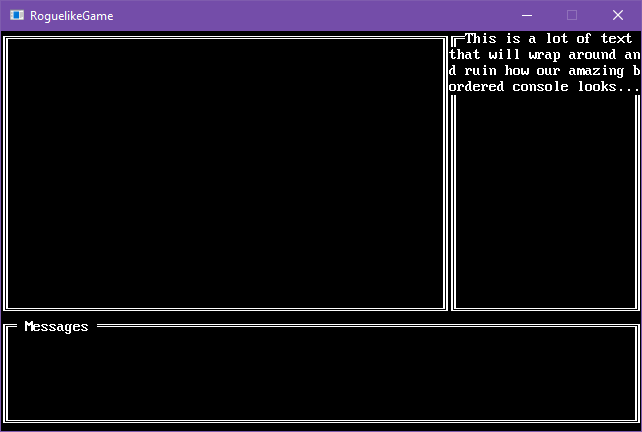

title: Create a bordered console
layout: docpage
---

A lot of the time you want a border around a console, which is pretty easy to do using the `Box` shape. However, if you want to use typing/virtual cursor or you're printing things that may wrap the next line, this becomes a problem. The text will wrap into the box border:



A border is supposed to be a decoration for the console and not get in the way of the console's normal functions. We can solve this by separating out the border from the console and treating it as its own object.

## Use a second surface

We can solve the border problem is by rendering a second `BasicSurface` whenever our console draws. A normal console is a combination of two things, a `BasicSurface` and a `SurfaceRenderer`. All we need to do is hook into the draw process and tell the system to draw a border positioned at **-1,-1** relative to the console's position. The border will be **+2,+2** in size compared to the console.

Let's create the extra `BasicSurface` in our new `BorderedConsole` class.

```csharp
using SadConsole.Consoles;

namespace RoguelikeGame
{
    class BorderedConsole : SadConsole.Console
    {
        SadConsole.Surfaces.BasicSurface borderSurface;

        public BorderedConsole(int width, int height) : base(width, height)
        {
            Print(0, 0, "This is a bunch of text data where we can see that there is a border around it");

            borderSurface = new SadConsole.Surfaces.BasicSurface(width + 2, height + 2, base.textSurface.Font);
        }
    }
}
```

Now that the `BasicSurface` that will hold our border is created, lets draw a box. To draw on a `BasicSurface` we use the `SurfaceEditor`. Add the following code below the creation of the **borderSurface**.

```csharp
var editor = new SadConsole.Surfaces.SurfaceEditor(borderSurface);
```

This line creates creates a `SurfaceEditor` instance which we can use to change the surface. SadConsole provides a shape class for making boxes: `SadConsole.Shapes.Box`. Let's create that, and use the editor instance to draw on the surface.

```csharp
// Create a box style using the thick looking lines
SadConsole.Shapes.Box box = SadConsole.Shapes.Box.Thick();

// Set the box width/height to match the border
box.Width = borderSurface.Width;
box.Height = borderSurface.Height;

// Draw the box using the editor object to the surface
// this alters the appropriate cells of the surface to have the look of the box
box.Draw(editor);

// Use a renderer to draw all the surface cells to a cached graphics texture
base.Renderer.Render(borderSurface);
```

You notice that `base.Renderer.Render` line? This actually draws the surface, not the screen though, but to memory. Each **Surface** has a `LastRenderResult` property that represents the last drawn state, which is a cached texture. When a **Renderer** goes to draw a surface, it checks for a `Surface.IsDirty` flag. If that flag is `true`, then the `LastRenderResult` is redrawn with the latest state of the console. This way, even if you call `Render` multiple times, though the surface has not actually changed, CPU/GPU time is not wasted.

How do we get our border to the screen though? Our console will automatically be drawn to the screen, so we'll hook into that process and draw the border along with the console. Override the `Draw` method and add code that will draw the border surface to the screen *before* the main console is drawn. 

In the `Draw` method we use a **DrawCall** to get something to the screen, part of the SadConsole's core drawing system. SadConsole gathers all drawing calls each frame and then renders them (eventually) to the screen. We need to tell SadConsole we want to draw our cached surface to the screen.

```csharp
public override void Draw(TimeSpan delta)
{
    // Draw our border to the screen
    Global.DrawCalls.Add(new DrawCallSurface(borderSurface, this.calculatedPosition - new Point(1), UsePixelPositioning));

    // Draw the main console to the screen
    base.Draw(delta);
}
```

Now when we move and draw the console, it will look similar like this:


## Final code

```csharp
using SadConsole.Consoles;

namespace RoguelikeGame
{
    class BorderedConsole : SadConsole.Console
    {
        SadConsole.Surfaces.BasicSurface borderSurface;

        public BorderedConsole(int width, int height) : base(width, height)
        {
            Print(0, 0, "This is a bunch of text data where we can see that there is a border around it");

            borderSurface = new SadConsole.Surfaces.BasicSurface(width + 2, height + 2, base.textSurface.Font);

            var editor = new SadConsole.Surfaces.SurfaceEditor(borderSurface);

            // Create a box style using the thick looking lines
            SadConsole.Shapes.Box box = SadConsole.Shapes.Box.Thick();

            // Set the box width/height to match the border
            box.Width = borderSurface.Width;
            box.Height = borderSurface.Height;

            // Draw the box using the editor object to the surface
            // this alters the appropriate cells of the surface to have the look of the box
            box.Draw(editor);

            // Use a renderer to draw all the surface cells to a cached graphics texture
            base.Renderer.Render(borderSurface);
        }

        public override void Draw(TimeSpan delta)
        {
            // Draw our border to the screen
            Global.DrawCalls.Add(new DrawCallSurface(borderSurface, this.calculatedPosition - new Point(1), UsePixelPositioning));

            // Draw the main console to the screen
            base.Draw(delta);
        }
    }
}
```
