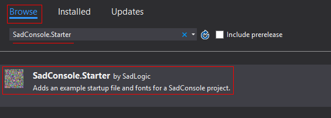

title: Create a new SadConsole project
layout: docpage
---

This page describes how to create a new project in Visual Studio to use SadConsole. If you already have a **MonoGame template** project created, read about how to use **SadConsole** [here](MonoGame-Template.md).

The best way to create a new SadConsole game is to start with the **Empty project** template provided by Visual Studio.

1. Click **File** > **New** > **Project...**

2. Select **Windows/Classic Desktop** in the left pane.

3. Select **Empty Project (.NET Framework)** as the project type.

4. Provide the **Name** and **Location** of where to save your project.

5. Click **OK**. Your project will be created.

Now that you have the project created, you need to add reference to the SadConsole NuGet package.

1. Right-click on the project in the **Solution Explorer** pane and click **Manage NuGet Packages**.

2. Search for **SadConsole.Starter**.

3. Select the package and then click **Install**.

    

When **SadConsole.Starter** is added to your project, Visual Studio should open up the [NuGet Starter MonoGame](NuGet-Starter-MonoGame.md) page which tells you next steps you need to do.