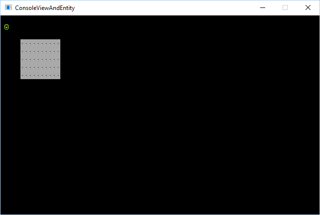

title: Display GameObjects on a console
layout: docpage
---

The `RenderArea` property on a `ISurface` allows you to only display a small section of the surface. This way you can have a giant surface that is bigger than the game window and allows you to scroll around. This is very useful for when you have console that represents the map or play area.

>**NOTE** You may want to review the introduction to [game objects article](How-to-create-a-gameobject.md).

Here is an example (click on the screenshot) of a console with a bunch of random characters and colors. The console is 1000x1000 but the view area is only 80x24 and it can be scrolled.

[](http://imgur.com/r7R7VA2)

### Use a render area
By default the render area is the same size of the backing text surface and no optimizations are made. Once you set the `ISurface.RenderArea` property to something custom, optimizations take affect for rendering.

```csharp
var myConsole = new SadConsole.Console(100,100);
myConsole.TextSurface.RenderArea = new Microsoft.Xna.Framework.Rectangle(20, 25, 30, 30);
```

In the example the console is created with a **100 x 100** surface and will render all **100 x 100** cells. Once you change it to be **30 x 30**, only that smaller area will actually render.

##### Reset the render area
Reset the render area by simply setting the `RenderArea` property to null. This will make the render area match the size of the text surface.

```csharp
myConsole.TextSurface.RenderArea = null;
```

### Game objects
Game objects are powerful because they represent independent animated consoles. Even though many of the game objects I use in my games are not animated, I still use them when I want to position characters independently of the console, for example a smiley face character that moves around but does not animate.

**Q** *Hey, if my entity is not going to be animated, why would I want to use this instead of a console?*  
Good question. The reason is that if you move characters around on the console, you need to remember erase the old position when you move the character to a new position. If you also have background characters (like roads or something) too, you need to not only erase the old position of the character, but restore it to what it was originally.

Think of it like this. If you print a character at `(20, 30)` to represent the player and then the player presses the left-arrow key, you need to move the character left by one cell. You do this by printing the character at `(19, 30)`. However the old location `(20, 30)` still has a character there. Now you need to **erase** the old location so it is blank. Let's say in this case your player is currently walking through a forest of green and yellow tiles, you'll need to remember what was there prior to the character and restore it.

Game objects help solve this problem because you position them physically on the screen instead of physically on an individual console.

##### Problems
A problem however appears when your console is not located at `(0, 0)` or you're using a view port. This is because if you position the object at `(1, 1)` on the **screen**, this may not map to where `(1, 1)` is on the console.

For example, if you position your console on the screen at `(5, 5)` this makes the left-most `(0, 0)` cell of the console draw there. If your object is positioned at `(1, 1)` it will not appear on the console because the game object position represents where on the **screen** it is located, not where on a console it should be drawn.

###### Example
```csharp
var console = new Console(10, 5);
console.Position = new Point(5, 3);
console.Fill(Color.Purple, Color.DarkGray, 250, null);

var entity = new SadConsole.GameHelpers.GameObject();
var animation = new SadConsole.Surfaces.AnimatedSurface("default", 1, 1);
var frame = animation.CreateFrame();
frame[0].Glyph = 1;
frame[0].Foreground = Color.GreenYellow;
frame[0].Background = Color.Transparent;
entity.Animation = animation;
entity.Position = new Point(1, 1);
entity.Update();

// Note, you need to call `entity.Render` after the console has been rendered
```



To fix this, the game object has a property called `RenderOffset` which offsets the position on the screen where the game object would be rendered by that amount. To sync any game object's position with a console use this code:

```csharp
entity.RenderOffset = console.RelativePosition - console.TextSurface.RenderArea.Location;
```

>**NOTE**  
>You use `console.RelativePosition` instead of `console.Position` because the relative position takes into account any console parents that may offset where the console is located on the screen.


If you're using `TextSurface.RenderArea` on your console, you need to check and makes sure that the game object is actually located within the view of the console so that it doesn't appear outside of the render area. Set the game object `IsVisible` to hide game objects that are outside of what you're showing the user. Obviously if your console is exactly the same size of the view area you don't really have to worry about this.

```csharp
entity.IsVisible = console.TextSurface.RenderArea.Contains(entity.Position);
```