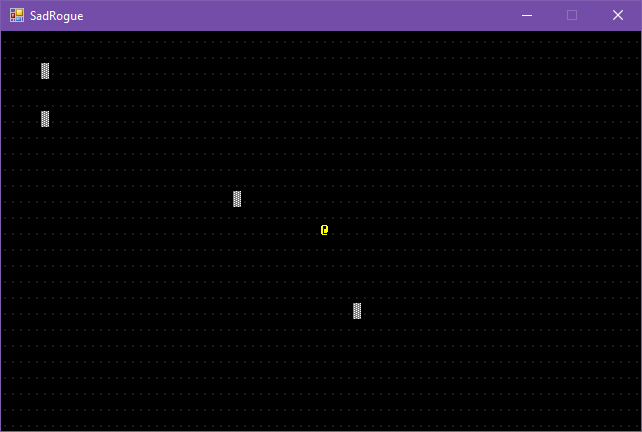

title: Roguelike Tutorial - Part 2 - Character and Map
layout: docpage
---

<div class="alert alert-danger" role="alert">
This article is part of an out-of-date series that will be replaced in the future.
</div>

In this article we'll accomplish the following:

- [x] Create objects to represent the player.
- [x] Create map tiles and a map.
- [x] Display a map and player on the screen.
- [x] Use the keyboard to move the player.

##### Tutorial index

- [Part 1 - Create the project](part-1---create-a-new-project.md)
- **Part 2 - Character and map**

## Create an entity

In a lot of text engines where you want to move characters around a console, you get some additional overhead. Normally, you print the character on the console. Then, when it moves, you redraw it in the new position. After that, you also have to make sure to restore whatever was under the original spot of the character.

SadConsole can avoid that with the `SadConsole.GameHelpers.GameObject` type. This type provides a positionable text object that can also be animated. The `GameObject` is used when you have a bunch of moving objects that are layered on top of a background.

We'll create a class named `EntityBase.cs` that represents things placed on the map. Right-click on the project file and choose **New** > **Add Folder** and name it `Entities`. Right-click on the new folder and choose **New** > **Class...** and name the class `EntityBase.cs`. In this class we'll inherit from `SadConsole.GameHelpers.GameObject`. This will represent the base class for monsters, the player, things like that.

```csharp
using Microsoft.Xna.Framework;

namespace SadRogue.Entities
{
    class EntityBase: SadConsole.GameHelpers.GameObject
    {
        public EntityBase(Color foreground, Color background, int glyph) : base(1, 1)
        {
            Animation.CurrentFrame[0].Foreground = foreground;
            Animation.CurrentFrame[0].Background = background;
            Animation.CurrentFrame[0].Glyph = glyph;
        }

        public void MoveBy(Point change, Map map)
        {
            Position += change;
        }
    }
}
```

If you noticed, there is a `MoveBy` method on the `EntityBase.cs` class. This will adjust the position of the entity by the amount provided. It will be easy to move something X or Y spaces on the map. The `Map` class doesn't exist yet, we'll fix that soon.

Next, add another class to the `Entities` folder named `Player.cs`. This class will represent the character the player controls in your game.

```csharp
using Microsoft.Xna.Framework;

namespace SadRogue.Entities
{
    class Player : EntityBase
    {
        public Player(): base(Color.Yellow, Color.Black, '@')
        {
        }
    }
}
```

## Create a map

Now that we have a player that will be contolled on a map, we need to create a class to hold information about the game map. We also need a class to handle drawing the map.

### Tiles

First, we need to create objects that make up the map. A map is a grid of these objects. Some things on the map will block the player (using our movement checks) and others will represent empty space. Add another folder to the solution named `MapObjects`. This folder will have each tile type that is used to make up a map. the types of tiles placed on the map.

Add a class to that folder named `TileBase.cs` and add this code. This class inherits from `SadConsole.Cell` which is a class that all surfaces use in rendering.

```csharp
using SadConsole;
using Microsoft.Xna.Framework;

namespace SadRogue.MapObjects
{
    class TileBase: Cell
    {
        public bool IsBlockingMove;
        public bool IsBlockingLOS;

        public TileBase(Color foreground, Color background, int glyph) : base(foreground, background, glyph)
        {

        }
    }
}
```

Add two more classes to the `MapObjects` folder named `Wall.cs` and `Floor.cs`. These classes inherit from our new `TileBase` class and sets it up with.. well.. wall things.

>**Wall.cs**

```csharp
using Microsoft.Xna.Framework;

namespace SadRogue.MapObjects
{
    class Wall : TileBase
    {
        public Wall() : base(Color.White, Color.Gray, 176)
        {
            IsBlockingLOS = true;
            IsBlockingMove = true;
        }
    }
}
```

>**Floor.cs**

```csharp
using Microsoft.Xna.Framework;

namespace SadRogue.MapObjects
{
    class Floor : TileBase
    {
        public Floor() : base(new Color(25, 25, 25), Color.Black, 46)
        {
            IsBlockingLOS = false;
            IsBlockingMove = false;
        }
    }
}
```

Now that we have tiles, we need a map class to hold them. Add a new class to the root of the project named `Map.cs`.

```csharp
using System.Collections.ObjectModel;

namespace SadRogue
{
    class Map
    {
        public int Width { get; private set; }
        public int Height { get; private set; }
        
        public ObservableCollection<Entities.EntityBase> Entities;

        public MapObjects.TileBase[] Tiles;

        public Map(int width, int height)
        {
            Width = width;
            Height = height;

            // Create our tiles for the map
            Tiles = new MapObjects.TileBase[width * height];

            // Fill the map with floors.
            for (int i = 0; i < Tiles.Length; i++)
                Tiles[i] = new MapObjects.Floor();

            // Set some temp walls, will be replaced by random generation
            // y * width + x = index of that x,y combination
            Tiles[5 * width + 5] = new MapObjects.Wall();
            Tiles[2 * width + 5] = new MapObjects.Wall();
            Tiles[10 * width + 29] = new MapObjects.Wall();
            Tiles[17 * width + 44] = new MapObjects.Wall();

            // Holds all entities on the map
            Entities = new ObservableCollection<SadRogue.Entities.EntityBase>();
        }
    }
}
```

I put in code comments to help explain things, but here is some more information. SadConsole can take an array of `Cell` types, and use that to create a surface that is drawn on the screen. If you remember, our `TileBase` class inherits from `Cell`. This new map type has an array of `TileBase` objects and we can use that to make up each x,y position in the map. And we can use SadConsole to draw those. We'll see how this works next.

### Drawing the map

Now that we have a map data structure and some basic information, we will use a `Screen` type to not only display the map, but to handle keyboard input as well.

A `Screen` type is a core concept in SadConsole. It represents something that receives input and can draw. A `Screen` can be a parent and/or a child of another `Screen`. In the case of our map, we'll use a single screen to represent drawing the player and their surroundings.

Create another folder in the project named `Screens` and add a new class named `Dungeon.cs`. This screen will handle linking a drawing surface with the map tiles. The code for this screen is pretty simple; it inherits from `SadConsole.Screen`.

```csharp
using Microsoft.Xna.Framework;
using SadConsole.Renderers;
using SadConsole.Surfaces;
using System;

namespace SadRogue.Screens
{
    class Dungeon: SadConsole.Screen
    {
        private SurfaceRenderer renderer = new SurfaceRenderer();
        private BasicSurface surface;
        private SadConsole.DrawCallSurface drawCall;

        public Point MapViewPoint { get { return surface.RenderArea.Location; } set { surface.RenderArea = new Rectangle(value, new Point(Width, Height)); } }

        public int Width { get; private set; }
        public int Height { get; private set; }

        public Dungeon(int screenX, int screenY, int screenWidth, int screenHeight)
        {
            Position = new Point(screenX, screenY);
            Width = screenWidth;
            Height = screenHeight;
        }
        
        public void LoadMap(Map map)
        {
            // Create a surface for drawing. It uses the tiles from a map object.
            surface = new BasicSurface(map.Width, map.Height, map.Tiles, SadConsole.Global.FontDefault, new Rectangle(0, 0, Width, Height));
            drawCall = new SadConsole.DrawCallSurface(surface, position, false);
        }

        public override void Draw(TimeSpan timeElapsed)
        {
            renderer.Render(surface);
            SadConsole.Global.DrawCalls.Add(drawCall);

            base.Draw(timeElapsed);
        }
    }
}
```

The first three variables in this class handle rendering, nothing exciting there. The next variable, `MapViewPoint`, handles determining (starting at the top-left of the map) what part of the map we render. If we draw the map on the physical screen in a size of **60x20**, and our map is **100x100** we need to support scrolling to the portion the player is at. This property handles controlling the map for that. 

The `LoadMap` method takes a `Map` object and creates the `BasicSurface`, which is used in drawing.

## Coordinator screen

We can now create the master screen that represents the state the game is in as the player moves through the dungeon. In the `Screen` folder, add a new class named `Adventure.cs`. This screen will not draw anything directly, but will be used to group all child screens (only the `Dungeon` screen for now) together. This new screen will also handle keyboard input.

This class is a little more complex so we'll build it piece-by-piece.

First start with the main declarations and variables. We'll declare the player, map, map screen, and expose the `MapViewPoint` from the map screen.

```csharp
using Microsoft.Xna.Framework;
using System;

namespace SadRogue.Screens
{
    /// <summary>
    /// Represents the whole screen when you are adventuring in a town or dungeon.
    /// Coordinates betwene child screens.
    /// </summary>
    class Adventure : SadConsole.Screen
    {
        private Map map;

        public Entities.Player Player;
        public Dungeon DungeonScreen;

        public Map Map { get { return map; } }

        public Point MapViewPoint
        {
            get { return DungeonScreen.MapViewPoint; }
            set
            {
                DungeonScreen.MapViewPoint = value;
                SyncEntityOffset();
            }
        }

```

Next, the constructor, which sets where on the screen the map screen will draw.

```csharp
        public Adventure()
        {
            DungeonScreen = new Dungeon(0, 0, Program.ScreenWidth, Program.ScreenHeight);

            Children.Add(DungeonScreen);
        }
```

Now add the `LoadMap` method, which as the name says, loads a map. This method hooks the `map.Entities.CollectionChanged` method. We will use this to ensure that the dungeon screen knows about any entity the map object has. Next,, we tell the dungeon screen to load the map for drawing.

```csharp
        public void LoadMap(Map map)
        {
            // If we had an old map, unhook this event
            if (this.map != null)
                map.Entities.CollectionChanged -= Entities_CollectionChanged;

            // Tell the dungeon screen to load this new map
            DungeonScreen.LoadMap(map);

            // Anytime an entity is removed or added, we need to know about it
            map.Entities.CollectionChanged += Entities_CollectionChanged;

            this.map = map;
        }
```

The code for the `Entities_CollectionChanged` method is uneventful, it just keeps the dungeon screen's `Children` collection in sync with the entities the map has. When a `GameObject` (which the entities are based on) is added to the `Children` collection of a screen, it does two things. First, anytime the screen drawing physical screen position changes, the entities will adjust position along with it. And secondly, any time the screen is told to draw, all child objects are also drawn.

```csharp
        private void Entities_CollectionChanged(object sender, System.Collections.Specialized.NotifyCollectionChangedEventArgs e)
        {
            switch (e.Action)
            {
                case System.Collections.Specialized.NotifyCollectionChangedAction.Add:
                    foreach (var item in e.NewItems)
                        DungeonScreen.Children.Add((SadRogue.Entities.EntityBase)item);
                    break;
                case System.Collections.Specialized.NotifyCollectionChangedAction.Remove:
                    foreach (var item in e.OldItems)
                        DungeonScreen.Children.Remove((SadRogue.Entities.EntityBase)item);
                    break;
                case System.Collections.Specialized.NotifyCollectionChangedAction.Replace:
                    foreach (var item in e.NewItems)
                        DungeonScreen.Children.Add((SadRogue.Entities.EntityBase)item);
                    foreach (var item in e.OldItems)
                        DungeonScreen.Children.Remove((SadRogue.Entities.EntityBase)item);
                    break;
                case System.Collections.Specialized.NotifyCollectionChangedAction.Reset:
                    DungeonScreen.Children.Clear();
                    break;
                default:
                    break;
            }

            SyncEntityOffset();
        }

        private void SyncEntityOffset()
        {
            foreach (var item in map.Entities)
            {
                // Make sure that the entity draws based on the current map scrolling values
                item.PositionOffset = new Point(-DungeonScreen.MapViewPoint.X, -DungeonScreen.MapViewPoint.Y);
            }
        }
```

The last method is the `Update` method. Here we will check for keyboard input and move the player accordingly.

```csharp
        public override void Update(TimeSpan timeElapsed)
        {
            base.Update(timeElapsed);

            // Handle keyboard when this screen is being run
            if (SadConsole.Global.KeyboardState.IsKeyPressed(Microsoft.Xna.Framework.Input.Keys.Left))
                Player.MoveBy(new Point(-1, 0), map);

            else if (SadConsole.Global.KeyboardState.IsKeyPressed(Microsoft.Xna.Framework.Input.Keys.Right))
                Player.MoveBy(new Point(1, 0), map);

            if (SadConsole.Global.KeyboardState.IsKeyPressed(Microsoft.Xna.Framework.Input.Keys.Up))
                Player.MoveBy(new Point(0, -1), map);

            else if (SadConsole.Global.KeyboardState.IsKeyPressed(Microsoft.Xna.Framework.Input.Keys.Down))
                Player.MoveBy(new Point(0, 1), map);
        }
    }
}
```

For reference, here are the methods defined by the class, and what they do:

| Method/Property  | Description |
| ---------------- | ----------- |
| MapViewPoint     | This property just forwards the map's `MapViewPoint` property. It also calls `SyncEntities` which is important. |
| LoadMap          | Tells the `DungeonScreen` to load the current map. Also hooks an event to know when an entity is removed or added.
| Entities_CollectionChanged | Triggered when an entity is added or removed from the map. This method makes sure that the (Screen base class) `DungeonScreen.Children` is in sync with the entities. A screen automatically draws and updates any child in the `Children` collection. |
| SyncEntityOffset | Makes sure that each entity is drawn in the correct position based on the `MapViewPoint`. Any time the screen scrolls, this needs to be called. |
| Update           | Handles game logic for this screen. |

## Hooking it all up

Finally, we need to make sure SadConsole knows about this screen. Back in **Program.cs**, add a static variable at the top (under `ScreenHeight/Width`) to represent the adventuring mode of the game.

```csharp
public static Screens.Adventure AdventureScreen;
```

Replace the code for the `Init` method with the following code.

```csharp
private static void Init()
{
    // Create the map
    AdventureScreen = new Screens.Adventure();
    AdventureScreen.LoadMap(new Map(100, 100));
    AdventureScreen.Player = new Entities.Player();
    AdventureScreen.Player.Position = new Point(13, 7);
    AdventureScreen.Map.Entities.Add(AdventureScreen.Player);
    
    SadConsole.Global.CurrentScreen.Children.Add(AdventureScreen);
}
```

Run the project and you should see something similar to this.



You can move the character around with the arrow keys. However, you can walk right on top of the walls. Let's fix that.

Open up the `Map.cs` file and add a new method to the map class: `IsTileWalkable`.

```csharp
public bool IsTileWalkable(int x, int y)
{
    if (x < 0 || y < 0 || x >= Width || y >= Height)
        return false;

    return !Tiles[y * Width + x].IsBlockingMove;
}
```

This method checks to see if the map data indicates a specific tile will block movement or not.

Open up the `Entities/EntityBase.cs` file and modify the `MoveBy` method to call the `map.IsTileWalkable` method.

```csharp
public void MoveBy(Point change, Map map)
{
    var newPosition = Position + change;

    // Check the map if we can move to this new position
    if (map.IsTileWalkable(newPosition.X, newPosition.Y))
        Position = newPosition;
}
```

Now run the game and you'll see that you can no longer walk through the walls!

## Closing thoughts

In this part of the series we created some map tile objects, a player entity, and a map. We displayed the map through a screen object, and we hooked up input to move our player around.