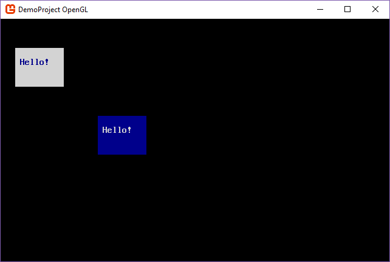

title: What are Screens, Consoles, and Surfaces?
layout: docpage
date: 2018-08-31 15:19:00
---

The main type of object in SadConsole is the `ScreenObject`. As you can probably guess from the name, it represents something that can be displayed on the screen. Alone, screen objects do not really do much of anything, they are empty shells that form the base of objects. 

SadConsole has two main functions that are performed on screen objects as the game loop runs:

1.  Update SadConsole objects.
1.  Draw SadConsole objects.

Intermixed in that process are all sorts of other things, input management, texture caching for performance, screen position calculations, etc. 

SadConsole uses the `ScreenObject` as the base class for all other objects, such as: consoles, drawing surfaces, and game entities. All of the following objects inherit from `ScreenObject` and can be positioned and parented to any other `ScreenObject` type.

| Type | Function |
| ---- | -------- |
| **Console related** |
| SadConsole.Console | Keyboard, mouse, virtual cursor support. |
| SadConsole.ControlsConsole | Same as Console. Adds text UI framework. |
| SadConsole.Window | Same as ControlsConsole. Adds floating/movable dialog system. |
| SadConsole.ConsoleContainer | A fake console that does nothing. It can receive keyboard and mouse events. Exists for you to extend and wrap objects that cannot take keyboard/mouse input. |
| **Surface related** |
| SadConsole.Surfaces.SurfaceBase | Abstract base class that defines an array of SadConsole.Cell objects. Provides methods to print and draw on the surface. |
| SadConsole.Surfaces.Basic | Basic implementation of SurfaceBase. Does nothing extra. |
| SadConsole.Surfaces.BasicNoDraw | Just like the Basic class but does not use a cached texture and will not draw itself on the screen, ever. |
| SadConsole.Surfaces.Animated | Animated surface that has multiple BasicNoDraw frames. |
| SadConsole.Surfaces.Layered | Multiple Basic surfaces that are drawn on top of each other to form a layered surface. |
| **Entity related** |
| SadConsole.Entities.Entity | Contains multiple animations. Has an additional position offset for syncing with viewports. |
| SadConsole.Entities.Zone | An invisible rectangle. Has a settings dictionary. Use with a game map to mark regions. |
| SadConsole.Entities.Hotspot | One or more invisible points. Has a settings dictionary. Use with a game map to mark specific spots. |
| SadConsole.Entities.EntityManager | Contains entities, zones, and hotspots. When parented to a SurfaceBase, manages offset syncing for objects. |

## ScreenObject processing

SadConsole uses the `SadConsole.Global.CurrentScreen` property to determine what objects are going to be processed. The current screen starts out as a `ScreenObject`, which has nothing to render. If you add something to its `Children` collection, those objects will be processed. They may or may not be drawn depending on the type of object.

In general, `ScreenObject` types handle the following:

1.  Position
1.  Visibility toggle
1.  Update and Drawing hooks
1.  Parent-child relationship with other ScreenObjects

When SadConsole starts, the current screen is initialized like so:

```csharp
Global.CurrentScreen = new ScreenObject();
```

From that point, you can add what you want to the current screen to get it in the system. For example, this code would add a new console (a console is a type of `ScreenObject`) to the engine:

```csharp
SadConsole.Global.CurrentScreen = new ScreenObject();

var console1 = new SadConsole.Console(10, 4);
console1.Fill(Color.DarkBlue, Color.LightGray, 0);
console1.Print(1, 1, "Hello!");
console1.Position = new Point(3, 3);

SadConsole.Global.CurrentScreen.Children.Add(console1);
```


Or this code would add two different consoles to the system, and position them at different points:

```csharp
var console1 = new SadConsole.Console(10, 4);
console1.Fill(Color.DarkBlue, Color.LightGray, 0);
console1.Print(1, 1, "Hello!");
console1.Position = new Point(3, 3);

var console2 = new SadConsole.Console(10, 4);
console2.Fill(Color.LightGray, Color.DarkBlue, 0);
console2.Print(1, 1, "Hello!");
console2.Position = new Point(20, 10);

SadConsole.Global.CurrentScreen.Children.Add(console1);
SadConsole.Global.CurrentScreen.Children.Add(console2);
```



At this point, the object hierarchy in current screen looks like the following:

```text
Global.CurrentScreen
|
\-- console1
\-- console2
```

If we were to parent `console2` to `console1`, it would look like the following:

```csharp
console1.Children.Add(console2);
Global.CurrentScreen.Children.Add(console1);
```

```text
Global.CurrentScreen
|
\-- console1
    |
    \-- console2
```


If you compare this screenshot with the previous, you'll notice that `console2` is positioned in a slightly different place. That is because the position of where something is drawn is based on its parent. Here are the position settings with both consoles added directly to the current screen:

```text
Global.CurrentScreen [Pos: (0,0) Drawn: (0,0)]
|
\-- console1 [Pos: (3,3) Drawn: (3,3)]
\-- console2 [Pos: (20,10) Drawn: (20,10)]
```

When the parent of `console2` was changed from the `CurrentScreen` to `console1`, its drawing position was changed:

```text
Global.CurrentScreen [Pos: (0,0) Drawn: (0,0)]
|
\-- console1 [Pos: (3,3) Drawn: (3,3)]
    |
    \-- console2 [Pos: (20,10) Drawn: (23,13)]
```

What happened is that `console2` inherted the drawing position of its parent, `console1` **(3,3)**, and was offset by that amount. So while the position of `console2` was still set to **(20,10)** the final drawing position was calculated by `object_Position (20,10) + parent_Render_Position (3,3) = object_Render_Position (23,13)`.

As SadConsole processes an object, if it finds that `IsVisible` value is set to false, it immediately stops processing that object (for drawing) and does not inspect the `Children` of that object. So, if you were to hide `console1` with `console1.IsVisible = false` then `console2` would not be drawn.

## Surfaces and Consoles

The `SadConsole.Surfaces.SurfaceBase` is made up of `SadConsole.Cell` objects. A `Cell` is a glyph with a foreground and background color. The surface provides methods for writing text on a surface. Other methods such as shifting the entire surface in a direction, setting the background color of a single cell, or drawing a box shape, are provided. The base class for a surface is `ScreenObject`, so it can be positioned on the screen just like a `Console` can. 

The `SadConsole.Surfaces.SurfaceBase` type is an abstract base class used by other objects. The ``SadConsole.Surfaces.Basic` surface is an implementation of that base class with no extra capabilities.

A `SadConsole.Console` type is actually a `SadConsole.Surfaces.SurfaceBase` with a bunch of extra handlers attached to it so you can use it like a terminal. It is not exactly meant to emulate a complete terminal, but it has some similar capabilities. Since the console is a surface, it has all of the same functions a surface does, such as printing text or manipulating individual cells. The console also provides keyboard and mouse input processing. It provides a `Cursor` object that emulates a terminal cursor. You can position the cursor within the console and use it for keyboard input or programmatically print with it.

Since both the console and surface are `ScreenObject` types, a surface can be parented to the `CurrentScreen`, to a console, or to any other `ScreenObject`. Our code from above that created two consoles can easily be replaced with a `Basic` surface:

```csharp
var surface1 = new SadConsole.Surfaces.Basic(10, 4);
surface1.Fill(Color.DarkBlue, Color.LightGray, 0);
surface1.Print(1, 1, "Hello!");
surface1.Position = new Point(3, 3);

var surface2 = new SadConsole.Surfaces.Basic(10, 4);
surface2.Fill(Color.LightGray, Color.DarkBlue, 0);
surface2.Print(1, 1, "Hello!");
surface2.Position = new Point(20, 10);

SadConsole.Global.CurrentScreen.Children.Add(surface1);
SadConsole.Global.CurrentScreen.Children.Add(surface2);
```

