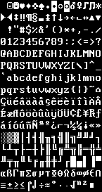

# Basic font information

Because of the way the SadConsole is designed, you use "tile sets" (a sprite sheet) that maps individual tiles to character codes. Therefore, the "tile set" you use is a set of indexed graphics, or, as is the default with SadConsole, a "tile set" of font characters.

Fonts are made up of two pieces, the graphic file and the font config file. Since SadConsole uses MonoGame, the graphic file can be any image format that MonoGame will load. In general, SadConsole uses **png** files.

## Graphics

The graphic file of the font must use a transparent background, *not* a solid color background. The glyphs in the font graphic should use a pure white color `(255, 255,255)`. There must be a solid-filled glyph in the graphic file..

Here is an example of the standard font graphic included in SadConsole.



>[!NOTE]
>Normally the background of the font texture is transparent, not black. In this article it is black so that you can see the glyphs.

The font is broken down into cells which are referenced by index. Index 0 represents the top-left cell, and moving right, counts up from 0. Once the index reaches the end of the line, it moves to the next line continuing to count.


When you set a glyph index to a console cell, the corresponding graphic index is used when the console is drawn. For example, the `0` number key on the keyboard is character code 48, and in the graphic file there is a `0` graphic at index 48. By default, all of the characters represented in the font file are placed in their matching character index. Character `A` (code 65) is placed at index 65, while character `z` (code 122) is placed at index 122, and so on.

## Config file

Each graphical font has a special config file that tells SadConsole how to interpret the graphic file. This is a json encoded file that ends with the **.font** extension.

Here is an example of a font config file. According to this config, each glyph in the graphic file is 8 pixels wide by 16 pixels hight. There is a 1 pixel spacing between every glyph, and the solid-filled glyph index is 219. Each font must have a solid glyph, this glyph is used for drawing the background of every cell.

```json
{
  "Name": "IBM_8x16",
  "FilePath": "IBM8x16.png",
  "GlyphHeight": 16,
  "GlyphPadding": 1,
  "GlyphWidth": 8,
  "SolidGlyphIndex": 219,
  "Columns": 16,
  "IsSadExtended": false
}
```

## FontMaster

When a font is loaded, a <xref:SadConsole.FontMaster?displayProperty=fullName> object is created. This is used to generate font objects used throughout SadConsole. The <xref:SadConsole.FontMaster.GetFont(SadConsole.Font.FontSizes)?displayProperty=fullName> method builds a cached <xref:SadConsole.Font?displayProperty=fullName> object which is used by consoles. There are six <xref:SadConsole.Font.FontSizes> that can be generated for a font. These represent a multiple applied to the glyph size of the font.

- Quarter
- Half
- One
- Two
- Three
- Four

For example, if you have a font is made up of *4x8* characters and you generate a <xref:SadConsole.Font.FontSizes.Two> variation of the font, the rendering output will display the characters x2 of the original, *8x16* in size. If you generate a <xref:SadConsole.Font.FontSizes.Quarter> variation of that font, you would end up with x0.25 the original, *1x4* in size.

## Next steps

* [Learn how to load and use a font](how-to-load-a-font.md).