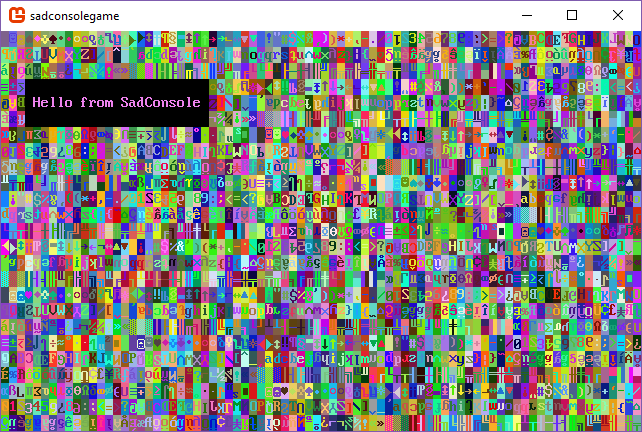

# Get Started 1 - Draw on a console

Welcome to the start of the Getting Started with SadConsole tutorial series. This series will outline how to use the basic parts of SadConsole from the perspective of a new developer.

## Prerequisites

To start this tutorial you'll need to have created a SadConsole project. It is recommended that you use the [SadConsole templates for .NET Core](../../getting-started-sadconsole-core-cli-template.md) which works for Windows, Linux, and macOS.

Alternatively, you can create a project with [Visual Studio and .NET Framework](../../getting-started-with-sadconsole-framework.md).

> [!WARNING]
> Because of the added complexity, I do not recommend that you create a MonoGame project using the MonoGame Visual Studio templates.

## Sync your code to mine

The previous section leads you to material that helps you create a SadConsole project. To ensure that we start off with the same material, make your *program.cs* file look like the following:

```csharp
using System;
using SadConsole;
using Microsoft.Xna.Framework;
using Console = SadConsole.Console;

namespace SadConsoleGame
{
    public static class Program
    {
        static void Main()
        {
            // Setup the engine and create the main window.
            SadConsole.Game.Create(80, 25);

            // Hook the start event so we can add consoles to the system.
            SadConsole.Game.OnInitialize = Init;

            // Start the game.
            SadConsole.Game.Instance.Run();
            SadConsole.Game.Instance.Dispose();
        }

        static void Init()
        {
            var console = new Console(80, 25);
            console.FillWithRandomGarbage();
            console.Fill(new Rectangle(3, 3, 23, 3), Color.Violet, Color.Black, 0, 0);
            console.Print(4, 4, "Hello from SadConsole");

            SadConsole.Global.CurrentScreen = console;
        }
    }
}
```

You should be able to run this code and see the following output:



One other thing to do. Make sure the namespace you're using is `SadConsoleGame`. You can change the default namespace in the project properties in Visual Studio, or you can (in Visual Studio 2019) double-click the *sadconsolegame.csproj* file to open it and make sure the `<RootNamespace>` is set to `SadConsoleGame`. If it is missing, add it.

Additionally, the `<TargetFramework>` value should be set to either `netcoreapp3.0` or `netcoreapp2.2`.

```xml
<Project Sdk="Microsoft.NET.Sdk">

  <PropertyGroup>
    <OutputType>WinExe</OutputType>
    <TargetFramework>netcoreapp3.0</TargetFramework>
    <RootNamespace>SadConsoleGame</RootNamespace>
  </PropertyGroup>
```

## Exploring the sample code

The `static void Init()` method created in the previous section provides a simple place to easily explore and play with SadConsole without creating any real game code. The `Init` method is declared as [`static`][csharp-static] which means that you don't have to create an object to access this method. This method was passed to SadConsole in the code at the start of the program. This is a hook where you can provide some extra initialization code for your game, such as creating all the startup variables and objects.

At the very top of the program are [`using`][csharp-using] statements which imports common SadConsole types into your programming space. Don't worry about those for now, but think of it like this. Just like how a house is located at an address in a neighborhood, so too are types. SadConsole types have an "address" that identify where they are located. One common one is `SadConsole.Console`. We're importing that directly so we only have to refer to it as `Console`.

Let's explore the `Init` method's code.

```csharp
static void Init()
{
    var console = new Console(80, 25);
    console.FillWithRandomGarbage();
    console.Fill(new Rectangle(3, 3, 23, 3), Color.Violet, Color.Black, 0, 0);
    console.Print(4, 4, "Hello from SadConsole");

    SadConsole.Global.CurrentScreen = console;
}
```

01. The first line of code in this method creates a new `SadConsole.Console` with a width of 80 cells and a height of 25 cells, and assigns it to the variable `console`.

    ```csharp
    var console = new Console(80, 25);
    ```

01. This next line fills the console with random characters and colors. It's used for debugging and it makes a pretty first screen.

    ```csharp
    console.FillWithRandomGarbage();
    ```

01. The next two lines are draw commands. The first is the `Fill` command, which fills a region of the console with a foreground color, background color, and a glyph character.

    ```csharp
    console.Fill(new Rectangle(3, 3, 23, 3), Color.Violet, Color.Black, 0, 0);
    //Fill: (Region, Foreground, Background, Glyph character, Glyph mirror setting)
    ```

01. The last draw command in this example is the `Print` command. This prints a string at a specific X, Y coordinates.

    ```csharp
    console.Print(4, 4, "Hello from SadConsole");
    ```

01. The last line in this example code sets the current screen. The current screen is the object that is displayed on the screen and processed by the keyboard and mouse handlers. If you don't set the current screen to something, nothing will be displayed when you run your game.

    ```csharp
    SadConsole.Global.CurrentScreen = console;
    ```

## Playing with SadConsole

Before we start this part of the tutorial, lets reset our code to a basic random console.

```csharp
static void Init()
{
    var console = new Console(80, 25);
    console.FillWithRandomGarbage();

    SadConsole.Global.CurrentScreen = console;
}
```

If you run it, you see the basic random console but it's missing the black box that says "Hello from SadConsole."

### Child consoles

You can attach consoles to other consoles, creating a child-parent relationship between them. When a console with children (the parent) is repositioned, all child consoles move along with it.

Let's demonstrate creating attaching a console.

Replace the `Init` code with the following:

```csharp
static void Init()
{
    var console = new Console(80, 25);
    console.FillWithRandomGarbage();

    var childConsole = new Console(25, 3);
    childConsole.Position = new Point(1, 1);
    childConsole.Fill(ColorAnsi.BlueBright, ColorAnsi.Blue, 0);
    childConsole.Print(1, 1, "Hello from childConsole");

    console.Children.Add(childConsole);

    SadConsole.Global.CurrentScreen = console;
}
```

If you notice the last line, the `console` variable (the one with all the random colors) is still assigned as the current screen. However, the lines above it have created a second console and attached it to the first console. Let's look at that code line by line.

01. First, a second console is created and assigned to the `childConsole` variable. This one is smaller in size, and if you notice, it's just about the same size as the black box we created in the previous section of the tutorial: 25 x 3.

    ```csharp
    var childConsole = new Console(25, 3);
    ```

01. The next three lines you're familiar with because of the previous section of this tutorial. However there is something new. First, the `Fill` method is using a different parameter set. This is called a method overload. Methods may be designed to accept different combinations of parameters. In this case, only the *Foreground*, *Background*, and *Glyph* need to be passed to fill the `childConsole`.

    ```csharp
    childConsole.Position = new Point(1, 1);
    childConsole.Fill(ColorAnsi.BlueBright, ColorAnsi.Blue, 0);
    childConsole.Print(1, 1, "Hello from childConsole");
    ```

    Also, notice that the color parameters are set differently. Instead of the using the `Color` class, the `ColorAnsi` class is used. `ColorAnsi` comes from SadConsole directly and has a set of colors that map to the traditional [16 EGA ANSI colors](https://en.wikipedia.org/wiki/Enhanced_Graphics_Adapter#Color_palette).

01. Finally, the last line of the new code adds the `childConsole` to a parent console.

    ```csharp
    console.Children.Add(childConsole);
    ```

When you run this code, you'll see a different result.


Since the child console is attached to the parent, you can interact with it individually. For example, try running your game again, but change some stuff such as the position, visibility, and even change the position of the parent to see how it affects the child. Try one of the following lines of code.

```csharp
// Hide the child console
childConsole.IsVisible = false;

// Move the child console to a different position
childConsole.Position = new Point(40, 18);

// Move the parent console. Note how it changes where the childConsole is drawn.
console.Position = new Point(4, 4);
```

## Exploring some basics

Now that you've seen how the parent-child relationship works with consoles, let's explore a little more about how to change the console, like we did with printing.

First, let's start with some clean code. Replace the `Init` method with the following:

```csharp
static void Init()
{
    var console = new Console(80, 25);
    
    // New code starts here
    
    SadConsole.Global.CurrentScreen = console;
}
```

You now have a blank console, which really, you won't be able to tell that it exists because it just looks like a black background. Try each of the following lines of code. Paste each line below the `// New code starts here` code comment. You can try and run your game with each line individually to see the result.

01. Change a specific cell in the console. You can adjust the foreground color, the background color, the glyph, or the glyph mirror setting of any X,Y coordinate in the console.

    Set the background of a cell. This fills the cell with a specific color.

    ```csharp
    // X, Y, Color
    console.SetBackground(2, 2, Color.DarkGray);
    ```

    Set the glyph of a cell. This changes the character displayed in the cell. The glyph is based on the character code in the font file. For more information about how a font sheet is put together and how the glyph index works, see [Basic Font Information](~/articles/basic-font-information.md).

    ```csharp
    // X, Y, Glyph index
    console.SetGlyph(2, 2, 1);
    ```

    Set the foreground color of a cell. A glyph is displayed in the color of the foreground of the cell. So by changing the foreground color, you change the color of the glyph. If the glyph is set to `0`, it is blank and you won't see any character symbol and any foreground color for that cell.

    ```csharp
    // X, Y, Color
    console.SetForeground(2, 2, Color.DarkBlue);
    ```

    Change the mirror of a cell. Each cell is initially set to `None` which represents un-mirrored. You can set the mirror to `None`, `FlipHorizontally`, and `FlipVertically`.

    ```csharp
    // X, Y, Mirror set
    console.SetMirror(2, 2, Microsoft.Xna.Framework.Graphics.SpriteEffects.FlipVertically);
    ```

02. Draw shapes on the console.

    Draw a Line. Simply sets the colors and glyph of all cells that fall in the path of a line. The line is made from a starting coordinate to the ending coordinate.

    ```csharp
    // Start XY, End XY, Foreground color, Background color, Glyph character
    console.DrawLine(new Point(2, 4), new Point(20, 6), Color.BlueViolet, Color.White, 4);
    ```

    Draw a circle. A circle is drawn inside of the rectangle shape. The `Cell` type is used to represent the combination of Foreground color, Background color, and glyph. Many different methods in SadConsole will use a `Cell` as a way to represent the appearance settings to apply to something.

    ```csharp
    console.DrawCircle(new Rectangle(10, 10, 8, 4), new Cell(Color.BlueViolet, Color.White, 4));
    ```

    Draw a box. Like the circle, a rectangle and cell appearance are used to draw a box.

    ```csharp
    console.DrawBox(new Rectangle(10, 17, 8, 4), new Cell(Color.BlueViolet, Color.White, 4));
    ```

## Conclusion

You've now explored some of the basics of SadConsole. Keep playing around with these commands. The next part of this series will explore keyboard and mouse input.

- [Part 2: Input](part-2-input.md)

[csharp-static]: https://docs.microsoft.com/en-us/dotnet/csharp/language-reference/keywords/static
[csharp-using]:  https://docs.microsoft.com/en-us/dotnet/csharp/language-reference/keywords/using
