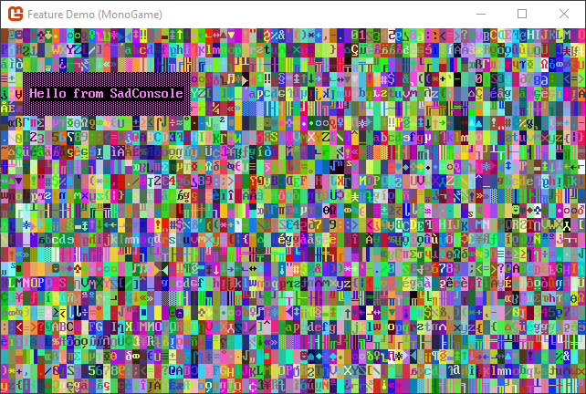
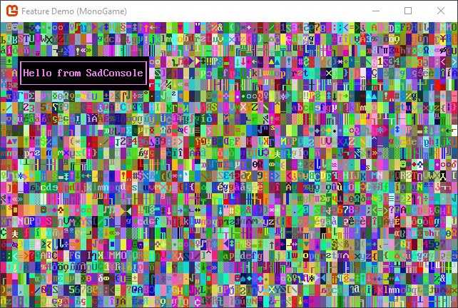
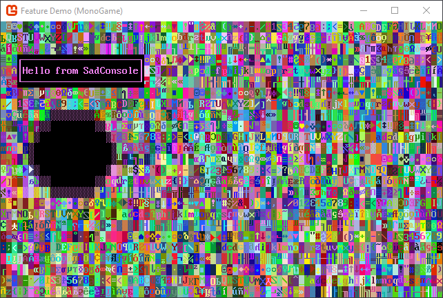
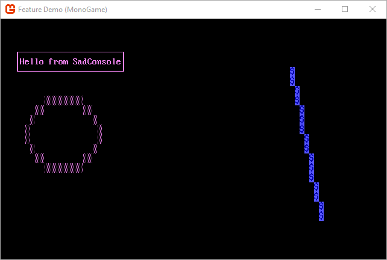

# Get Started 1 - Draw on a console

Welcome to the start of the Getting Started with SadConsole tutorial series. This series will outline how to use the basic parts of SadConsole from the perspective of a new developer.

## Prerequisites

To start this tutorial you'll need to have created a SadConsole project. It is recommended that you use the [Create a new SadConsole .NET project with the SadConsole templates](../../getting-started-cli.md) which works for Windows, Linux, and macOS.

> [!WARNING]
> Because of the added complexity, I don't recommend that you create a MonoGame project using the MonoGame Visual Studio templates.

## Sync your code to mine

The previous section leads you to material that helps you create a SadConsole project. For this tutorial, make sure the default namespace is `SadConsoleGame`. If you need to learn more about namespaces, visit the CSharp reference article. You can force the namespace by adding the `<RootNamespace>` setting to the `<PropertyGroup>` node in the project file (the file with the _.csproj_ extension):

```xml
<PropertyGroup>
  <OutputType>Exe</OutputType>
  <TargetFramework>net5.0</TargetFramework>
  <RootNamespace>SadConsoleGame</RootNamespace>
</PropertyGroup>
```

To ensure that we start off with the same material, make your *program.cs* file look like the following:

```csharp
using System;
using SadConsole;
using SadRogue.Primitives;
using Console = SadConsole.Console;

namespace SadConsoleGame
{
    public static class Program
    {
        static void Main()
        {
            // Setup the engine and create the main window.
            Game.Create(80, 25);

            // Hook the start event so we can add consoles to the system.
            Game.Instance.OnStart = Init;

            // Start the game.
            Game.Instance.Run();
            Game.Instance.Dispose();
        }

        static void Init()
        {
            Game.Instance.StartingConsole.FillWithRandomGarbage(SadConsole.Game.Instance.StartingConsole.Font);
            Game.Instance.StartingConsole.Fill(new Rectangle(3, 3, 23, 3), Color.Violet, Color.Black, 0, Mirror.None);
            Game.Instance.StartingConsole.Print(4, 4, "Hello from SadConsole");
        }
    }
}
```

You should be able to run this code and see the following output. You can run your program by pressing the <kbd>F5</kbd> key. If you're using the terminal, run `dotnet run`:


One other thing to do. Make sure the namespace you're using is `SadConsoleGame`. You can change the default namespace in the project properties in Visual Studio, or you can (in Visual Studio 2019) double-click the *sadconsolegame.csproj* file to open it and make sure the `<RootNamespace>` is set to `SadConsoleGame`. If it is missing, add it.

Additionally, the `<TargetFramework>` value should be set to `net5.0`.

```xml
<Project Sdk="Microsoft.NET.Sdk">

  <PropertyGroup>
    <OutputType>WinExe</OutputType>
    <TargetFramework>net5.0</TargetFramework>
    <RootNamespace>SadConsoleGame</RootNamespace>
  </PropertyGroup>

</Project>
```

## Exploring the sample code

The `static void Init()` method created in the previous section provides a simple place to easily explore and play with SadConsole without creating any real game code. The `Init` method is declared as [`static`][csharp-static] which means that you don't have to create an instance of a type to access this method. This method was provided to SadConsole in the code at the start of the program. This is a hook where you can provide some extra initialization code for your game, such as creating all the startup variables and objects.

At the very top of the program are [`using`][csharp-using] statements which imports common SadConsole types into your programming space. Don't worry about those for now, but think of it like this: Just like how a house is located at an address in a neighborhood, so too are object types. SadConsole types have an "address" that identify where they are located. The `using` statements are used in two ways:

01. `using SadRogue.Primitives;`

    To access a type in that namespace, such as the `Point` type which contains X,Y coordinates, you normally would have to type it out completely: `var myPoint = new SadRogue.Primitives.Point(10, 10)`. When the namespace is referenced in the `using` statement, every type in that namespace is imported into the code file directly. So you no longer have to type the namespace and can simply use `var myPoint = new Point(10, 10)`.

01. `using Console = SadConsole.Console;`

    This works bit like the previous `using` except that instead of importing a all the types in the namespace, it only imports a single type. That type is renamed to the  and maps a new type to it. It just so happens in this case it's using the same name, `Console`. You could, for example, map `SadConsole.Console` to `AConsole` with `using AConsole = SadConsole.Console;`. This avoids a problem where there are two `Console` types. One comes from the `System` namespace, which you generally import, and from `SadConsole`. Forcing `Console` to represent the `SadConsole.Console` type avoids any common mistakes you may run into.

Let's explore the `Init` method's code.

```csharp
static void Init()
{
    Game.Instance.StartingConsole.FillWithRandomGarbage(SadConsole.Game.Instance.StartingConsole.Font);
    Game.Instance.StartingConsole.Fill(new Rectangle(3, 3, 23, 3), Color.Violet, Color.Black, 0, Mirror.None);
    Game.Instance.StartingConsole.Print(4, 4, "Hello from SadConsole");
}
```

01. This code is accessing the default starting console. You provided the size of the starting console when you created the SadConsole game. The first code line fills the console with some garbage, that is, random characters and colors.

    ```csharp
    Game.Instance.StartingConsole.FillWithRandomGarbage(SadConsole.Game.Instance.StartingConsole.Font);
    ```

01. The next line fills a rectangle region with some color to create a box.

    ```csharp
    Game.Instance.StartingConsole.Fill(new Rectangle(3, 3, 23, 3), Color.Violet, Color.Black, 0, Mirror.None);
    ```

    The parameters are as follows:

    - Region to fill: Position X, Position Y, Width, Height: `new Rectangle(3, 3, 23, 3)`
    - The foreground color to use for each character in the region: `Color.Violet`
    - The background color to use for each character in the region: `Color.Black`
    - The glyph character to fill, `0` represents an empty character.
    - The mirror setting for the glyph. You can mirror them horizontally or vertically. Because the `FillWithRandomGarbage` randomizes the mirror, this needs needs to be cleared for our box.

01. The last line prints some text as position 4, 4. This position is inside the box. Because the `Print` statement here isn't specifying any color settings, the text will have the same foreground and background as the `Fill` method, which is **Violet** and **Black**, respectively.

    ```csharp
    Game.Instance.StartingConsole.Print(4, 4, "Hello from SadConsole");
    ```

Play around with these methods. Try filling in some other boxes, changing the colors, and printing different strings to different areas. You can remove the `FillWithRandomGarbage` line if you would like while playing around.

## More drawing

Let's add some more code to the `Init` method to draw more things to the screen. However, simplify the access to `Game.Instance.StartingConsole` by assigning it to a variable named `startingConsole`, this will make it easier to write code that interacts with it. You can copy/paste this code over your existing code so that you're in sync with the article:

```csharp
private static void Init()
{
    var startingConsole = Game.Instance.StartingConsole;

    startingConsole.FillWithRandomGarbage(SadConsole.Game.Instance.StartingConsole.Font);
    startingConsole.Fill(new Rectangle(3, 3, 23, 3), Color.Violet, Color.Black, 0, Mirror.None);
    startingConsole.Print(4, 4, "Hello from SadConsole");
}
```

### Shapes

Previously we used `Fill` to fill in a rectangular region. With SadConsole you can draw shapes such as a rectangle or an ellipsis. This works similar to `Fill` but gives you more control over the drawing. For example, you can apply a border to the box you draw, with `Fill`, you cannot do that.

#### Box

After the `Print` line that prints _"Hello from SadConsole"_, add the following to draw a box around it:

```csharp
startingConsole.DrawBox(new Rectangle(3, 3, 23, 3), ShapeParameters.CreateBorder(new ColoredGlyph(Color.Violet, Color.Black, 176)));
```



The `DrawBox` method takes a region and a `ShapeParameters` object. The `ShapeParameters` object defines the style in which to create a shape, and in this case, the box. We're using it in a simple mode, which is just providing a `ColoredGlyph` for the border. A `ColoredGlyph` type represents a foreground color, a background color, a glyph character, all in a single type. This glyph is what gets drawn as the border of the box. A `ColoredGlyph` is also used to specify the fill of the shape, but we're going to omit that for now.

The `DrawBox` method breaks down into the following parameters:

- **Rectangle**: This is the region to draw box in.
- **Shape Parameters**: The style of border and fill settings that are applied to the box.

With `DrawBox` you can also specify that you want to use a line style for the box instead of the glyph character provided.

```csharp
startingConsole.DrawBox(new Rectangle(3, 3, 23, 3),
                        ShapeParameters.CreateStyledBox(ICellSurface.ConnectedLineThin,
                                                        new ColoredGlyph(Color.Violet, Color.Black)));
```



`ShapeParameters` can describe many different ways to create the box. While the `ShapeParameters.CreateBorder` method used a `ColoredGlyph` to set the foreground, background, and symbol used to draw the whole border, `ShapeParameters.CreateStyledBox` instead uses a _connected line style_ for the symbols used to draw the box. A `ColoredGlyph` is still used to set the foreground and background of the border. There are a few line styles, and you can create your own, but we'll name two of the most likely used styles:

- `ICellSurface.ConnectedLineThin`: A thin single line.
- `ICellSurface.ConnectedLineThick`: A thick double line.

Try the **Thick** line style to see how it looks.

#### Circle

Next, let's draw a circle, it follows roughly the same pattern:

```csharp
startingConsole.DrawCircle(new Rectangle(5, 8, 16, 8), 
                           ShapeParameters.CreateFilled(new ColoredGlyph(Color.Violet, Color.Black, 176),
                                                        new ColoredGlyph(Color.White, Color.Black)));
```

The code above is using a black background to fill the box.

Run your game and you'll see the following screen:



#### Line

The line shape is probably the simplest. There is no fill to worry about, you simply set the starting point of the line, the ending point, and then what glyph and colors to use when drawing the line.

However, before we drawn a line, let's remove the `FillWithRandomGarbage` code line. All of this visual noise will make it hard to see something as small as a line. After removing that code line, add the following line to the end of your code:

```csharp
startingConsole.DrawLine(new Point(60, 5), new Point(66, 20), '$', Color.AnsiBlue, Color.AnsiBlueBright, Mirror.None);
```

Your `Init` method should look like the following:

```csharp
private static void Init()
{
    var startingConsole = Game.Instance.StartingConsole;

    startingConsole.Fill(new Rectangle(3, 3, 23, 3), Color.Violet, Color.Black, 0, Mirror.None);
    startingConsole.Print(4, 4, "Hello from SadConsole");

    startingConsole.DrawBox(new Rectangle(3, 3, 23, 3),
                            ShapeParameters.CreateStyledBox(ICellSurface.ConnectedLineThin,
                                                            new ColoredGlyph(Color.Violet, Color.Black)));

    startingConsole.DrawCircle(new Rectangle(5, 8, 16, 8), 
                               ShapeParameters.CreateFilled(new ColoredGlyph(Color.Violet, Color.Black, 176),
                                                            new ColoredGlyph(Color.White, Color.Black)));

    startingConsole.DrawLine(new Point(60, 5), new Point(66, 20), '$', Color.AnsiBlue, Color.AnsiBlueBright, Mirror.None);
}
```

Run your game and you'll see the following screen:



## Other basics

There are a few other methods you can use to change a console. We learned that the `Print` method works at a specific position and prints out a string with a foreground and background, but, you can also work with individual cells. You can adjust the foreground color, the background color, the glyph, or the glyph mirror setting of any cell in the console, by referring to its X,Y coordinate.

- Set the foreground color of a cell. A glyph is displayed in the color of the foreground of the cell. So by changing the foreground color, you change the color of the glyph. If the glyph is set to `0`, it's blank and you won't see any character symbol nor the foreground color for that cell. In our example, this alters the _S_ in _SadConsole_.

  ```csharp
  // X, Y, Color
  startingConsole.SetForeground(15, 4, Color.DarkGreen);
  ```

- Set the background of a cell. This fills the cell with a specific color. In our example, this alters the _C_ in _SadConsole_.

  ```csharp
  // X, Y, Color
  startingConsole.SetBackground(18, 4, Color.DarkCyan);
  ```

- Set the glyph of a cell. This changes the character displayed in the cell. The glyph is based on the character index in the font file. In our example, this alters the _H_ in _Hello_.

  ```csharp
  // X, Y, Glyph index or character
  startingConsole.SetGlyph(4, 4, '@'); // use '@' or 1, they're the same index glyph
  ```

- Change the mirror of a cell. Each cell is initially set to `None` which represents un-mirrored. You can set the mirror to `None`, `Horizontal`, or `Vertical`. In our example, this alters the _f_ in _from_.

  ```csharp
  // X, Y, Mirror set
  console.startingConsole.SetMirror(10, 4, Mirror.Vertical);
  ```

## Conclusion

You've now explored some of the basics of SadConsole. The `Game.Instance.StartingConsole` is a console you can use to quickly prototype and experiment. Keep experimenting with these methods. The next part of this series will explore the Console cursor and the screen layout system built into SadConsole.

- [Next: Get Started 2 - Cursor and parenting](part-2-cursor-parents.md)

[csharp-static]: https://docs.microsoft.com/dotnet/csharp/language-reference/keywords/static
[csharp-using]:  https://docs.microsoft.com/dotnet/csharp/language-reference/keywords/using
